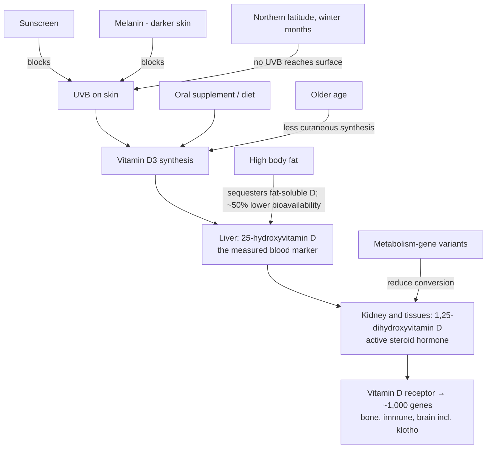

# Vitamin D

Vitamin D is misnamed as a vitamin: cholecalciferol (D3), made in skin from UVB exposure or ingested, is hydroxylated to 25-hydroxyvitamin D (the stable circulating form measured in blood tests) and then to 1,25-dihydroxyvitamin D, a steroid hormone that enters the nucleus and regulates transcription. It is described as controlling on the order of 1,000 genes — roughly 5% of the protein-coding genome — spanning bone homeostasis, immune modulation, and brain function. That breadth is why deficiency plausibly matters for aging broadly, and also why single-outcome trials keep disappointing: the intervention is repletion of a permissive hormone, not a drug aimed at one pathway. (@FoundMyFitness (FoundMyFitness) — "Dr. Rhonda Patrick: Optimizing Longevity with Micronutrients & Vigorous Exercise", 2025-11-05, [link](https://www.youtube.com/watch?v=JelnAdNFL2M))

## Why deficiency is common

Roughly 30% of the US population is described as deficient (25-hydroxyvitamin D ≤ 20 ng/mL) and a further ~40% as insufficient (≤ 30 ng/mL). The causes are structural rather than dietary carelessness: sunscreen, melanin, northern latitude (above certain latitudes no UVB reaches the surface for about five months a year), and age all reduce cutaneous synthesis, and higher body fat sequesters the fat-soluble vitamin — obesity is described as cutting bioavailability roughly in half. Genetic variants in the conversion enzymes additionally lower the levels some people achieve at a given intake, which is the argument for measuring rather than assuming. (@FoundMyFitness (FoundMyFitness) — "Dr. Rhonda Patrick: Optimizing Longevity with Micronutrients & Vigorous Exercise", 2025-11-05, [link](https://www.youtube.com/watch?v=JelnAdNFL2M))

One under-used dietary route: mushrooms synthesize vitamin D by the same photochemistry as skin (UV conversion of a membrane sterol), so dark-grown supermarket mushrooms contain almost none at purchase but generate substantial vitamin D from one to two hours of direct sunlight after purchase — a 50–100 g sun-exposed serving is described as covering a day's requirement, with oyster mushrooms roughly 100-fold richer than button mushrooms. Mechanistically solid but variable in delivered dose, largely D2 rather than D3, and no substitute for testing and correcting measured deficiency; details and caveats at [[culinary-mushrooms-and-fungal-nutrition]]. (@joinzoe (ZOE) — "The fungi scientist: The #1 mistake you're making when eating mushrooms for health", 2026-06-04, [link](https://www.youtube.com/watch?v=ZUoz97Wn_Xc))

## Evidence, in ascending strength of design

**Animal:** vitamin-D-receptor knockout mice show a progeria-like phenotype — accelerated aging of skin, bone, hair, and organs by eight months of age. Vivid, but a receptor knockout models total signaling loss, not human insufficiency. (@FoundMyFitness (FoundMyFitness) — "Dr. Rhonda Patrick: Optimizing Longevity with Micronutrients & Vigorous Exercise", 2025-11-05, [link](https://www.youtube.com/watch?v=JelnAdNFL2M))

**Observational:** low measured vitamin D associates with higher all-cause mortality and with about an 80% higher dementia risk in some cohorts, while supplement users show about 40% lower dementia incidence; low levels also associate dose-dependently with white-matter hyperintensities (in one UK cohort, each 10 nmol/L increase in level tracked with less white-matter damage). In the reported 12,388-person supplement-use cohort, the 40% estimate came from self-selected use of several vitamin D forms over ten years rather than randomized assignment. Associations were weaker in people who already had mild cognitive impairment or carried APOE4, and supplementation did not erase either group's much larger baseline risk. All of this carries the classic reverse-causation and healthy-user problems — sick, sedentary, indoor-living people may both have low vitamin D and be less likely to supplement. (@FoundMyFitness (FoundMyFitness) — "This Supplement Could Cut Your Dementia Risk By 40%", 2025-05-19, [link](https://www.youtube.com/watch?v=tpFOA1AUFCk)) (@FoundMyFitness (FoundMyFitness) — "Dr. Rhonda Patrick: Optimizing Longevity with Micronutrients & Vigorous Exercise", 2025-11-05, [link](https://www.youtube.com/watch?v=JelnAdNFL2M))

**Mendelian randomization:** people carrying variants that genetically lower vitamin D levels show higher all-cause, respiratory, and cancer mortality, and the transcript reports up to 54% higher dementia risk. Because gene variants are assigned at conception, this design reduces reverse causation, but its credibility still depends on instrument validity and absence of pathways from the variants to dementia other than vitamin D. It estimates lifelong genetically influenced exposure and cannot show that starting a supplement later in life reproduces the effect or set a dose or target. (@FoundMyFitness (FoundMyFitness) — "This Supplement Could Cut Your Dementia Risk By 40%", 2025-05-19, [link](https://www.youtube.com/watch?v=tpFOA1AUFCk)) (@FoundMyFitness (FoundMyFitness) — "Dr. Rhonda Patrick: Optimizing Longevity with Micronutrients & Vigorous Exercise", 2025-11-05, [link](https://www.youtube.com/watch?v=JelnAdNFL2M))

**Randomized trials (small, deficiency or disease context):** 4,000 IU/day for about a month in severely deficient obese African-American adults reversed epigenetic-clock age by nearly two years — a biomarker endpoint subject to every caution in [[biological-age-biomarkers]]. Two placebo-controlled trials at a modest 800 IU/day for a year — one in Alzheimer's disease, one in mild cognitive impairment — reported improved memory or attention measures; the Alzheimer's trial also reported an amyloid-beta blood-marker change and the MCI trial lower oxidative-stress markers. These are intermediate outcomes in small clinical populations, not dementia-incidence trials, and the transcript itself acknowledges mixed cognitive findings in cognitively normal adults. Proposed brain routes include microglial and astrocyte immune modulation, neurotrophic signaling, oxidative-stress control, and amyloid-beta efflux, but none has been shown to mediate prevention in humans. (@FoundMyFitness (FoundMyFitness) — "This Supplement Could Cut Your Dementia Risk By 40%", 2025-05-19, [link](https://www.youtube.com/watch?v=tpFOA1AUFCk)) (@FoundMyFitness (FoundMyFitness) — "Dr. Rhonda Patrick: Optimizing Longevity with Micronutrients & Vigorous Exercise", 2025-11-05, [link](https://www.youtube.com/watch?v=JelnAdNFL2M))

**Evidence conflict — target level and high-dose safety:** the talk's recommended blood-level sweet spot of ~40–60 ng/mL (up to 80) is Rhonda Patrick's position, materially above the ≥30 ng/mL sufficiency threshold she also cites, and above the 20 ng/mL adequacy level used by major nutrition bodies. No outcome trial supports titrating healthy people into the 40–80 range, large general-population trials of supplementation (not covered in this talk) have been broadly null on primary endpoints, and this wiki's supplement page separately records high-dose vitamin D associating with falls and fractures ([[supplement-evidence-and-safety]]). The defensible core is deficiency correction; the upper half of her target range is expert preference carrying her characteristic insufficiency-first framing ([[rhonda-patrick]]). (@FoundMyFitness (FoundMyFitness) — "Dr. Rhonda Patrick: Optimizing Longevity with Micronutrients & Vigorous Exercise", 2025-11-05, [link](https://www.youtube.com/watch?v=JelnAdNFL2M))

## Practical implications

- **Test 25-hydroxyvitamin D before and during supplementation rather than dosing blind — moderate.** Conversion-gene variants mean identical doses land at different blood levels; a minority need substantially more than standard doses to escape deficiency, and testing is the only way to know. (@FoundMyFitness (FoundMyFitness) — "Dr. Rhonda Patrick: Optimizing Longevity with Micronutrients & Vigorous Exercise", 2025-11-05, [link](https://www.youtube.com/watch?v=JelnAdNFL2M))
- **If deficient or insufficient: about 4,000 IU/day of D3 corrects most people to sufficiency (≥30 ng/mL) — moderate for the repletion pharmacology; the downstream benefits are graded per the evidence tiers above.** Higher body fat, darker skin, northern winters, and older age raise the likelihood of needing supplementation at all. (@FoundMyFitness (FoundMyFitness) — "Dr. Rhonda Patrick: Optimizing Longevity with Micronutrients & Vigorous Exercise", 2025-11-05, [link](https://www.youtube.com/watch?v=JelnAdNFL2M))
- **Do not titrate into the 40–80 ng/mL range expecting outcome benefit — the target is contested expert preference, and megadosing carries documented harm signals (falls, fractures at high doses).** Deficiency correction, not level maximization, is what the trial evidence supports. [[supplement-evidence-and-safety]] (@FoundMyFitness (FoundMyFitness) — "Dr. Rhonda Patrick: Optimizing Longevity with Micronutrients & Vigorous Exercise", 2025-11-05, [link](https://www.youtube.com/watch?v=JelnAdNFL2M))
- **Do not use vitamin D as a stand-alone dementia or longevity strategy — strong as an evidence boundary.** The dementia signal is observational plus MR plus small deficiency-population trials; blood-pressure control, hearing care, exercise, and sleep act on larger established risk domains ([[cognitive-reserve-and-brain-health]]).
- **For dementia prevention specifically: correct established deficiency for general health, but do not treat the reported 40% association as a supplement effect — strong evidence boundary.** The source's large study compared voluntary users with non-users; APOE4 and mild cognitive impairment remained dominant risk markers despite supplementation. (@FoundMyFitness (FoundMyFitness) — "This Supplement Could Cut Your Dementia Risk By 40%", 2025-05-19, [link](https://www.youtube.com/watch?v=tpFOA1AUFCk))

## Gaps & open questions

- Does correcting deficiency in a randomized, adequately powered trial reduce dementia incidence, mortality, or fracture — as opposed to moving cognition scores and epigenetic clocks in small deficient cohorts?
- Where between 20 and 40 ng/mL does marginal benefit actually stop — and does it differ by outcome (bone versus immune versus brain)?
- Do the Mendelian-randomization mortality effects reflect lifelong exposure that mid-life supplementation cannot recover?
- How should dosing be individualized for high body fat, malabsorption, and conversion-gene variants beyond retest-and-adjust?
- The epigenetic-age reversal finding is one month in one severely deficient population; does it persist, replicate, or predict anything clinical?
- Can an adequately powered randomized repletion trial reduce incident dementia, and do effects differ by baseline deficiency, cognition, sex, APOE genotype, or vitamin D form?

## Related

[[supplement-evidence-and-safety]] · [[culinary-mushrooms-and-fungal-nutrition]] · [[biological-age-biomarkers]] · [[cognitive-reserve-and-brain-health]] · [[epigenetic-alterations-and-reprogramming]] · [[bone-remodeling-and-mechanical-loading]] · [[photoprotection]] · [[rhonda-patrick]] · [[aging-model]] · [[practice-playbook]]
