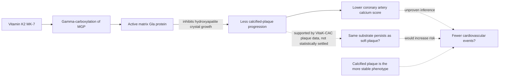

# Vitamin K2 and arterial calcification

Vitamin K is a family of fat-soluble vitamins whose shared biochemical job is to serve as a cofactor for gamma-carboxylation, a post-translational modification that activates a set of vitamin-K-dependent proteins. The K2 subfamily (menaquinones) is distinguished by side-chain length: MK-4 circulates briefly and is dosed in milligrams in the oncology-adjunct literature, while MK-7 circulates far longer and is dosed in micrograms; the two must not be interchanged (see the nomenclature warning in [[supplement-evidence-and-safety]]). The cardiovascular interest in K2 runs through one of those vitamin-K-dependent proteins: matrix Gla protein (MGP), produced by vascular smooth muscle cells. Carboxylated (active) MGP binds hydroxyapatite — the calcium-phosphate mineral that vascular cells release into the artery wall — and inhibits its growth into crystals, so adequate vitamin K status is proposed to restrain the calcification of atherosclerotic plaque. Uncarboxylated MGP cannot do this, which is the mechanistic case for supplementation. (@Physionic (Physionic) — "Could this change Everything about Vitamin K2 and Calcified Arteries? [New Study]", 2026-08-17, [link](https://www.youtube.com/watch?v=STML7Yugs70))

## Why a lower calcium score is not automatically a better outcome

The coronary artery calcium (CAC) score predicts events: across people, more calcification associates with more heart attacks. But that between-person gradient compares people at different overall stages of atherosclerosis — someone with a high CAC typically also carries more soft (non-calcified) plaque, because both accumulate as disease advances. It does not follow that, within a person, blocking the calcification process is protective. Calcified plaque is generally regarded as more stable than soft or mixed plaque, so an intervention that interrupts calcification could in principle leave the same atherosclerotic substrate in a more dangerous, uncalcified state — or, more optimistically, reduce both compartments while only calcification is measured. The same composition-versus-score logic appears from the treatment side in [[coronary-ct-angiography]], where effective lipid lowering can raise CAC as plaque stabilizes. CAC is therefore a disease-stage marker, not a validated surrogate to be pushed downward for its own sake. (@Physionic (Physionic) — "Could this change Everything about Vitamin K2 and Calcified Arteries? [New Study]", 2026-08-17, [link](https://www.youtube.com/watch?v=STML7Yugs70))

## Trial evidence

Randomized trials of K2 (typically MK-7) against calcification progression are mixed. The 2026 VitaK-CAC trial randomized 167 adults with symptomatic coronary artery disease and baseline CAC of 50–400 Agatston units to MK-7 360 micrograms/day or placebo for two years. CAC increased in both groups, but less with MK-7: the transcript reports an approximately 36% versus 48% score increase and calcium-mass increases of about 7 versus 12 mg; biomarker change also supported target engagement. The result applies to people with established symptomatic disease and pre-existing calcification, most already receiving statins, not primary prevention in healthy adults. [American College of Cardiology trial summary](https://www.acc.org/Latest-in-Cardiology/Journal-Scans/2026/06/15/17/15/VitaK-CAC) (@DrBradStanfield (Dr Brad Stanfield) — "Should You Take Vitamin K2? (New Trial)", 2026-07-02, [link](https://www.youtube.com/watch?v=jtvFe_cibS8))

**Evidence update (2026-08-24, VitaK-CAC publication).** The trial is now published in JAMA Cardiology, and the published paper contains plaque data beyond the calcium score. Reviewing Gil Carvalho's account of the paper: in the placebo group total plaque volume (calcified plus non-calcified) increased by about 42% over the two years — typical progressive disease — while the MK-7 group increased by about 67%; that difference did not reach statistical significance, so faster growth under K2 is not demonstrated, but slower growth is certainly not seen. The authors interpret their findings as MK-7 slowing the calcification of non-calcified plaque — the same atherosclerotic substrate persisting in a less-calcified state — and state that it is uncertain whether the relatively small reduction in calcium-score evolution translates into fewer events, with only a well-designed outcome trial able to answer whether MK-7 is beneficial. Two corrections to the earlier transcript-based account above follow: the published trial did assess non-calcified plaque (the earlier claim that soft plaque was not imaged, sourced from a pre-publication video summary, was wrong), and the direction of the answer is the pessimistic branch of this page's own diagram — less calcification without less plaque. Both earlier accounts are retained above for provenance. [JAMA Cardiology abstract](https://jamanetwork.com/journals/jamacardiology/article-abstract/2850256) (@NutritionMadeSimple (Nutrition Made Simple!) — "Doctor Reveals: Why I Don't Take Vitamin K2", 2026-08-20, [link](https://www.youtube.com/watch?v=gabe22beirQ))

A separate 2023 trial reported clinical events rather than imaging alone: overall it found no significant difference in cardiovascular events between K2 and placebo, with a suggestion of fewer events in the subgroup with baseline calcium score above 400 — but with roughly 13 events total across both groups the trial was far too small to conclude anything beyond the absence of an obvious harm signal. Reported side effects in the K2 trials to date are few. (@NutritionMadeSimple (Nutrition Made Simple!) — "Doctor Reveals: Why I Don't Take Vitamin K2", 2026-08-20, [link](https://www.youtube.com/watch?v=gabe22beirQ))

The imaging result is internally coherent but modest: biochemical activation, Agatston score, and calcium mass moved in the expected direction, while the fraction classified as rapid progressors did not clearly fall. Other populations, including diabetes, kidney disease, and dialysis, have produced null results, and the dialysis trial that recorded clinical events found no benefit but was small and poorly generalizable. The totality therefore supports possible slowing of CAC progression in a selected secondary-prevention population, not a class-wide or population-wide effect. (@DrBradStanfield (Dr Brad Stanfield) — "Should You Take Vitamin K2? (New Trial)", 2026-07-02, [link](https://www.youtube.com/watch?v=jtvFe_cibS8))

Three boundaries keep this from being a practice-changing result. First, the new trial measured calcification only — soft plaque was not imaged — so it cannot distinguish beneficial total-plaque reduction from a shift of the same substrate toward the less stable compartment. Second, no trial in this literature was designed or powered for cardiovascular events; the entire benefit case currently rests on a biomarker whose desired direction is itself uncertain. Third, the apparent effect is mild even where present. Physionic's summary position, offered explicitly as his own reading, is that he leans toward benefit on the broader K2-and-cardiovascular-disease question but regards the evidence as weak, with the signal concentrated at MK-7 doses above 200 micrograms per day, in people with known plaque-related cardiovascular disease, over years rather than months — while remaining unconvinced that reduced calcification per se is a good thing until outcome data exist. (@Physionic (Physionic) — "Could this change Everything about Vitamin K2 and Calcified Arteries? [New Study]", 2026-08-17, [link](https://www.youtube.com/watch?v=STML7Yugs70))

Brad Stanfield reaches the more cautious practical conclusion that the positive surrogate trial still does not provide a compelling reason to take K2 for heart health. His concern is not that K2 has been shown to destabilize plaque—it has not—but that statins can increase measured calcium while reducing events, demonstrating that the direction of CAC change under treatment is not a validated stand-in for clinical benefit. This is an attributed interpretation of surrogate validity, consistent with the page's current resolution. (@DrBradStanfield (Dr Brad Stanfield) — "Should You Take Vitamin K2? (New Trial)", 2026-07-02, [link](https://www.youtube.com/watch?v=jtvFe_cibS8))

Gil Carvalho reaches the same resolution from the plaque-biology side and states it more strongly: he neither takes K2 nor recommends it for heart health, including to family members with documented plaque and very high calcium scores, because the premise of pushing calcium out of arteries misreads what calcification is. Calcium is part of the artery's scarring response and can stabilize plaque against rupture — statins and PCSK9 inhibitors reduce events while increasing the calcium score, with the calcification itself thought to contribute to stabilization. His analogy: a street full of asphalt patches has many accidents because it is an old, damaged street, not because of the patches; slowing the repair work while leaving the potholes would be expected to make things worse. On this reading the VitaK-CAC plaque data — calcification slowed, total plaque not slowed — is exactly the pattern one would worry about, though not statistically demonstrated harm. He also flags the marketing environment: the supplement is widely promoted to people with high calcium scores on the strength of the calcium-score surrogate alone, which he regards as unsound logic regardless of how future outcome trials turn out. (@NutritionMadeSimple (Nutrition Made Simple!) — "Doctor Reveals: Why I Don't Take Vitamin K2", 2026-08-20, [link](https://www.youtube.com/watch?v=gabe22beirQ))

## Bone, formulation, and interaction boundaries

Vitamin-K-dependent proteins also participate in bone mineralization. The transcript describes a three-year trial in postmenopausal women using MK-7 180 micrograms/day that modestly slowed bone-mineral-density loss at the hip and spine, but no demonstrated fracture reduction followed. Bone-density movement is an intermediate outcome, so it does not establish routine fracture prevention; weight-bearing and resistance exercise and indicated osteoporosis therapy remain the outcome-supported priorities. [[bone-remodeling-and-mechanical-loading]] (@DrBradStanfield (Dr Brad Stanfield) — "Should You Take Vitamin K2? (New Trial)", 2026-07-02, [link](https://www.youtube.com/watch?v=jtvFe_cibS8))

On bone, Carvalho's reading matches the boundary above: the suggestion of benefit from K2 supplementation is concentrated in postmenopausal women with osteoporosis, where he considers it defensible in specific cases, and is much less supported in generally healthy or male populations; he does not take it for bone health either. For food sources, natto (fermented soybeans) is the most concentrated dietary K2 source, higher natto consumers show lower heart-disease mortality in observational data, and the food is considered healthy to include — with the caveats of soy allergy and interactions between natto components and some anticoagulants, which require prescriber confirmation before eating substantial amounts ([[nattokinase]] covers the related enzyme). Food-pattern evidence of this kind does not validate the isolated supplement. (@NutritionMadeSimple (Nutrition Made Simple!) — "Doctor Reveals: Why I Don't Take Vitamin K2", 2026-08-20, [link](https://www.youtube.com/watch?v=gabe22beirQ))

MK-7 content may decline during storage and may be less stable in combination products containing minerals, making lot-level independent testing more informative than front-label dose alone. The transcript proposes protected encapsulation and third-party testing, but it does not supply a broadly representative market survey, so the prevalence of under-dosed products remains uncertain. It also proposes 90 micrograms/day as a conservative long-term dose; that is Brad Stanfield's risk-minimizing judgment, not an evidence-based prevention regimen or established upper-limit calculation. (@DrBradStanfield (Dr Brad Stanfield) — "Should You Take Vitamin K2? (New Trial)", 2026-07-02, [link](https://www.youtube.com/watch?v=jtvFe_cibS8))

## Position in the larger system

Vitamin K2 acts, if it acts, on the calcification node of the atherosclerosis pathway — downstream of the ApoB-retention process that initiates and grows plaque ([[lipoprotein-retention-and-atherogenesis]]). Nothing about MGP biology reduces particle exposure, so K2 cannot substitute for interventions with outcome evidence on the upstream cause (diet-pattern change, statins, [[ezetimibe]], [[pcsk9-inhibition]]) or for blood-pressure and smoking control. Its bone-biology role and general dosing cautions are covered in [[supplement-evidence-and-safety]]; the K2-containing food natto and its enzyme are covered in [[nattokinase]].

## Practical implications

- **Do not take K2 to lower a CAC score, and do not read CAC change as the outcome that matters — strong as a surrogate-outcome caution.** No trial shows that K2 changes heart attacks, strokes, or mortality, and slower calcification is not established as beneficial given plaque-composition uncertainty. Keep prevention anchored on ApoB, blood pressure, smoking, and metabolic control. [[lipoprotein-retention-and-atherogenesis]] (@Physionic (Physionic) — "Could this change Everything about Vitamin K2 and Calcified Arteries? [New Study]", 2026-08-17, [link](https://www.youtube.com/watch?v=STML7Yugs70))
- **Investigational practice:** if supervised use is nevertheless considered in someone with known plaque-related coronary disease, the trial signal sits at MK-7 above 200 micrograms daily sustained for years; short courses, low doses, and low-risk users have repeatedly shown nothing. This is a trial-design observation plus expert interpretation, not an outcome-supported protocol — and the published VitaK-CAC plaque data weaken even the surrogate case, since total plaque did not slow while calcification did. (@Physionic (Physionic) — "Could this change Everything about Vitamin K2 and Calcified Arteries? [New Study]", 2026-08-17, [link](https://www.youtube.com/watch?v=STML7Yugs70)) (@NutritionMadeSimple (Nutrition Made Simple!) — "Doctor Reveals: Why I Don't Take Vitamin K2", 2026-08-20, [link](https://www.youtube.com/watch?v=gabe22beirQ))
- **For people with established plaque or high calcium scores: keep therapy anchored on interventions with demonstrated event reduction — diet and exercise first, then indicated medical therapy (statins, [[ezetimibe]], [[pcsk9-inhibition]]) on top of, never instead of, lifestyle — strong.** Natto is a reasonable food-level source of K2 within a healthy pattern (soy-allergy and anticoagulant-interaction caveats apply); it is not a treatment for calcification. (@NutritionMadeSimple (Nutrition Made Simple!) — "Doctor Reveals: Why I Don't Take Vitamin K2", 2026-08-20, [link](https://www.youtube.com/watch?v=gabe22beirQ))
- **Anyone on vitamin-K-antagonist anticoagulation (warfarin) must not add or change vitamin K intake without prescriber coordination — strong.** Vitamin K directly participates in coagulation-factor activation and antagonizes warfarin's mechanism. [[supplement-evidence-and-safety]]
- **Do not use K2 as a stand-alone fracture-prevention strategy — moderate for modest bone-density effects, absent for fracture reduction.** Review fracture risk at the cadence recommended for age and risk, prioritize progressive loading, and use guideline-indicated osteoporosis care where applicable. [[bone-remodeling-and-mechanical-loading]] (@DrBradStanfield (Dr Brad Stanfield) — "Should You Take Vitamin K2? (New Trial)", 2026-07-02, [link](https://www.youtube.com/watch?v=jtvFe_cibS8))
- **If a clinician and patient still choose MK-7, avoid treating 90, 180, 360, or 720 micrograms/day as a universal dose and verify product quality where feasible — limited.** Long-term safety beyond roughly three years, product stability, and clinical benefit remain unresolved; warfarin use changes the decision entirely. (@DrBradStanfield (Dr Brad Stanfield) — "Should You Take Vitamin K2? (New Trial)", 2026-07-02, [link](https://www.youtube.com/watch?v=jtvFe_cibS8))

## Gaps & open questions

- Does MK-7 supplementation change cardiovascular events or mortality in any population? No outcome-powered trial exists; the one trial reporting events (~13 total) was null overall with an uninterpretable high-CAC subgroup signal.
- Does slowed calcification under K2 reflect less total plaque, or the same plaque held in a softer, less stable state? The published VitaK-CAC plaque data point toward the second reading — total plaque grew at least as fast under MK-7 (42% vs 67%, not statistically different) while calcification of non-calcified plaque slowed — but the comparison was underpowered, so a properly powered CCTA trial is still needed.
- Is there a real dose-response above 200 micrograms of MK-7, and does vitamin D co-supplementation modify the effect?
- Do the chronic-kidney-disease and dialysis populations — where medial calcification pressure is highest — respond differently from atherosclerotic calcification in the general population?
- Does baseline vitamin K status (e.g., uncarboxylated MGP levels) identify responders?
- Does MK-7 reduce fractures, rather than only modestly changing bone density, in postmenopausal women or other high-risk groups?
- How often do commercial MK-7 products retain their labeled dose through shelf life, especially in mineral-containing combination products?

## Related

[[coronary-ct-angiography]] · [[lipoprotein-retention-and-atherogenesis]] · [[supplement-evidence-and-safety]] · [[nattokinase]] · [[ezetimibe]] · [[pcsk9-inhibition]] · [[aging-model]] · [[practice-playbook]]
