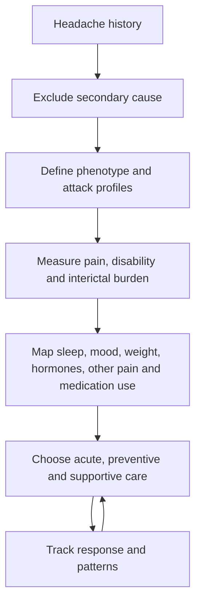

# Brian Grosberg

Brian Grosberg is a headache neurologist whose teaching framework treats headache as a pattern-recognition and burden-management problem: first exclude a secondary cause, then define the attack phenotype, time course, associated symptoms, disability, comorbidities, and medication exposure before choosing acute and preventive treatment. His distinctive emphasis is that the most useful diagnostic instrument is often a carefully kept headache diary rather than a scan or consumer wearable. (@PeterAttiaMD (Peter Attia MD) — "406 ‒ Migraine, cluster headache, and tension headache: symptoms, causes, prevention, and treatment", 2026-08-31, [link](https://www.youtube.com/watch?v=uiNEP8A34SE))

## Evidence stance and distinctive perspectives

Grosberg's contrarian correction to trigger culture is that not every patient has a food trigger and several small perturbations may combine: delayed weekend caffeine, shifted sleep, and release from weekday stress can jointly cross an attack threshold. He therefore prefers routine meals, hydration, sleep regularity, exercise, and a diary-guided test of suspected triggers over indiscriminate elimination. He also separates eligibility from access: many people warrant prevention but receive only repeated rescue care, while newer CGRP-targeting therapy and older preventives must be chosen around the individual rather than a single class hierarchy. (@PeterAttiaMD (Peter Attia MD) — "406 ‒ Migraine, cluster headache, and tension headache: symptoms, causes, prevention, and treatment", 2026-08-31, [link](https://www.youtube.com/watch?v=uiNEP8A34SE))

His most safety-critical distinctions are temporal: migraine aura usually evolves gradually and reversibly, whereas sudden maximal symptoms and first or changed neurological events require assessment; cluster headache escalates too quickly for slow oral rescue and often needs acute, transitional, and preventive plans simultaneously; and repeated acute-medication use can become a secondary headache driver. The clinical and guideline evidence for these positions is weighed at [[primary-headache-disorders]]. (@PeterAttiaMD (Peter Attia MD) — "406 ‒ Migraine, cluster headache, and tension headache: symptoms, causes, prevention, and treatment", 2026-08-31, [link](https://www.youtube.com/watch?v=uiNEP8A34SE))

## Practical implications

- Use Grosberg's material as specialist educational interpretation, not a diagnosis or individualized drug protocol. (@PeterAttiaMD (Peter Attia MD) — "406 ‒ Migraine, cluster headache, and tension headache: symptoms, causes, prevention, and treatment", 2026-08-31, [link](https://www.youtube.com/watch?v=uiNEP8A34SE))
- Bring a structured diary to care and describe onset speed, duration, laterality, associated symptoms, disability, medicines, and response rather than reporting pain intensity alone. (@PeterAttiaMD (Peter Attia MD) — "406 ‒ Migraine, cluster headache, and tension headache: symptoms, causes, prevention, and treatment", 2026-08-31, [link](https://www.youtube.com/watch?v=uiNEP8A34SE))
- Treat first, sudden, changed, systemic, neurological, exertional, positional, or pregnancy-related headache patterns as assessment problems before trigger-management problems. (@PeterAttiaMD (Peter Attia MD) — "406 ‒ Migraine, cluster headache, and tension headache: symptoms, causes, prevention, and treatment", 2026-08-31, [link](https://www.youtube.com/watch?v=uiNEP8A34SE))

## Gaps & open questions

- Which parts of his individualized sequencing outperform simpler guideline algorithms in comparative care studies?
- Which diary fields provide enough decision value to justify their collection burden?
- How generalizable are his observations from a highly selected specialty-clinic population?

## Related

[[primary-headache-disorders]] · [[peter-attia]] · [[sleep-quality-and-circadian-alignment]] · [[neuromodulators-and-state-control]]
