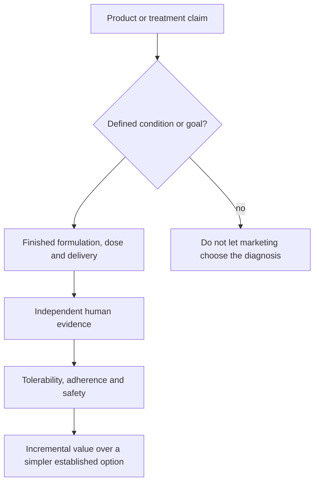

# Dr Dray

Dr Dray is a dermatologist and health educator whose recurring framework separates established dermatologic mechanisms and treatments from cosmetic marketing claims. Across product reviews and clinical Q&A, she emphasizes diagnosis before treatment, routine simplicity, tolerability and adherence, and skepticism toward prestige categories or mechanistic claims unsupported by finished-product or human evidence. (@DrDrayzday (Dr Dray) — "Costco Skincare: What’s Actually Worth Buying? | Dermatologist Shops", 2026-08-10, [link](https://www.youtube.com/watch?v=JukyC7WttqI)) (@DrDrayzday (Dr Dray) — "Is Sugar Really Bad for Your Skin? | Dermatologist Q&A", 2026-08-09, [link](https://www.youtube.com/watch?v=c0tYCBtxRO4)) (@DrDrayzday (Dr Dray) — "Copper Peptides, Hair Loss & Retinol Questions Answered", 2026-08-08, [link](https://www.youtube.com/watch?v=0sxHRZPDvss))

## Evidence stance and distinctive perspectives

Her distinctive position is that many consumer hierarchies—salon versus drugstore hair care, medical-grade versus ordinary skincare, eye cream versus moisturizer, or novel hero ingredient versus basic functional formulation—are commercial categories rather than evidence tiers. She similarly treats ingredient-combination anxiety as frequently overstated: most combinations can be tried according to texture if tolerated, while cumulative irritation and a few specific exceptions matter more than elaborate scheduling rules. (@DrDrayzday (Dr Dray) — "Costco Skincare: What’s Actually Worth Buying? | Dermatologist Shops", 2026-08-10, [link](https://www.youtube.com/watch?v=JukyC7WttqI)) (@DrDrayzday (Dr Dray) — "Copper Peptides, Hair Loss & Retinol Questions Answered", 2026-08-08, [link](https://www.youtube.com/watch?v=0sxHRZPDvss))

In nutrition, her minority framing resists classifying a modest amount of added sugar or ordinary whole-fruit intake as an isolated cause of skin disease. She places greater weight on dietary pattern, food matrix, fiber removal in juice, excessive packaged-food exposure, and clinically relevant glycemic load. This is directionally consistent with [[nutrition-evidence-and-personalization]], although some specific reassurance in the source is clinical opinion rather than a systematic evidence review. (@DrDrayzday (Dr Dray) — "Is Sugar Really Bad for Your Skin? | Dermatologist Q&A", 2026-08-09, [link](https://www.youtube.com/watch?v=c0tYCBtxRO4))

## Practical implications

- Use her material as expert educational interpretation, not individualized diagnosis or a substitute for treatment by a clinician.
- Apply her recurring filter whenever a product is considered: diagnosis, active, delivery, independent evidence, tolerability, adherence, and incremental value.
- Give higher confidence to established dermatologic mechanisms and standard therapies than to specific retail recommendations, unpublished manufacturer studies, or extrapolations from an ingredient to a finished product.

## Gaps & open questions

- Which recommendations in the source library rest on clinical guidelines or controlled trials versus practice experience and mechanistic inference?
- How often do product formulations change after a review, altering applicability?
- What conflicts of interest, sponsorship policies, or evidence-search methods should be recorded for source appraisal?

## Related

[[skin-barrier-and-moisturization]] · [[skincare-evidence-and-routine-design]] · [[hair-loss-diagnosis-and-scalp-health]] · [[topical-retinoids]] · [[photoprotection]] · [[procedural-skin-remodeling]] · [[nutrition-evidence-and-personalization]] · [[supplement-evidence-and-safety]]
