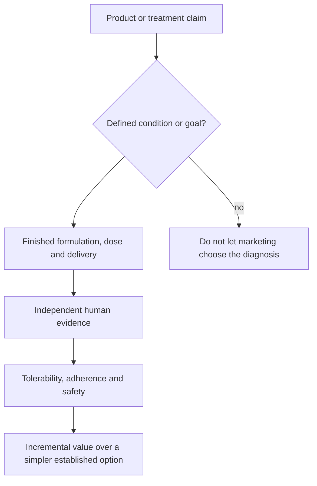

# Dr Dray

Dr Dray is a dermatologist and health educator whose recurring framework separates established dermatologic mechanisms and treatments from cosmetic marketing claims. Across product reviews and clinical Q&A, she emphasizes diagnosis before treatment, routine simplicity, tolerability and adherence, and skepticism toward prestige categories or mechanistic claims unsupported by finished-product or human evidence. (@DrDrayzday (Dr Dray) — "Costco Skincare: What’s Actually Worth Buying? | Dermatologist Shops", 2026-08-10, [link](https://www.youtube.com/watch?v=JukyC7WttqI)) (@DrDrayzday (Dr Dray) — "Is Sugar Really Bad for Your Skin? | Dermatologist Q&A", 2026-08-09, [link](https://www.youtube.com/watch?v=c0tYCBtxRO4)) (@DrDrayzday (Dr Dray) — "Copper Peptides, Hair Loss & Retinol Questions Answered", 2026-08-08, [link](https://www.youtube.com/watch?v=0sxHRZPDvss))

## Evidence stance and distinctive perspectives

```mermaid
flowchart TD
  CLAIM[Product or treatment claim] --> DX{Defined condition or goal?}
  DX --> FORM[Finished formulation, dose and delivery]
  FORM --> EVID[Independent human evidence]
  EVID --> TOL[Tolerability, adherence and safety]
  TOL --> VALUE[Incremental value over a simpler established option]
  DX -->|no| NO[Do not let marketing choose the diagnosis]
```

Her distinctive position is that many consumer hierarchies—salon versus drugstore hair care, medical-grade versus ordinary skincare, eye cream versus moisturizer, dollar-store versus prestige products, or novel hero ingredient versus basic functional formulation—are commercial categories rather than evidence tiers. She similarly treats ingredient-combination anxiety as frequently overstated: most combinations can be tried according to texture if tolerated, while cumulative irritation and a few specific exceptions matter more than elaborate scheduling rules. (@DrDrayzday (Dr Dray) — "Costco Skincare: What’s Actually Worth Buying? | Dermatologist Shops", 2026-08-10, [link](https://www.youtube.com/watch?v=JukyC7WttqI)) (@DrDrayzday (Dr Dray) — "Copper Peptides, Hair Loss & Retinol Questions Answered", 2026-08-08, [link](https://www.youtube.com/watch?v=0sxHRZPDvss)) (@DrDrayzday (Dr Dray) — "Dollar Tree Skincare: Dermatologist Reviews What's Worth Buying (2026)", 2026-08-07, [link](https://www.youtube.com/watch?v=sgKXoDJb4-o))

Her off-price-shopping extension is to avoid treating the retailer as the evidence unit: inventory can be displaced by packaging changes rather than age, yet the buyer still has to inspect the exact unit's date, seal, storage plausibility, and regulated labeling. Her clinical extension uses the same logic in reverse—do not let a familiar consumer story choose the diagnosis. Heavy cream is not an established cause of milia, unilateral darkening calls for a localized differential, and persistent scratching in [[lichen-simplex-chronicus]] is a neurocutaneous feedback loop rather than a failure of willpower. (@DrDrayzday (Dr Dray) — "TJ Maxx Skincare: Dermatologist Reviews What's Worth Buying", 2026-07-31, [link](https://www.youtube.com/watch?v=bkruuZQ_QTE)) (@DrDrayzday (Dr Dray) — "Are Copper Peptides Better Than Vitamin C? Dermatologist Explain", 2026-08-01, [link](https://www.youtube.com/watch?v=YuHLRmJMUzI)) (@DrDrayzday (Dr Dray) — "Why You Can't Stop Scratching That One Spot | Lichen Simplex Chronicus", 2026-07-30, [link](https://www.youtube.com/watch?v=NNXRXZEY4so))

Her retinoid and peptide reviews sharpen that hierarchy: conversion-step count, advertised percentage, ingredient-list plausibility, and a single user's experience cannot substitute for finished-formula comparative trials. She regards [[topical-copper-peptides|copper peptides]] as biologically plausible but optional, treats most vitamin C/peptide/retinoid incompatibility rules as unsubstantiated, and favors the simplest tolerated formulation that a person can use consistently. (@DrDrayzday (Dr Dray) — "Best Retinol & Retinal Products for 2026 | Dermatologist's Top 3", 2026-08-12, [link](https://www.youtube.com/watch?v=8rmIw-F7mNc)) (@DrDrayzday (Dr Dray) — "Do Copper Peptides Really Work? Dermatologist Reviews the Science", 2026-08-03, [link](https://www.youtube.com/watch?v=--tBqDNB-LY))

Her class-level peptide position completes that picture: peptides are a family of molecules, not one ingredient, so the question is always which peptide, for what, delivered how. She treats topical peptides as innocuous nice-to-haves whose observed benefits are most parsimoniously hydration, ranks Matrixyl, Matrixyl 3000, and Argireline as merely the most familiar rather than the best proven, and refuses to pay a premium for peptide-labeled products — while sunscreen and retinoid consistency remain the treatments she does not skip ([[topical-peptides]]). Her sharpest warning is reserved for the injectable-peptide wave: "anti-aging" injection claims are nonspecific by construction, the products lack clinical guidelines, evidence, and quality control, and only doctor-prescribed, supervised peptide medications clear her safety bar. (@DrDrayzday (Dr Dray) — "Peptides for Skin: Which Ones Actually Work? Dermatologist Explains", 2026-08-20, [link](https://www.youtube.com/watch?v=bQvrFrhUets))

She applies the same route-and-endpoint test to topical PDRN: cell, animal, injected, and wound-healing findings cannot establish a cosmetic eye-cream effect without barrier delivery and finished-product human outcomes. Her contrarian verdict is that PDRN is currently a marketing gimmick, while the reviewed eye cream can still be a competent moisturizer because caffeine, niacinamide, humectants, and film formers have more direct functions. She also treats eye cream as optional—ordinary tolerated moisturizer can hydrate eyelids—and frames roughly a rice-grain amount per eye as a product-sparing application heuristic rather than a therapeutic dose. [[topical-pdrn-and-centella]] (@DrDrayzday (Dr Dray) — "PDRN Skincare: Is It Worth the Hype? A Dermatologist Explains", 2026-08-24, [link](https://www.youtube.com/watch?v=bktMjB3Ke2o))

Her vitamin C position applies the same must-have skepticism to one of skincare's most entrenched hero ingredients: mechanism and modest trial evidence make ascorbic acid a legitimate option, but a seven-trial, 139-participant systematic-review base, absent head-to-head comparisons with retinoids or hydroquinone, enforced sunscreen use inside the supporting trials, unverifiable derivative delivery, irritation risk (especially for deeper skin tones fighting hyperpigmentation), and high price mean nobody needs one — she does not use it herself, preferring niacinamide, and ranks sunscreen then retinoids as the evidence-based core. [[topical-vitamin-c]] (@DrDrayzday (Dr Dray) — "Do You Actually Need Vitamin C Serum? A Dermatologist Explains", 2026-08-17, [link](https://www.youtube.com/watch?v=WQrwaOFMEzc))

For photoprotection, she rejects both price and mineral-versus-chemical identity as adequate proxies for performance. Her distinctive position is that people with lupus need layered, high-UVA protection but may be disadvantaged by assuming mineral filters are categorically superior; she also separates measurable bloodstream absorption of organic filters from demonstrated endocrine harm. (@DrDrayzday (Dr Dray) — "Are Chemical Sunscreens Really Safe? Dermatologist Explains", 2026-08-02, [link](https://www.youtube.com/watch?v=BVnGrOMfeRM))

In hair loss, she rejects DHT blocker as a universal product category: DHT-directed therapy fits diagnosed androgenetic alopecia, not immune, traction, shedding, or scarring disorders. She ranks finasteride and dutasteride above pumpkin-seed oil, saw palmetto, horsetail, and green-tea extract on human evidence, while emphasizing that supplements remain pharmacologically active, poorly standardized, and capable of harm. (@DrDrayzday (Dr Dray) — "DHT Blockers for Hair Loss: What Actually Works? | Dermatologist Explains", 2026-08-11, [link](https://www.youtube.com/watch?v=lOaole90oSI))

Her GLP-1 hair-loss framing is explicitly multifactorial: rapid weight loss and reduced nutritional intake remain the leading explanation, dermal white adipose tissue is a research hypothesis rather than a settled drug-specific mechanism, and an acute shed may unmask concurrent androgenetic alopecia. She advises preserving the drug's established metabolic benefits while reviewing dose, weight-loss pace, nutrition, and diagnosis with the prescriber instead of reflexively stopping treatment or buying a newly marketed serum or device. (@DrDrayzday (Dr Dray) — "Does Ozempic Cause Hair Loss? New Research Explained", 2026-08-04, [link](https://www.youtube.com/watch?v=0VW43kd63zM))

She applies the same compartment-first reasoning to post-weight-loss laxity: topicals may hydrate or modestly support dermal collagen, but cannot replace facial fat or remove redundant skin. Her distinctive skepticism is strongest for topical growth factors and exosomes, which she regards as expensive moisturizers until penetration, target engagement, safe dosing, and independently reproducible advantage are demonstrated. (@DrDrayzday (Dr Dray) — "Can Skincare Fix Ozempic Face? Dermatologist Explains", 2026-07-29, [link](https://www.youtube.com/watch?v=zURv_nMTUc0))

For aging dorsal-hand skin, she orders interventions by causal leverage and burden: repeated UV protection and moisturization precede retinoids and optional procedures, while PDRN, topical growth factors, exosomes, and expensive creams are not accepted as substitutes for evidence of delivery and human effect. Her contrarian commercial perspective is that people with visible aging or medication-associated shedding form a marketing-vulnerable group, so spending should follow diagnosis and evidence rather than a newly manufactured product category. (@DrDrayzday (Dr Dray) — "Why Do My Hands Bruise So Easily? Dermatologist Explains", 2026-08-06, [link](https://www.youtube.com/watch?v=0o0bMXOL-Lo)) (@DrDrayzday (Dr Dray) — "Does Ozempic Cause Hair Loss? New Research Explained", 2026-08-04, [link](https://www.youtube.com/watch?v=0VW43kd63zM))

Her retinoid-market position extends the anti-category stance to vocabulary itself: serum is a marketing word with no defining rules, so a moisturizer carrying an active is as effective as a serum carrying it; HPR marketed as retinol-equivalent misleads consumers because retinol esters typically do not perform like retinol; and her contrarian case for over-the-counter adapalene rests on drug-grade formula standardization — a non-response then reflects the ingredient, not an opaque cosmetic formula. She is also willing to rank against reputation on irritation: cosmetic retinols are not reliably gentler than adapalene, and trifarotene's receptor-specificity marketing did not bear out in practice. (@DrDrayzday (Dr Dray) — "Can Adapalene Really Prevent Wrinkles? Dermatologist Q&A", 2026-08-15, [link](https://www.youtube.com/watch?v=l30kQh-VdwI)) (@DrDrayzday (Dr Dray) — "Can You Mix Azelaic Acid With Anything? Dermatologist Q&A", 2026-08-16, [link](https://www.youtube.com/watch?v=oyQl5MU3pRQ))

Her debunking runs in both directions rather than defaulting to skepticism. Against overclaiming, she rejects "dual retinoid" and vitamin C-derivative marketing (cell-culture support only — her plastic-lemon analogy for derivatives standing in for ascorbic acid), calls the Volufiline volume-restoration study bogus, and attributes retinoid-blamed facial fat loss to ordinary aging ("guilty by association"). Against viral underclaiming, she rejects the conclusion that a pH change made a reformulated azelaic-acid serum ineffective — free-acid value is not an established efficacy determinant for a surface-acting ingredient, an ingredient-specific analysis in which she aligns with [[michelle-wong]]'s chemistry ([[azelaic-acid]]) — and corrects a fellow dermatologist's claim that blue-light acne devices have no evidence, citing systematic-review support while bounding it below standard-of-care drugs ([[home-skin-photobiomodulation]]). The shared method: the claim's evidence is examined at the level of the specific ingredient, mechanism, and endpoint, whichever direction the verdict falls. (@DrDrayzday (Dr Dray) — "Anua Azelaic Acid REFORMULATED? Controversy Explained | Derm Q&A", 2026-08-22, [link](https://www.youtube.com/watch?v=1b7nGYAIktw)) (@DrDrayzday (Dr Dray) — "Can Adapalene Cause Facial Fat Loss? Dermatologist Q&A", 2026-08-23, [link](https://www.youtube.com/watch?v=DprHVOUpvaM))

Her hyperpigmentation framing extends diagnosis-first reasoning into disease chronology: the "post" in post-inflammatory hyperpigmentation is treated as a misnomer, because biopsy and objective measurement can find active inflammation beneath lesions that look like plain dark spots — especially in melanin-rich skin, where inflammation may read purple, gray, brown, or nothing at all rather than red. The practice consequences are her recurring themes applied to pigment: continue disease-directed maintenance after visible clearance, keep the routine simple because product-stacking irritation drives the pigment it is meant to fade, avoid picking and at-home microneedling or IPL, and treat iron-oxide tinted sunscreen as part of therapy because visible light drives pigmentation. [[hyperpigmentation-and-dark-spots]] (@DrDrayzday (Dr Dray) — "Why Your Hyperpigmentation Won’t Go Away | Dermatologist Explains", 2026-08-13, [link](https://www.youtube.com/watch?v=DYqU1VIR3pw))

In genital health she applies the same anti-marketing, diagnosis-first pattern to yeast infections: the vagina maintains its own hygiene, feminine-hygiene products and douching cause the problems they claim to prevent, diet is not the driving force outside poorly controlled diabetes, Candida elimination diets are both illogical and risky, and probiotics or yogurt lack compelling clinical evidence for prevention. Her destigmatizing frame — recurrent infections are not a hygiene failure and can occur with everything done right — pairs with a hard boundary on self-treatment beyond three infections a year. [[vulvovaginal-candidiasis]] (@DrDrayzday (Dr Dray) — "How to Prevent Yeast Infections | Dermatologist Explains", 2026-08-14, [link](https://www.youtube.com/watch?v=vexU74uqAT0))

In nutrition, her minority framing resists classifying a modest amount of added sugar or ordinary whole-fruit intake as an isolated cause of skin disease. She places greater weight on dietary pattern, food matrix, fiber removal in juice, excessive packaged-food exposure, and clinically relevant glycemic load. This is directionally consistent with [[nutrition-evidence-and-personalization]], although some specific reassurance in the source is clinical opinion rather than a systematic evidence review. (@DrDrayzday (Dr Dray) — "Is Sugar Really Bad for Your Skin? | Dermatologist Q&A", 2026-08-09, [link](https://www.youtube.com/watch?v=c0tYCBtxRO4))

Her gut–skin position preserves the same hierarchy: fiber fermentation and short-chain fatty acids make a plausible immune and barrier pathway, but animal results and microbiome differences do not show that fiber treats eczema or psoriasis. She also objects to the vague Mediterranean label and predicts that food-industry health halos will detach the name from the intact-food pattern; the practical unit is the food and substitution, not the label. [[fiber-gut-skin-axis]] (@DrDrayzday (Dr Dray) — "Can Eating More Fiber Improve Your Skin? | Dermatologist Explains", 2026-08-27, [link](https://www.youtube.com/watch?v=FzrowYqQnnE))

Her metabolic-dermatology position extends the whole-patient frame beyond product evaluation: adipose tissue is an inflammatory organ, so obesity in psoriasis and hidradenitis suppurativa is a treatment target rather than a coexisting finding, and she treats the GLP-1 combination evidence as a reason dermatologists cannot only treat the skin surface — while bounding it firmly (not a stand-alone skin treatment, strongest rationale where a metabolic indication already exists, start-low-and-go-slow dosing, and explicit wariness of high-dose direct-to-consumer compounding). She also pushes back on the drugs-are-a-band-aid framing: lifestyle remains the cornerstone, but a possible weight-independent anti-inflammatory benefit means the drugs should not be dismissed as mere weight-loss shortcuts. [[glp-1-receptor-agonists]] [[psoriasis-and-systemic-inflammation]] [[hidradenitis-suppurativa]] (@DrDrayzday (Dr Dray) — "Can Ozempic & Wegovy Improve Your Skin? Skin Benefits of GLP-1s", 2026-08-28, [link](https://www.youtube.com/watch?v=vESsyr2i6iA))

Her diet-and-skin teaching applies pattern-over-macronutrient logic with two distinctive emphases: dietary sodium as an overlooked skin-specific inflammatory input (skin sodium storage, IL-17 activation, barrier disruption), and structured skepticism of online cure testimonies — her recurring question is whether the person ever had the disease, given provisional diagnoses, transiently positive autoimmune markers, and spontaneously remitting states. She opposes unsupervised elimination diets even in diseases with small elimination-study signals, and reads the low-fat era as a standing warning against centering advice on any single macronutrient. [[diet-and-inflammatory-skin-disease]] (@DrDrayzday (Dr Dray) — "Your Diet Could Be Making Your Skin Inflammation Worse", 2026-08-25, [link](https://www.youtube.com/watch?v=kwdfMqF6SSk))

Her Q&A method grounds even over-the-counter recommendations in study-level evidence: her AmLactin 12% recommendation rests on two human histology studies (12% versus 5% facial lactic acid; ammonium lactate preventing clobetasol-induced dermal atrophy), and she declines to extend the same dermal claim to heterogeneous home-strength glycolic products while conceding in-office glycolic peels are superior. The same appetite for bounded verdicts shows in her procedure counseling — validating post-inflammatory-hyperpigmentation fears in Fitzpatrick IV, pushing patients to make providers quantify their own complication rates — and in her deflation of fluorescent-light aging worries by dose comparison with the sun. [[skin-barrier-and-moisturization]] [[procedural-skin-remodeling]] [[keratosis-pilaris]] (@DrDrayzday (Dr Dray) — "Dermatologist Answers Your Skincare Questions | AmLactin, Fraxel, Sunscreen & KP", 2026-08-29, [link](https://www.youtube.com/watch?v=YIQdXvlvmgA)) Her fuller AHA comparison turns the AmLactin question into a lesson in exposure logic: "what's better, this or that" is an oversimplification until concentration, formulation, pH, delivery vehicle, contact time, and setting are specified. Her verdict is deliberately setting-split — in-office glycolic peels beat everything at home, while among safe home products 12% buffered ammonium lactate uniquely carries dermal-thickness evidence that buffered home glycolic cannot match at any labeled percentage — and she explicitly rejects ranking ingredients as an Olympics with medals, since tolerance and individual response legitimately drive selection. [[alpha-hydroxy-acids]] (@DrDrayzday (Dr Dray) — "Amlactin vs. Glycolic Acid: Which Is Better for Anti-Aging?", 2026-08-31, [link](https://www.youtube.com/watch?v=pnlFKtIQSNE))

Her PRP/PRF position is the finished-product rule applied to a treatment made from the patient's own blood: because PRP is not a standardized product — centrifugation steps, leukocyte content, platelet dose, activation, and donor biology all vary — trial evidence cannot be transferred to a given clinic's protocol, so her consumer script demands the protocol-level question (what exactly is injected, how prepared, how many sessions, what evidence for this specific preparation, what happens on non-response). She accepts the meta-analytic randomized signal for PRP in androgenetic alopecia while refusing both the miracle framing and the PRF-as-next-generation upgrade, whose sustained-release fibrin-scaffold rationale she treats as biologically plausible but unproven; her verdict on the field is that "the marketing has gotten way ahead of the science," and her positioning is adjunct-after-diagnosis, never a replacement for minoxidil, finasteride, dutasteride, or spironolactone. [[platelet-rich-plasma-and-fibrin]] (@DrDrayzday (Dr Dray) — "PRP vs PRF: Which Is Better for Hair Loss & Skin Rejuvenation?", 2026-09-01, [link](https://www.youtube.com/watch?v=pa0XPk2UuHA))

Her exfoliation teaching refuses the universal schedule the internet demands and adds a distinctive accounting move: count the exfoliation already hidden in a routine — shaving, washcloths, shower water, cleansing — before adding a labeled exfoliant, because over-exfoliation usually comes from unrecognized stacking rather than any single aggressive product. She reads flakiness as failed water-dependent desquamation calling for moisturizer rather than acid, reframes the exfoliate-after-forty rule as moisturizer-first with AHAs optional, and polices both directions of dogma — no extra credit for daily exfoliation, none for prohibiting it. [[exfoliation-and-desquamation]] (@DrDrayzday (Dr Dray) — "How Often Should You Really Exfoliate Your Skin?", 2026-09-02, [link](https://www.youtube.com/watch?v=bLDs-KM0F1o))

Her systemic-sign teaching treats visible morphology as a trigger for diagnosis rather than a cosmetic target. Acanthosis, xanthomas, jaundice, clubbing, dermatomyositis patterns, koilonychia, and generalized itch can narrow a differential but do not diagnose the underlying disease; new or consequential findings require targeted clinical assessment rather than scrubbing, removal, self-treatment, or shotgun testing. [[cutaneous-signs-of-systemic-disease]] (@DrDrayzday (Dr Dray) — "7 Skin Signs That Could Reveal a Health Problem | Dermatologist Explains", 2026-08-26, [link](https://www.youtube.com/watch?v=QKDlc1r8fQk))

Her photosensitivity, hair, and collagen Q&A applies the same compartment rule three ways: photosensitivity requires diagnosis before selecting a systemic or light-based treatment; anti-fibrotic effects in scarred heart tissue do not imply loss of healthy dermal collagen from spironolactone or minoxidil; and sebaceous output is not trained upward by shampooing, so a scalp that becomes greasy daily can be shampooed daily. She also extends the finished-formula rule to mixing two shades of the same sunscreen and to topical growth factors: shared branding does not validate the mixed film, while cell-culture signaling does not establish intact-skin delivery or a worthwhile finished-product effect. [[photoprotection]] [[hair-loss-diagnosis-and-scalp-health]] [[topical-visible-aging-interventions]] (@DrDrayzday (Dr Dray) — "Does Spironolactone Age Your Skin? The Truth About Collagen", 2026-08-30, [link](https://www.youtube.com/watch?v=q9Vvl_SJVNA))

## Practical implications

- Use her material as expert educational interpretation, not individualized diagnosis or a substitute for treatment by a clinician.
- Apply her recurring filter whenever a product is considered: diagnosis, active, delivery, independent evidence, tolerability, adherence, and incremental value.
- Give higher confidence to established dermatologic mechanisms and standard therapies than to specific retail recommendations, unpublished manufacturer studies, or extrapolations from an ingredient to a finished product.

## Gaps & open questions

- Which recommendations in the source library rest on clinical guidelines or controlled trials versus practice experience and mechanistic inference?
- How often do product formulations change after a review, altering applicability?
- What conflicts of interest, sponsorship policies, or evidence-search methods should be recorded for source appraisal?

## Related

[[skin-barrier-and-moisturization]] · [[skincare-evidence-and-routine-design]] · [[exfoliation-and-desquamation]] · [[fiber-gut-skin-axis]] · [[diet-and-inflammatory-skin-disease]] · [[hidradenitis-suppurativa]] · [[psoriasis-and-systemic-inflammation]] · [[keratosis-pilaris]] · [[cutaneous-signs-of-systemic-disease]] · [[vulvovaginal-candidiasis]] · [[seborrheic-dermatitis]] · [[post-weight-loss-skin-laxity]] · [[topical-visible-aging-interventions]] · [[topical-copper-peptides]] · [[topical-peptides]] · [[experimental-peptides]] · [[hair-loss-diagnosis-and-scalp-health]] · [[platelet-rich-plasma-and-fibrin]] · [[lichen-simplex-chronicus]] · [[hyperpigmentation-and-dark-spots]] · [[scars-and-dermal-remodeling]] · [[post-surgical-neuropathic-pain-and-phantom-sensation]] · [[actinic-purpura-and-aging-skin-fragility]] · [[alpha-hydroxy-acids]] · [[ebola-virus-disease-and-skin-signs]] · [[glp-1-receptor-agonists]] · [[topical-retinoids]] · [[topical-vitamin-c]] · [[azelaic-acid]] · [[cellulite]] · [[sweating-and-antiperspirants]] · [[home-skin-photobiomodulation]] · [[michelle-wong]] · [[photoprotection]] · [[procedural-skin-remodeling]] · [[nutrition-evidence-and-personalization]] · [[supplement-evidence-and-safety]]
