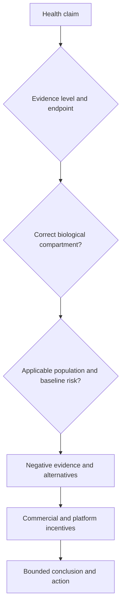

# Gil Carvalho

Gil Carvalho is a physician and science communicator whose recurring method audits nutrition and health claims at the level of study design, biological compartment, outcome, and applicable population. He is particularly attentive to how commercial media convert novelty and fear into attention, then convert attention into affiliate sales. (@NutritionMadeSimple (Nutrition Made Simple!) — "Diary of a CEO Spreads Dangerous Health Misinformation. And They Know It.", 2026-08-28, [link](https://www.youtube.com/watch?v=C2bFpays_ik))

## Evidence stance and distinctive perspectives

Carvalho's distinctive criticism is not merely that a large podcast aired inaccurate claims. He points to a mismatch between accurate producer-authored evidence notes and contradictory high-reach spoken claims, clips, and sales links as evidence of a governance failure: fact-checking that does not reach the same audience or constrain publication cannot carry the epistemic burden assigned to it. His proposed remedy is open platforming with friction—let unconventional guests explain their theory, then confront the strongest counterevidence during the conversation, using an independent specialist or pre-publication research when the host lacks domain expertise. This position and its evidentiary limits are developed at [[health-misinformation-and-media-incentives]]. (@NutritionMadeSimple (Nutrition Made Simple!) — "Diary of a CEO Spreads Dangerous Health Misinformation. And They Know It.", 2026-08-28, [link](https://www.youtube.com/watch?v=C2bFpays_ik))

His technical corrections repeatedly use category boundaries: ketone bodies in circulation do not replace every colonic effect of fiber fermentation; a normal post-meal glucose rise is not itself disease; tumor fuel use is heterogeneous and preclinical metabolic findings do not establish universal cancer treatment; and the effect of a preventive drug depends on baseline risk and decision-relevant outcomes rather than a decontextualized average. These are useful appraisal examples, but Carvalho's account remains a secondary source whose cited studies must be checked directly before quantitative claims become current. (@NutritionMadeSimple (Nutrition Made Simple!) — "Diary of a CEO Spreads Dangerous Health Misinformation. And They Know It.", 2026-08-28, [link](https://www.youtube.com/watch?v=C2bFpays_ik))

## Practical implications

- Use Carvalho's videos as claim maps and methodological critiques, then open the underlying guideline, review, or trial before changing practice. (@NutritionMadeSimple (Nutrition Made Simple!) — "Diary of a CEO Spreads Dangerous Health Misinformation. And They Know It.", 2026-08-28, [link](https://www.youtube.com/watch?v=C2bFpays_ik))
- When a health claim sells a product, audit whether the problem was defined in a way that turns normal physiology or ordinary uncertainty into a customer-acquisition funnel. (@NutritionMadeSimple (Nutrition Made Simple!) — "Diary of a CEO Spreads Dangerous Health Misinformation. And They Know It.", 2026-08-28, [link](https://www.youtube.com/watch?v=C2bFpays_ik))
- Preserve correct minority positions by testing evidence and predictions rather than using popularity or contrarian style as a truth criterion. (@NutritionMadeSimple (Nutrition Made Simple!) — "Diary of a CEO Spreads Dangerous Health Misinformation. And They Know It.", 2026-08-28, [link](https://www.youtube.com/watch?v=C2bFpays_ik))

## Gaps & open questions

- How consistently do the sources selected in his critiques entail the quantitative and causal conclusions presented?
- Which of his content-selection, sponsorship, and correction practices are documented well enough to compare with the outlets he critiques?
- How effective is adversarial but civil on-air fact-checking at changing durable belief and health behavior?

## Related

[[health-misinformation-and-media-incentives]] · [[supplement-evidence-and-safety]] · [[nutrition-evidence-and-personalization]] · [[dietary-fiber]] · [[free-sugars-and-glycemic-response]] · [[replication-and-research-incentives]]
