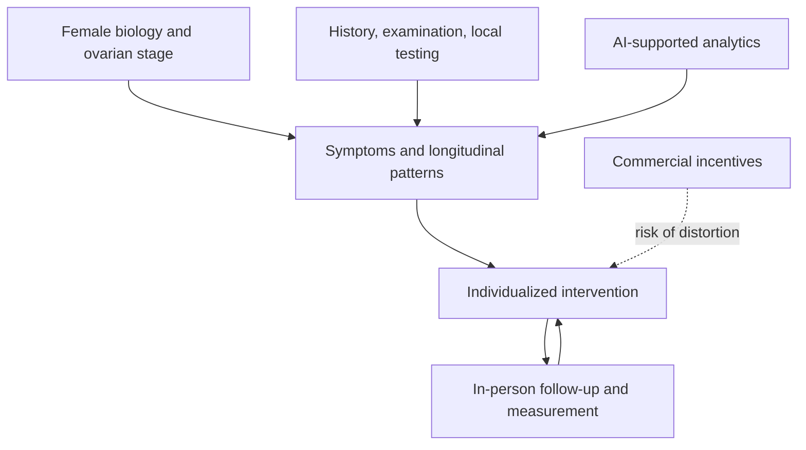

# Jennifer Pearlman

Jennifer Pearlman is a Canadian physician and menopause practitioner whose Femspan framework treats ovarian aging as a major midlife transition linking symptoms, chronic-disease risk, and later healthspan. Her model combines female-specific biology, lifestyle and metabolic risk management, individualized hormone therapy, longitudinal pattern recognition, and selective advanced diagnostics. (@matt.kaeberlein (Healthspan Medicine) — "The Best Women’s Health Tips on the Planet with Dr. Jennifer Pearlman", 2026-03-20, [link](https://www.youtube.com/watch?v=b_LAI4oG0_w))

## Clinical framework

Pearlman emphasizes that women are not scaled-down men: ovarian hormone loss is relatively abrupt, symptoms extend beyond hot flashes, and conventional research and diagnostic pathways can miss female-specific presentations. She favors transdermal estradiol, adequate individualized progesterone when the uterus is present, cautious female-range testosterone for selected sexual-function indications, and gradual adjustment with close follow-up. These are her clinical positions; several preventive and regenerative extensions remain incompletely tested. (@matt.kaeberlein (Healthspan Medicine) — "The Best Women’s Health Tips on the Planet with Dr. Jennifer Pearlman", 2026-03-20, [link](https://www.youtube.com/watch?v=b_LAI4oG0_w))

Her distinctive historical position is that the post-WHI era created “dark decades” in menopause care: prescribing collapsed, trainees stopped learning the field, and a formulation-specific result hardened into category-wide avoidance. She attributes the absence of a micronized-progesterone comparison partly to withdrawn commercial funding and calls for independent funding of neglected women’s-health questions. This is an attributed account, not independent proof of the funding decision or of the outcomes the omitted comparison would have shown. [[whi-and-menopause-hormone-therapy]] (@matt.kaeberlein (Healthspan Medicine) — "The Study That Derailed Women's Health And What We're Doing About It (with Dr. Jennifer Pearlman)", 2026-03-08, [link](https://www.youtube.com/watch?v=lQREELkPSIo))

Her distinctive health-system position is hybrid rather than fully virtual medicine: automation and AI can organize complex data and spread scarce expertise, but physical examination, local diagnostics, human relationship, and clinician accountability remain necessary. She warns that investor-owned care at scale can disintermediate the physician's duty to the patient, a risk she calls commercial creep. (@matt.kaeberlein (Healthspan Medicine) — "The Best Women’s Health Tips on the Planet with Dr. Jennifer Pearlman", 2026-03-20, [link](https://www.youtube.com/watch?v=b_LAI4oG0_w))

Pearlman's most speculative interests are elective ovarian-tissue banking and serial transplantation to postpone menopause, endometrial stem-cell applications, and AI-timed regenerative care. She explicitly states that long-term data are absent and that she is not referring patients for menopause reversal; these ideas should be retained as research hypotheses rather than blended into her current clinical protocol. (@matt.kaeberlein (Healthspan Medicine) — "The Best Women’s Health Tips on the Planet with Dr. Jennifer Pearlman", 2026-03-20, [link](https://www.youtube.com/watch?v=b_LAI4oG0_w))

## Practical implications

Pearlman's work is most useful as a prompt to assess menopause symptoms and long-term risks together, distinguish hormone formulations and routes, and preserve clinician judgment when adding AI or remote care. It does not establish elective ovarian surgery, whole-body imaging, AI coronary imaging, or broad hormone optimization as universal longevity care. (@matt.kaeberlein (Healthspan Medicine) — "The Best Women’s Health Tips on the Planet with Dr. Jennifer Pearlman", 2026-03-20, [link](https://www.youtube.com/watch?v=b_LAI4oG0_w))

## Gaps & open questions

- Which Femspan components improve validated outcomes beyond high-quality menopause and preventive care?
- Can hybrid AI-supported practice expand access without amplifying overtesting or commercial incentives?
- Which claims about female-specific microvascular disease and advanced imaging translate into better outcomes through actionable testing pathways?
- Can proposed ovarian and endometrial regenerative interventions be tested with adequate long-term safety follow-up?

## Related

[[menopause-hormone-therapy]] · [[whi-and-menopause-hormone-therapy]] · [[perimenopause-assessment-and-testing]] · [[ovarian-aging-and-tissue-cryopreservation]] · [[womens-exercise-across-the-lifespan]] · [[proactive-health-monitoring]] · [[aging-model]]
