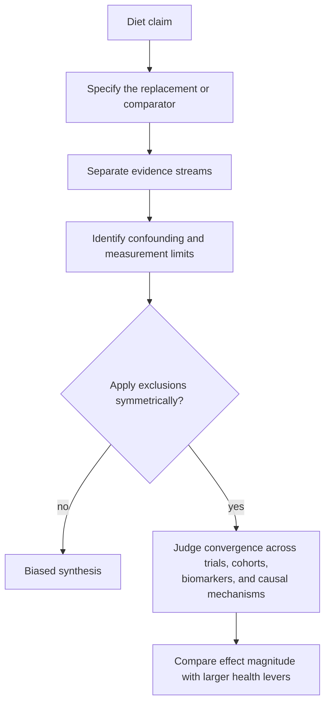

# Layne Norton

Layne Norton is a nutrition researcher and evidence communicator whose distinctive contribution in the current corpus is an explicit framework for adjudicating contested diet evidence. He treats foods as substitutions rather than isolated exposures, asks whether apparently contradictory trials differ through identifiable confounders, and requires logical symmetry: a confounder cannot be accepted when it supports one's preferred conclusion and rejected when it does not. (@PeterAttiaMD (Peter Attia MD) — "380 ‒ The seed oil debate: are they uniquely harmful relative to other dietary fats?", 2026-01-19, [link](https://www.youtube.com/watch?v=iB49uq-t1UM))

In the seed-oil debate, Norton concludes that ordinary seed-oil intake is not uniquely harmful relative to saturated fat: trans-fat contamination explains much of the adverse signal in older substitution trials, while feeding, cohort, tissue-biomarker, and genetic evidence converge toward benefit from lowering LDL/ApoB through polyunsaturated-fat substitution. His narrower position on frying is more cautious: repeatedly heated oil plausibly accumulates harmful oxidation products, but lard introduces a competing saturated-fat pathway and no human outcome trial resolves the comparison. [[seed-oils]] [[dietary-fat-quality-and-cardiovascular-risk]] (@PeterAttiaMD (Peter Attia MD) — "380 ‒ The seed oil debate: are they uniquely harmful relative to other dietary fats?", 2026-01-19, [link](https://www.youtube.com/watch?v=iB49uq-t1UM)) (@PeterAttiaMD (Peter Attia MD) — "Cooking with Lard vs Seed Oils | Layne Norton, Ph.D.", 2026-01-21, [link](https://www.youtube.com/watch?v=7_cbaDXAWYM))

## Practical implications

- Use Norton's material as evidence synthesis rather than clinical guidance; inspect the underlying comparator, confounders, effect size, and endpoint before adopting a conclusion. (@PeterAttiaMD (Peter Attia MD) — "380 ‒ The seed oil debate: are they uniquely harmful relative to other dietary fats?", 2026-01-19, [link](https://www.youtube.com/watch?v=iB49uq-t1UM))
- His prioritization of obesity, activity, and fitness above cooking-fat disputes is a magnitude judgment grounded in non-comparable hazard estimates, not a direct randomized ranking. (@PeterAttiaMD (Peter Attia MD) — "Cooking with Lard vs Seed Oils | Layne Norton, Ph.D.", 2026-01-21, [link](https://www.youtube.com/watch?v=7_cbaDXAWYM))

## Gaps & open questions

- How often does convergence across indirect evidence correctly predict the result of a later long-duration nutrition trial?
- Which claims in this corpus reflect Norton's research expertise versus broader expert interpretation outside his own studies?

## Related

[[seed-oils]] · [[dietary-fat-quality-and-cardiovascular-risk]] · [[lipoprotein-retention-and-atherogenesis]] · [[nutrition-evidence-and-personalization]] · [[energy-balance-and-calorie-counting]] · [[peter-attia]]
