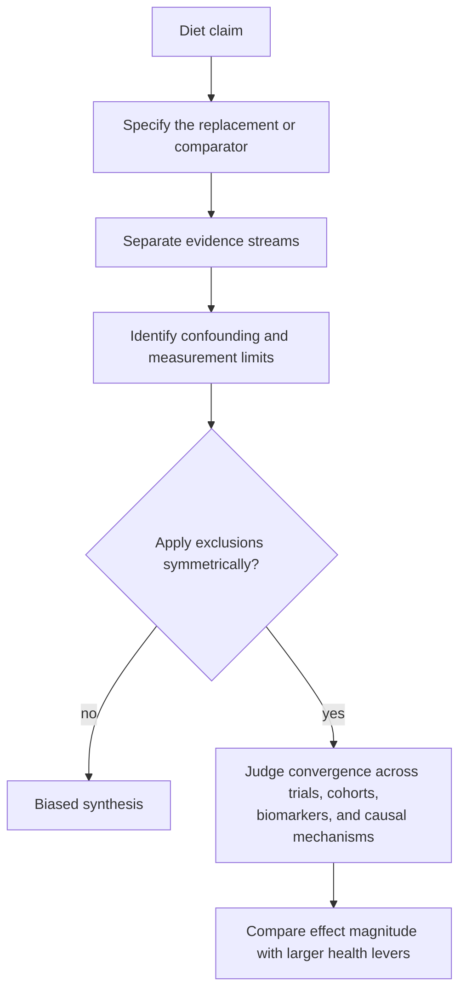

# Layne Norton

Layne Norton is a nutrition researcher and evidence communicator whose distinctive contribution in the current corpus is an explicit framework for adjudicating contested diet evidence. He treats foods as substitutions rather than isolated exposures, asks whether apparently contradictory trials differ through identifiable confounders, and requires logical symmetry: a confounder cannot be accepted when it supports one's preferred conclusion and rejected when it does not. (@PeterAttiaMD (Peter Attia MD) — "380 ‒ The seed oil debate: are they uniquely harmful relative to other dietary fats?", 2026-01-19, [link](https://www.youtube.com/watch?v=iB49uq-t1UM))

```mermaid
flowchart TD
  CLAIM[Diet claim] --> COMP[Specify the replacement or comparator]
  COMP --> STREAMS[Separate evidence streams]
  STREAMS --> CONF[Identify confounding and measurement limits]
  CONF --> SYM{Apply exclusions symmetrically?}
  SYM -->|no| BIAS[Biased synthesis]
  SYM -->|yes| CONV[Judge convergence across trials, cohorts,<br/>biomarkers, and causal mechanisms]
  CONV --> MAG[Compare effect magnitude with larger health levers]
```

In the seed-oil debate, Norton concludes that ordinary seed-oil intake is not uniquely harmful relative to saturated fat: trans-fat contamination explains much of the adverse signal in older substitution trials, while feeding, cohort, tissue-biomarker, and genetic evidence converge toward benefit from lowering LDL/ApoB through polyunsaturated-fat substitution. His narrower position on frying is more cautious: repeatedly heated oil plausibly accumulates harmful oxidation products, but lard introduces a competing saturated-fat pathway and no human outcome trial resolves the comparison. [[seed-oils]] [[dietary-fat-quality-and-cardiovascular-risk]] (@PeterAttiaMD (Peter Attia MD) — "380 ‒ The seed oil debate: are they uniquely harmful relative to other dietary fats?", 2026-01-19, [link](https://www.youtube.com/watch?v=iB49uq-t1UM)) (@PeterAttiaMD (Peter Attia MD) — "Cooking with Lard vs Seed Oils | Layne Norton, Ph.D.", 2026-01-21, [link](https://www.youtube.com/watch?v=7_cbaDXAWYM))

The same adjudication method extends to consumer claims. Against fitness-influencer sweetener rankings, he starts from the chemistry the claim ignores — sucrose is half glucose, half fructose, so orange juice, honey, and maple syrup carry nearly identical fructose per 100 kcal — before reaching the evidence tier, where isocaloric substitution trials show no unique fructose harm and the alarming effects come from unattainable animal doses ([[free-sugars-and-glycemic-response]]). (@biolayne1 (Dr. Layne Norton) — "This Might Be the Dumbest Thing I've Ever Seen | What the Fitness | Biolayne", 2026-08-28, [link](https://www.youtube.com/watch?v=qLYqQPVnuUA)) Against wearable calorie counts, he applies a conservation-first triage: when a dieter reports a deficit without weight loss, the instrument (typically the smartwatch, with validated errors from −30% to +116% by exercise mode) is the likelier failure than thermodynamics, and expenditure should be inferred from the multi-week intake-and-weight trend instead ([[energy-balance-and-calorie-counting]]). (@biolayne1 (Dr. Layne Norton) — "How Accurate is the Calorie Burn on Your Smartwatch? | Educational Video | Biolayne", 2026-09-02, [link](https://www.youtube.com/watch?v=qC9zqm0Y8ik))

His signature contrarian position in longevity discourse is deflationary: fiber, not any marketed biohack, is the intervention with real mortality evidence. He sets fiber's convergent outcome literature — an umbrella review of over 17 million subjects, plus a 2026 diabetes cohort with a ~53% lower adjusted relative mortality risk at moderate versus low intake — against cold plunges, red-light therapy, and grounding mats, which lack comparable data ([[dietary-fiber]]). (@biolayne1 (Dr. Layne Norton) — "The Biohack That Reduces Mortality Risk by 50% | Educational Video | Biolayne", 2026-08-26, [link](https://www.youtube.com/watch?v=gHJ7vzU4iQc))

On continuous glucose monitoring, Norton draws the intervention boundary at baseline metabolic risk: he treats CGM as potentially useful for prediabetes but as an unnecessary expense for healthy normoglycemic users, because an isolated post-meal excursion is normal physiology rather than evidence of future harm. A [2026 systematic review](https://pubmed.ncbi.nlm.nih.gov/41588451/) supports the subgroup direction and absence of appreciable glycemic benefit in healthy participants, while leaving room for short-term behavioral feedback and emphasizing that durable outcome benefit remains untested. [[continuous-glucose-monitoring]] (@biolayne1 (Dr. Layne Norton) — "Are Continuous Glucose Monitors a Waste of Money? | Educational Video | Biolayne", 2026-08-19, [link](https://www.youtube.com/watch?v=bUvReH3HWZc))

On cardiovascular attribution, he separates a protein target from the diet and drug exposures correlated with it. His position is that carnivore and high-protein diets are not interchangeable categories, that saturated-fat-driven ApoB elevation is a plausible causal route whereas protein quantity alone is not established as one, and that anabolic-androgenic steroid exposure is a major omitted confounder when early cardiovascular disease in bodybuilders is used as an anecdote. The categorical no-evidence formulation is too strong after a [2026 observational report](https://doi.org/10.1016/j.jnha.2025.100727) of higher events above 1.8 g/kg/day in participants over 55; [[dietary-protein-and-cardiovascular-risk]] records that unresolved conflict without treating the cohort as causal. (@biolayne1 (Dr. Layne Norton) — "Heart Surgeon Says High Protein Causes Heart Attack | What the Fitness | Biolayne", 2026-08-14, [link](https://www.youtube.com/watch?v=DFhpqZK4qP4))

His sharpest media-ethics position is consequence-based: unsupported wellness claims are not protected from forceful criticism merely because they are framed as alternative opinions when they can direct people into lethal exposure stacks. He applies that principle to a reported death involving a cleansing regimen, psychoactive drugs, and prolonged sauna exposure; the transferable lesson is to audit combined physiological risk rather than the claimed meaning of each component. [[health-misinformation-and-media-incentives]] [[sauna-and-deliberate-heat-exposure]] (@biolayne1 (Dr. Layne Norton) — "Holistic Treatment Turns Deadly in Miami | What the Fitness | Biolayne", 2026-08-21, [link](https://www.youtube.com/watch?v=c401VoJpdIA))

**Commercial interests:** Norton's videos routinely promote his own paid products — the Carbon Diet Coach app, coaching services, supplements (Outwork Nutrition), and a research review (REPS) — sometimes as the practical vehicle for a video's advice (e.g., trend-based expenditure tracking via his app). His evidence syntheses should be read with this disclosed self-referral in view, and the diabetes-cohort video also contains a self-corrected error: the video described a type 1 diabetes population, while the study included type 1 and type 2. The three videos added here carry the same promotions even when no promoted product is part of the specific conclusion. (@biolayne1 (Dr. Layne Norton) — "How Accurate is the Calorie Burn on Your Smartwatch? | Educational Video | Biolayne", 2026-09-02, [link](https://www.youtube.com/watch?v=qC9zqm0Y8ik)) (@biolayne1 (Dr. Layne Norton) — "The Biohack That Reduces Mortality Risk by 50% | Educational Video | Biolayne", 2026-08-26, [link](https://www.youtube.com/watch?v=gHJ7vzU4iQc)) (@biolayne1 (Dr. Layne Norton) — "Are Continuous Glucose Monitors a Waste of Money? | Educational Video | Biolayne", 2026-08-19, [link](https://www.youtube.com/watch?v=bUvReH3HWZc)) (@biolayne1 (Dr. Layne Norton) — "Heart Surgeon Says High Protein Causes Heart Attack | What the Fitness | Biolayne", 2026-08-14, [link](https://www.youtube.com/watch?v=DFhpqZK4qP4)) (@biolayne1 (Dr. Layne Norton) — "Holistic Treatment Turns Deadly in Miami | What the Fitness | Biolayne", 2026-08-21, [link](https://www.youtube.com/watch?v=c401VoJpdIA))

## Practical implications

- Use Norton's material as evidence synthesis rather than clinical guidance; inspect the underlying comparator, confounders, effect size, and endpoint before adopting a conclusion. (@PeterAttiaMD (Peter Attia MD) — "380 ‒ The seed oil debate: are they uniquely harmful relative to other dietary fats?", 2026-01-19, [link](https://www.youtube.com/watch?v=iB49uq-t1UM))
- His prioritization of obesity, activity, and fitness above cooking-fat disputes is a magnitude judgment grounded in non-comparable hazard estimates, not a direct randomized ranking. (@PeterAttiaMD (Peter Attia MD) — "Cooking with Lard vs Seed Oils | Layne Norton, Ph.D.", 2026-01-21, [link](https://www.youtube.com/watch?v=7_cbaDXAWYM))
- Treat his categorical language as a prompt to inspect the underlying review, not as the evidence grade: the CGM claim survives only with a population boundary, and the protein claim now has a low-certainty conflicting cohort. (@biolayne1 (Dr. Layne Norton) — "Are Continuous Glucose Monitors a Waste of Money? | Educational Video | Biolayne", 2026-08-19, [link](https://www.youtube.com/watch?v=bUvReH3HWZc)) (@biolayne1 (Dr. Layne Norton) — "Heart Surgeon Says High Protein Causes Heart Attack | What the Fitness | Biolayne", 2026-08-14, [link](https://www.youtube.com/watch?v=DFhpqZK4qP4))

## Gaps & open questions

- How often does convergence across indirect evidence correctly predict the result of a later long-duration nutrition trial?
- Which claims in this corpus reflect Norton's research expertise versus broader expert interpretation outside his own studies?
- How consistently does his short-form categorical framing preserve the uncertainty and population limits of the underlying evidence?

## Related

[[seed-oils]] · [[dietary-fat-quality-and-cardiovascular-risk]] · [[dietary-protein-and-cardiovascular-risk]] · [[lipoprotein-retention-and-atherogenesis]] · [[nutrition-evidence-and-personalization]] · [[energy-balance-and-calorie-counting]] · [[dietary-fiber]] · [[free-sugars-and-glycemic-response]] · [[continuous-glucose-monitoring]] · [[sauna-and-deliberate-heat-exposure]] · [[health-misinformation-and-media-incentives]] · [[peter-attia]]
