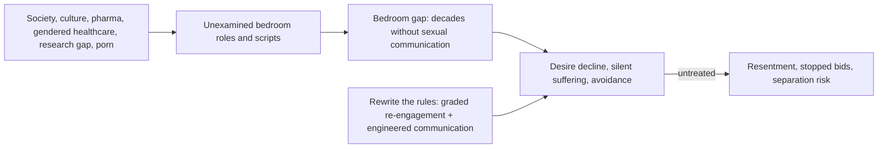

# Maria Sophocles

Maria Sophocles identifies herself in the supplied interview as a gynecologist and surgeon who added formal sexual-counseling training after finding surgical practice insufficient for patients with sexual problems. Her clinical claims draw on roughly 85,000 patient visits over 30 years (mostly in the United States) plus interviews across five continents, distilled into a book on what she calls the bedroom gap and a TED talk on the same theme. (@RenaMalikMD (Rena Malik, M.D.) — "Think More Chores Will Get You More Sex? Here’s What Actually Builds Desire", 2026-09-02, [link](https://www.youtube.com/watch?v=zLyv9TczNoc))

## Distinctive positions

- **Sexual communication failure is near-universal, not local.** Across country, religion, culture, and class, couples spend decades executing a rote sexual script without ever discussing what either partner likes; the shaping forces she names — society, culture, pharma, gendered healthcare, the research gap, pornography — assign men a performing role and women a passive-receptacle role that both arrive with as unexamined expectations. [[sexual-desire-arousal-and-aging]] (@RenaMalikMD (Rena Malik, M.D.) — "Think More Chores Will Get You More Sex? Here’s What Actually Builds Desire", 2026-09-02, [link](https://www.youtube.com/watch?v=zLyv9TczNoc))
- **Desire at zero is rebuilt by grading, not willpower.** Her ladder runs shame-unhooking (thinking of oneself as a sexual being is not selfish) → non-sexual pleasure retraining (her chocolate-bar office exercise) → G-rated non-escalating touch with penetration explicitly off the table → communication → a protected weekly intimacy window. Jumping from zero to intercourse sets up failure. (@RenaMalikMD (Rena Malik, M.D.) — "Think More Chores Will Get You More Sex? Here’s What Actually Builds Desire", 2026-09-02, [link](https://www.youtube.com/watch?v=zLyv9TczNoc))
- **Erotic memory works like a savings account.** The brain stores encountered erotic content and links it to later touch, so private or shared erotica deposits change the erotic coloring of ordinary physical contact — a mechanism-level rationale for normalizing erotica in any medium. (@RenaMalikMD (Rena Malik, M.D.) — "Think More Chores Will Get You More Sex? Here’s What Actually Builds Desire", 2026-09-02, [link](https://www.youtube.com/watch?v=zLyv9TczNoc))
- **Communication is lubrication, and its mechanics matter.** First conversations belong in side-by-side, judgment-poor settings (car, walk); openers start from appreciation with the request between the lines; initial shutdown is expected learned behavior, not a final answer. Lubricant itself is for everyone at any age, and a lubricant that doesn't resolve discomfort is a signal to seek care rather than to suffer silently. [[genitourinary-syndrome-of-menopause]] (@RenaMalikMD (Rena Malik, M.D.) — "Think More Chores Will Get You More Sex? Here’s What Actually Builds Desire", 2026-09-02, [link](https://www.youtube.com/watch?v=zLyv9TczNoc))
- **Chores build rapport, not credit; scorekeeping is fatal.** Acts of service are one love language, so matched contribution signals attentiveness — but housework is not a sexual transaction, and measuring toward 50/50 systematically undercounts the partner; her stated aim is to try to do more than half. (@RenaMalikMD (Rena Malik, M.D.) — "Think More Chores Will Get You More Sex? Here’s What Actually Builds Desire", 2026-09-02, [link](https://www.youtube.com/watch?v=zLyv9TczNoc))

## Practical implications

- Use her frameworks as clinical-experience-grade counseling structure for couples and individuals with desire loss — none of the specific protocols (chocolate-bar retraining, G-rated laddering, Friday-afternoon scheduling) has controlled-trial support in the supplied source. (@RenaMalikMD (Rena Malik, M.D.) — "Think More Chores Will Get You More Sex? Here’s What Actually Builds Desire", 2026-09-02, [link](https://www.youtube.com/watch?v=zLyv9TczNoc))
- Route pain with sex, persistent dryness, or suspected menopause-related tissue change to medical evaluation rather than treating them as communication problems ([[genitourinary-syndrome-of-menopause]], [[vulvovaginal-anatomy-and-hormone-sensitivity]]).

## Gaps & open questions

- How much of her universality claim reflects sampling (patients presenting with problems; TED-community interviews) versus population prevalence?
- Do graded re-engagement ladders and scheduled intimacy windows outperform standard couple or sex therapy in controlled comparisons?
- What are the book's commercial-promotion incentives, and do any of its quantitative claims (visit counts, cross-cultural patterns) have independent documentation?

## Related

[[sexual-desire-arousal-and-aging]] · [[genitourinary-syndrome-of-menopause]] · [[vulvovaginal-anatomy-and-hormone-sensitivity]] · [[menopause-hormone-therapy]] · [[relationship-maintenance-and-friendship]] · [[interpersonal-regulation-and-emotional-capacity]] · [[rena-malik]] · [[tami-rowen]]
