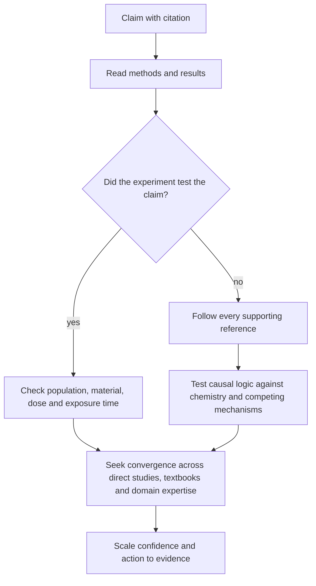

# Michelle Wong

Michelle Wong is a chemistry PhD and beauty-science educator whose recurring framework treats a cosmetic claim as a chain from source to mechanism to formulation to realistic exposure and outcome. Her product reviews are most informative about sensory properties, usability, ingredient chemistry, and hypotheses; sponsorship, one-person experience, and manufacturer testing limit their ability to establish comparative clinical effects. (@LabMuffinBeautyScience (Lab Muffin Beauty Science) — "I tried cult Korean skincare products so you don't have to (Stylevana AD)", 2025-10-15, [link](https://www.youtube.com/watch?v=c6vcx4LIDGA))

## Evidence stance and distinctive perspectives

Wong's contrarian evidence position is that peer review is a filter, not a reliability grade, and that an introduction or abstract can repeat a claim that the paper's original experiment never tested. Her shampoo-pH case starts with the methods: the widely cited study measured the pH of 123 products with indicator paper but did not expose hair to shampoo. Following all 31 references did not uncover direct support for the headline mechanism. Her general lesson is to verify that methods and results entail the claim, trace citations to their originating evidence, test causal arrows against first principles, and compare laboratory exposure with real use. (@LabMuffinBeautyScience (Lab Muffin Beauty Science) — "Do most shampoos damage hair? Spotting bad studies", 2025-09-29, [link](https://www.youtube.com/watch?v=Bf_Wl2gpEvM))

Her formulation perspective resists ranking products by a hero ingredient, nominal percentage, conversion-step count, foam volume, or shared manufacturer. A rinse-off ingredient has little opportunity to act unless the finished cleanser demonstrates delivery; retinal's one-step conversion advantage over retinol can be offset by concentration, stability, encapsulation, vehicle, and tolerability; and a lightweight sunscreen may improve daily adherence while being poorly matched to sweat or movement. Packaging belongs inside this causal model because it controls dose, contamination, portability, and adherence. (@LabMuffinBeautyScience (Lab Muffin Beauty Science) — "I tried cult Korean skincare products so you don't have to (Stylevana AD)", 2025-10-15, [link](https://www.youtube.com/watch?v=c6vcx4LIDGA))

Her safety position is likewise consequence-sensitive rather than based on generic ingredient exclusion lists. She reserves strongest avoidance for drug-like lash serums without drug-level warnings, volatile or sensitizing home nail systems, rapid gel removers that may contain prohibited methylene chloride, and poorly traceable high-consequence products. These category judgments mix established hazards, regulator findings, mechanistic inference, and personal experience and therefore require claim-by-claim evidence grading in [[cosmetic-product-safety-and-regulatory-gaps]]. (@LabMuffinBeautyScience (Lab Muffin Beauty Science) — "Products I refuse to use (as a chemist)", 2025-09-08, [link](https://www.youtube.com/watch?v=Lb8DkTzFyYI))

Her communicator-appraisal framework separates relevant authority from authority theater. CRABS checks conflicts, references, author expertise, buzzwords, and scope of practice; MUDCAPS adds misleading credentials, undisclosed interests, defensiveness, missing credit, appeal to authority, questionable peers, and a spotty track record. Wong presents these as defeasible warning signs rather than automatic disqualifiers: a person outside a narrow credential can still be correct, an expert can still be wrong, and the claim must ultimately survive evidence and mechanistic scrutiny. Her distinctive responsibility claim is asymmetric—public expert status amplifies a claim, so it also increases the obligation to disclose limits, answer good-faith questions, and correct consequential errors. (@LabMuffinBeautyScience (Lab Muffin Beauty Science) — "Are you falling for these skincare experts?", 2025-08-11, [link](https://www.youtube.com/watch?v=0bRpljNL7ro))

## Practical implications

- Use Wong's work as a structured route into formulation science and source tracing, not as independent clinical validation or individualized medical advice.
- For a cited claim, begin with what was done and measured; then test whether the cited population, material, dose, exposure time, comparator, and endpoint match the consumer conclusion. (@LabMuffinBeautyScience (Lab Muffin Beauty Science) — "Do most shampoos damage hair? Spotting bad studies", 2025-09-29, [link](https://www.youtube.com/watch?v=Bf_Wl2gpEvM))
- Treat sponsored sensory observations as potentially useful for application and adherence, while seeking independent finished-product evidence for biological outcomes. (@LabMuffinBeautyScience (Lab Muffin Beauty Science) — "I tried cult Korean skincare products so you don't have to (Stylevana AD)", 2025-10-15, [link](https://www.youtube.com/watch?v=c6vcx4LIDGA))
- Use CRABS and MUDCAPS to decide how much verification a source needs, not to decide truth by biography. Check the cited evidence, exposure, mechanism, and finished product even when credentials appear relevant. (@LabMuffinBeautyScience (Lab Muffin Beauty Science) — "Are you falling for these skincare experts?", 2025-08-11, [link](https://www.youtube.com/watch?v=0bRpljNL7ro))

## Gaps & open questions

- Which source-selection, conflict-of-interest, correction, and literature-search procedures underlie each educational review?
- How often do later formula changes make product-specific observations obsolete?
- Which of Wong's mechanistic corrections have direct independent replication rather than textbook convergence or informal testing?
- How accurately do Wong's communicator red flags predict later correction, replication, or regulator action, and how often do they penalize defensible minority views?

## Related

[[skincare-evidence-and-routine-design]] · [[cosmetic-product-safety-and-regulatory-gaps]] · [[hair-shaft-damage-and-bond-builders]] · [[skin-barrier-and-moisturization]] · [[topical-retinoids]] · [[photoprotection]]
