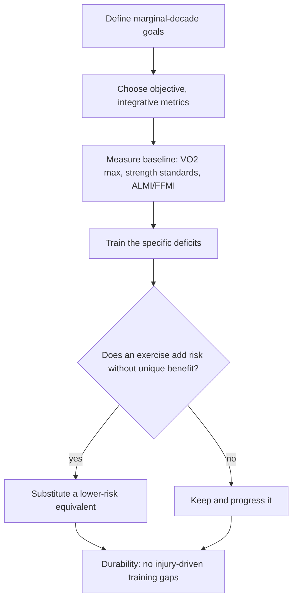

# Peter Attia

Peter Attia is a Stanford-educated physician focused on the applied science of longevity, whose recurring framework treats healthspan and lifespan as engineering problems: identify the capacities and risk exposures that predict late-life function and mortality, measure them objectively, and train or treat backward from the last decade of life (the centenarian-decathlon framing — define the physical tasks you want in your marginal decade, then train specifically to keep them). He weights exercise — strength, power, and cardiorespiratory fitness — as the most powerful modifiable behavior, worth doing for healthspan even under a hypothetical lifespan cost. (Peter Attia MD — "Building strength and muscle mass: optimize training & nutrition for longevity (AMA #71 rebroadcast)", 2026-07-06, [link](https://www.youtube.com/watch?v=CqNqfb37gig))

## Evidence stance and distinctive perspectives

For time-constrained exercise, Attia frames volume and intensity as a budget rather than opposing doctrines: high volume permits a large low-intensity base, while very low volume demands harder sessions after a novice adaptation period. In the women's-health discussion he also argues that exercise and menopause hormone therapy likely have additive benefits, while acknowledging that the combination has not been proved in a direct trial. [[time-efficient-concurrent-training]] [[womens-exercise-across-the-lifespan]] (@PeterAttiaMD (Peter Attia MD) — "378 ‒ Women’s health & performance: how training, nutrition, & hormones interact across life stages", 2026-01-05, [link](https://www.youtube.com/watch?v=CDsH60jt34o))

Distinctive, attributed positions in the current corpus: strength, muscle mass, and VO2 max predict mortality precisely because they integrate years of work and cannot be crammed; aging clocks are unhelpful because nothing rivals chronological age as a mortality predictor, so functional metrics beat molecular age scores ([[biological-age-biomarkers]]); after 50 the first rule of training is avoiding injury, justifying deliberate de-risking such as abandoning conventional deadlifts despite criticism from strength purists; willingness to train after warming up beats wearable metrics as an overtraining signal; and scheduled deloads are mostly unnecessary below serious training intensities. He is skeptical of injectable myokine mimetics replacing exercise (contra Mike Israetel) and of peptide marketing that outruns human evidence ([[experimental-peptides]]). (Peter Attia MD — "Building strength and muscle mass: optimize training & nutrition for longevity (AMA #71 rebroadcast)", 2026-07-06, [link](https://www.youtube.com/watch?v=CqNqfb37gig)) (@PeterAttiaMD (Peter Attia MD) — "403 ‒ Peptides: separating scientific promise from marketing hype", 2026-08-10, [link](https://www.youtube.com/watch?v=Km_01CLEkYU))

In cancer screening he draws a sharp line between population-efficiency guidelines and individual optimization: guidelines like the USPSTF's biennial mammography answer a resource-allocation question, so an individual minimizing her own chance of dying from a screenable cancer should generally screen more effectively (annual cadence, risk assessment by the mid-20s, MRI where risk warrants) while knowingly accepting the false-positive burden — the same CISNET models cited for biennial policy showing larger mortality reductions with annual screening ([[breast-cancer-screening]]). (@PeterAttiaMD (Peter Attia MD) — "396 – Breast cancer screening: understanding risk, deciding when to start, and more", 2026-06-15, [link](https://www.youtube.com/watch?v=_9mBlZXA1Lk))

For aerobic training, Attia frames zone two and high intensity as tools constrained by time and recovery rather than rival doctrines. He recommends prioritizing high intensity when total weekly exercise is near 150 minutes, but using zone two to accumulate sustainable volume when more time is available; his distinctive claim is that zone two is valuable for practicality, not because it produces an exclusive adaptation. [[cardiorespiratory-fitness]] (@PeterAttiaMD (Peter Attia MD) — "A guide to cardiorespiratory training at any fitness level to improve longevity (AMA 79 sneak peek)", 2026-01-12, [link](https://www.youtube.com/watch?v=yisfGtcV5xk))

In the seed-oil dispute, Attia presses the residual uncertainty that acute-toxicity calculations do not by themselves close decades-long chronic-disease questions, and asks whether saturated fat remains consequential when LDL is pharmacologically controlled. He presents these as challenges to inference rather than evidence that seed oils are harmful; the comparative frying-medium question remains unanswered. [[seed-oils]] [[dietary-fat-quality-and-cardiovascular-risk]] (@PeterAttiaMD (Peter Attia MD) — "Cooking with Lard vs Seed Oils | Layne Norton, Ph.D.", 2026-01-21, [link](https://www.youtube.com/watch?v=7_cbaDXAWYM))

## Practical implications

- Use his material as expert clinical synthesis with explicit personal protocols mixed in; distinguish the cited evidence (hazard ratios, trials, Mendelian randomization) from n-of-1 practice (his own exercise substitutions, HRV devices, testing habits).
- His clinic standards (75th-percentile ALMI/FFMI, strength tests, VO2 max percentile targets) are coherent operational targets, not outcome-validated thresholds.
- Commercial interests exist (he cites his training company 10 Squared when discussing marginal-decade training); weigh recommendations adjacent to those interests accordingly.

## Gaps & open questions

- Which of his protocol details rest on trials versus clinical extrapolation, and how would his strength standards perform as validated risk instruments?
- How does his de-risking philosophy trade off against the maximal-capacity view held by strength-sport practitioners?

## Related

[[cardiorespiratory-fitness]] · [[time-efficient-concurrent-training]] · [[womens-exercise-across-the-lifespan]] · [[dietary-fat-quality-and-cardiovascular-risk]] · [[seed-oils]] · [[muscle-strength-and-mortality]] · [[resistance-training]] · [[creatine]] · [[breast-cancer-screening]] · [[brain-cholesterol-homeostasis]] · [[performance-nutrition-and-hydration]] · [[biological-age-biomarkers]] · [[experimental-peptides]] · [[nmr-blood-analysis]] · [[environmental-pollution-and-health]] · [[practice-playbook]] · [[aging-model]]
