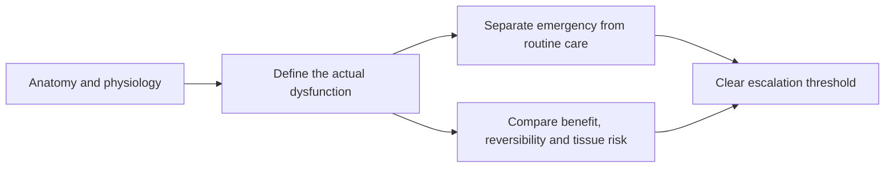

# Rena Malik

Rena Malik is a urologist and pelvic surgeon whose educational work covers lower urinary-tract function, erectile and sexual health, reproductive hormones, and patient decision-making. In the current corpus, her recurring method is to translate anatomy into concrete safety boundaries: distinguish phimosis from emergency paraphimosis, separate clitoral-hood from clitoral piercing, treat stream duration as a clue rather than a diagnosis, and separate female testosterone's supported sexual-desire indication from broader proposed benefits. (@RenaMalikMD (Rena Malik, M.D.) — "Can a Clitoral Piercing Make Sex Feel Better? | Tight Foreskin, Testosterone for Women", 2026-07-31, [link](https://www.youtube.com/watch?v=1jlLfaoHTcI)) (@RenaMalikMD (Rena Malik, M.D.) — "Peeing 'Just in Case?' The #1 Peeing Mistake That Could Be Weakening Your Bladder", 2026-07-27, [link](https://www.youtube.com/watch?v=CWDOyOkSyag))

A second recurring method is anti-quick-fix triage of supplement claims: she reads the underlying study design (for example, a mixed-exposure NHANES analysis finding no protection from dietary polyunsaturated fats against erectile dysfunction) and redirects attention to exercise, weight, blood pressure, glucose, sleep, and smoking as the interventions with support — the principle that benefit in one health domain does not transfer automatically to another. Her interview compilations also function as curation, assembling menopause, hormone, and sexual-medicine specialists (Mary Claire Haver, Vonda Wright, Rachel Rubin, Kelly Casperson, Lauren Streicher, and others) around shame reduction and under-treated conditions such as genitourinary syndrome of menopause, and extending into stone disease with a three-expert panel (Brian Eisner, Margaret Pearle, Roger Sur) that models open disagreement — lemonade's citrate effect, non-obstructing-stone pain, empiric versus urine-directed therapy — while flagging that the episode's sponsor and two panelists' device inventorship color its treatment-technology claims. (@RenaMalikMD (Rena Malik, M.D.) — "How to Fight Kidney Stones and Win Every Single Time", 2026-07-10, [link](https://www.youtube.com/watch?v=HRPLLdVfiXk)) (@RenaMalikMD (Rena Malik, M.D.) — "Taking Fish Oil for Better Erections? The Research Says Something Different", 2026-07-20, [link](https://www.youtube.com/watch?v=HriavIhCp1I)) (@RenaMalikMD (Rena Malik, M.D.) — "Why Your Vagina Doesn't Get 'Loose' From Sex (Despite What Social Media Says)", 2026-07-24, [link](https://www.youtube.com/watch?v=DnbhB-6vy80))

Across later compilations, Malik also makes evidence boundaries explicit: physiological testosterone replacement is separated from supraphysiological enhancement, and established PDE5 indications are separated from observational cardiovascular associations and preclinical brain or muscle hypotheses. Her sexual-aging material treats changing stimulation needs, pain, hormones, vascular health, and partner interpretation as interacting causes rather than reducing sexual function to chronological age. (@RenaMalikMD (Rena Malik, M.D.) — "Think Low Testosterone Is Ruining Your Life? Watch This Before Starting TRT", 2026-07-17, [link](https://www.youtube.com/watch?v=8KcBB_1sHwE)) (@RenaMalikMD (Rena Malik, M.D.) — "The Real Reason Sex Gets Better (or Worse) with Age", 2026-07-15, [link](https://www.youtube.com/watch?v=pVZnliApCWQ)) (@RenaMalikMD (Rena Malik, M.D.) — "Why ED Pills May Protect Your Heart, Brain, and Make You Stronger", 2026-07-13, [link](https://www.youtube.com/watch?v=dLqPxKeYF04))

Her 2026 panels extend that method to two fast-moving areas. For experimental peptides, she insists that the chemical class contains both trial-supported medicines and animal-only compounds, and that evidence and manufacturing assurance must be assessed molecule by molecule. For menopause care, she treats sexual health and quality of life as legitimate clinical outcomes while explicitly withholding certainty about testosterone or MHT preventing dementia or cardiovascular disease. These are useful evidence boundaries; guest claims about current compounding lists, hormone levels, and off-label dosing remain time-sensitive and require independent guidance review. (@RenaMalikMD (Rena Malik, M.D.) — "3 Peptides Doctors Won't Prescribe (And Why That Matters)", 2026-08-21, [link](https://www.youtube.com/watch?v=IgemoZFSxe4)) (@RenaMalikMD (Rena Malik, M.D.) — "Why Testosterone May Matter for Women Far More Than You’ve Been Told", 2026-08-19, [link](https://www.youtube.com/watch?v=lghetVbxKJk))

Her panel and relationship material extends the same boundary-setting into behavioral sexual medicine: a three-specialist premature-ejaculation episode (urologists Alan Shindel and Justin Dubin, psychologist Christian Nelson) models multi-expert teaching that separates clinical definitions from self-diagnosis, sets fold-change rather than cinematic expectations for treatment, and confronts the manosphere-driven misinformation economy her guests study; her solo relationship videos convert the responsive-desire model into concrete behavior (scheduled undistracted closeness, blame-free communication) for couples in long sexless stretches. [[premature-ejaculation]] [[sexual-desire-arousal-and-aging]] (@RenaMalikMD (Rena Malik, M.D.) — "The #1 Sex Mistake Men Make: Why Lasting Longer Doesn’t Mean Better Sex", 2026-08-14, [link](https://www.youtube.com/watch?v=aJlK0qZD-Xo)) (@RenaMalikMD (Rena Malik, M.D.) — "The #1 Mistake Keeping Couples in a Sexless Marriage", 2026-08-17, [link](https://www.youtube.com/watch?v=EkYN2Wwfa5I))

Her late-August 2026 material extends the individualized-interpretation theme in two directions. The member AMA teaches testosterone labs as three-layer interpretation — SHBG carrier effects, androgen-receptor sensitivity that is not measured in routine care, and substantial test-retest variability — so a personal historical baseline can provide context but does not outrank a validated diagnostic pathway or population reference interval; it also converts prostate-symptom prevention into metabolic and behavioral levers (waist, diabetes control, walking, sleep-apnea evaluation, avoiding just-in-case voiding) and normalizes squirting prevalence data against pornography-driven expectations. Her interview with [[tami-rowen]] models the group-data-versus-individual-patient stance both clinicians share: read trial averages strictly, but assess temporally linked individual side effects rather than treating either the association or its dismissal as automatic. (@RenaMalikMD (Rena Malik, M.D.) — "Why Men Care So Much About Squirting — And What Actually Matters", 2026-08-28, [link](https://www.youtube.com/watch?v=55KdS4gS6k4)) (@RenaMalikMD (Rena Malik, M.D.) — "She's Lubricated… But Does She Actually Want Sex? ft. Women's Sexual Health Expert", 2026-08-26, [link](https://www.youtube.com/watch?v=ioXnBzREeis))

Her September 2026 interview with gynecologist [[maria-sophocles]] extends the behavioral thread from diagnosis to rehabilitation: rebuilding desire from complete aversion through graded non-genital re-engagement, engineered low-judgment communication, erotic-memory framing, and scheduled weekly intimacy windows, with Malik contributing the pleasure-as-novel-sensation framing she attributes to Barry Komisaruk and both clinicians rejecting the transactional chore-play reading of desire. [[sexual-desire-arousal-and-aging]] (@RenaMalikMD (Rena Malik, M.D.) — "Think More Chores Will Get You More Sex? Here’s What Actually Builds Desire", 2026-09-02, [link](https://www.youtube.com/watch?v=zLyv9TczNoc))

Her distinctive clinical framing is function-first and harm-reduction oriented. For sexual anatomy, she resists size and cosmetic-performance norms when benefit is uncertain and tissue damage may be permanent; for urinary behavior, she cautions against both habitual prolonged holding and habitual low-volume pre-emptive voiding. These are useful organizing positions, but the videos frequently summarize evidence without enough study detail for independent claim-level grading. (@RenaMalikMD (Rena Malik, M.D.) — "Why The Average Penis Is Better Than Most Men Think", 2026-07-29, [link](https://www.youtube.com/watch?v=P3UbnEG8aaI)) (@RenaMalikMD (Rena Malik, M.D.) — "Peeing 'Just in Case?' The #1 Peeing Mistake That Could Be Weakening Your Bladder", 2026-07-27, [link](https://www.youtube.com/watch?v=CWDOyOkSyag))

Her chastity-device guidance applies that framework to consensual restraint: separate the relationship meaning of BDSM from the mechanics of constriction, pressure, occlusion, and failed release; treat consent and a working exit plan as parts of injury prevention; and place a hard emergency boundary around a stuck device with swelling or color change. Her proposed 30-minute penile-device limit and one-finger fit check remain expert harm-reduction heuristics because chastity-specific clinical evidence and validated fit standards are sparse. [[genital-restraint-device-safety]] (@RenaMalikMD (Rena Malik, M.D.) — "Chastity Cages Are Getting Popular — But Nobody Warns You About THIS", 2026-08-24, [link](https://www.youtube.com/watch?v=dCKC0aenxeY))

## Practical implications

- Use Malik's material as a starting framework for recognizing symptoms and preparing questions, not as individualized diagnosis or dosing guidance. (@RenaMalikMD (Rena Malik, M.D.) — "Peeing 'Just in Case?' The #1 Peeing Mistake That Could Be Weakening Your Bladder", 2026-07-27, [link](https://www.youtube.com/watch?v=CWDOyOkSyag))
- For an irreversible genital procedure or prescribed hormone, verify indication, alternatives, operator qualifications, monitoring, and rescue options with an appropriately trained clinician. (@RenaMalikMD (Rena Malik, M.D.) — "Why The Average Penis Is Better Than Most Men Think", 2026-07-29, [link](https://www.youtube.com/watch?v=P3UbnEG8aaI))
- Escalate time-sensitive anatomy problems—particularly a trapped swollen foreskin or inability to urinate—rather than relying on self-treatment. (@RenaMalikMD (Rena Malik, M.D.) — "Can a Clitoral Piercing Make Sex Feel Better? | Tight Foreskin, Testosterone for Women", 2026-07-31, [link](https://www.youtube.com/watch?v=1jlLfaoHTcI)) (@RenaMalikMD (Rena Malik, M.D.) — "Peeing 'Just in Case?' The #1 Peeing Mistake That Could Be Weakening Your Bladder", 2026-07-27, [link](https://www.youtube.com/watch?v=CWDOyOkSyag))

## Gaps & open questions

- Which quantitative claims in the video corpus remain valid after review of their original studies and current professional guidance?
- How often do anatomy-first educational videos change help-seeking, delayed care, or inappropriate self-treatment?
- Which patient groups are missed by simplified public-education mechanisms?

## Related

[[phimosis-and-paraphimosis]] · [[genital-modification-and-sexual-function]] · [[genital-restraint-device-safety]] · [[bladder-filling-and-voiding-behavior]] · [[kidney-stones]] · [[erectile-dysfunction-and-vascular-health]] · [[premature-ejaculation]] · [[pde5-inhibitors]] · [[testosterone-replacement-therapy]] · [[menopause-hormone-therapy]] · [[genitourinary-syndrome-of-menopause]] · [[vulvovaginal-anatomy-and-hormone-sensitivity]] · [[sexual-desire-arousal-and-aging]] · [[hormonal-contraception]] · [[pornography-motivation-and-sexual-health]] · [[omega-3-fatty-acids]] · [[benign-prostatic-hyperplasia]] · [[female-ejaculation-and-squirting]] · [[tami-rowen]] · [[maria-sophocles]]
