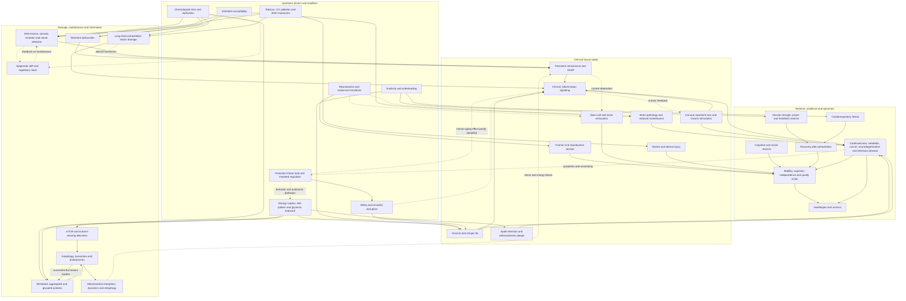

# Aging model

This page is a causal hypothesis under revision, not a declaration that aging has one master cause. It organizes the current wiki into upstream pressures, damage and maintenance processes, tissue states, functional reserve, and clinical outcomes. A solid arrow means the linked pages support the direction in humans or through convergent mechanistic evidence; a dashed arrow means the direction, importance, or human translation remains weak. Moving a biomarker is not equivalent to restoring function, preventing disease, or extending life. [[hallmarks-of-aging]] [[biological-age-biomarkers]] [[biological-age-reversal]]

## Reading the model

Three distinctions prevent category errors.

- **Aging rate versus disease risk:** lowering ApoB can prevent cardiovascular events without proving slower organism-wide aging. [[lipoprotein-retention-and-atherogenesis]]
- **Damage versus response:** inflammation, senescence, and repair programs can be harmful when persistent yet useful during infection, wound healing, or adaptation. Suppressing an age-associated signal is not automatically repair. [[cellular-senescence]] [[inflammaging-and-il-6]]
- **State versus trajectory:** a measurement can reflect current level, rate of drift, resilience after stress, or noise. These are not interchangeable and may respond differently to intervention. [[aging-dynamics-and-resilience]]

## Grand causal map



The map is deliberately cyclic. Damage can impair the systems that clear damage; senescent and immune cells can sustain inflammation; matrix fragments can provoke tissue injury that releases more fragments; illness can reduce activity and further erode reserve. [[loss-of-proteostasis]] [[autophagy-and-lysosomal-quality-control]] [[extracellular-matrix-aging]] [[immune-aging-and-rejuvenation]]

## Where interventions enter

```mermaid
flowchart LR
  MOVE[Daily movement] --> INACT[Inactivity / underloading]
  RT[[resistance-training]] --> MUS[Muscle strength and reserve]
  AER[[time-efficient-concurrent-training]] --> CRF[Cardiorespiratory fitness]
  DIET[Plant-rich, protein-adequate dietary pattern] --> META[Metabolic and glycemic pressure]
  SLEEP[Sleep and circadian care] --> SLP[Sleep disruption]
  SUN[[photoprotection]] --> UV[UV injury]
  LIPID[Statins / [[ezetimibe]] / [[pcsk9-inhibition]]] --> APOB[ApoB exposure]
  GLP[[glp-1-receptor-agonists]] --> ADIP[Visceral and ectopic fat]
  MHT[[menopause-hormone-therapy]] --> SYM[Menopause symptoms and selected bone risk]
  CREAT[[creatine]] --> MUS

  RAPA[[mtor-and-rapamycin]] -. human longevity unproven .-> MTOR[mTOR / autophagy]
  SENO[Candidate senolytics] -. early human evidence .-> SEN[Senescent-cell burden]
  NAD[[nad-supplementation]] -. inconsistent translation .-> MITO[Mitochondrial metabolism]
  TPE[[therapeutic-plasma-exchange]] -. biomarkers only .-> MILIEU[Circulating milieu]
  PEP[[plasma-derived-extracellular-particles]] -. animal research .-> MILIEU
  THY[[thymus-regeneration]] -. small multi-drug studies .-> IMM[Immune aging]
  DEGLY[[enzymatic-deglycation]] -. ex vivo only .-> AGE[Established AGEs]
  REPROG[Partial reprogramming] -. preclinical; identity/cancer risk .-> EPI[Epigenetic state]
```

The upper half contains interventions with actionable human uses, although their demonstrated endpoint is often disease prevention or function rather than aging itself. The lower half contains research hypotheses; it must not be converted into a consumer regimen. [[longevity-intervention-prioritization]] [[longevity-clinics-and-evidence]] [[supplement-evidence-and-safety]]

## Explicit causal postulates

### Postulate 1 — aging is a coupled loss of maintenance and reserve, not a list of independent hallmarks

**Postulate:** persistent damage increasingly exceeds repair and buffering capacity; interacting cell, matrix, immune, and metabolic states then reduce recovery and functional reserve. This is proposed because [[aging-dynamics-and-resilience]] frames aging as drift plus impaired recovery, while [[loss-of-proteostasis]], [[mitochondrial-dysfunction]], [[genomic-instability-and-dna-repair]], and [[extracellular-matrix-aging]] each describe damage–maintenance feedback. **Confidence: moderate as an organizing structure, weak as a quantitatively identified human model.** No current measure partitions a person's decline into these components.

### Postulate 2 — stochastic information loss and molecular damage reinforce one another

**Postulate:** DNA lesions, somatic mutation, and regulatory dispersion impair maintenance programs, while declining maintenance permits further damage and noise. [[stochastic-aging-and-molecular-noise]] and [[dream-complex-and-repair-capacity]] imply this loop; [[programmed-versus-stochastic-aging]] shows why developmental-gene signatures do not by themselves prove an active aging program. **Confidence: emerging.** Cross-species and cell evidence support parts of the loop, but causal ordering in humans and the size of any irreversible component remain unknown.

### Postulate 3 — long-lived extracellular matrix is an independent memory of age

**Postulate:** matrix cross-links, cleavage, and stiffness preserve damage outside cells, alter mechanotransduction, and can drive inflammatory feedback even if cellular state is partly reset. This follows from [[advanced-glycation-end-products]] and [[extracellular-matrix-aging]], including old-matrix/young-cell experiments. **Confidence: moderate preclinically, weak for human outcome attribution.** The specific contribution of CML, glucosepane, elastin fragments, and other lesions is unresolved.

### Postulate 4 — chronic inflammation is usually a mediator and amplifier, not a single root cause

**Postulate:** senescent cells, visceral fat, immune remodeling, matrix fragments, infection, and tissue injury converge on inflammatory signaling, which then worsens metabolic, vascular, and tissue function. [[cellular-senescence]], [[visceral-and-ectopic-fat]], [[immune-aging-and-rejuvenation]], and [[inflammaging-and-il-6]] imply convergence. **Confidence: moderate.** The weak link is intervention logic: IL-6 and related pathways also support host defense, repair, and exercise adaptation, so indiscriminate suppression may cause harm.

### Postulate 5 — reserve changes the clinical expression of accumulated pathology

**Postulate:** muscle, cardiorespiratory fitness, cognitive reserve, and social function buffer a given molecular burden and improve recovery after stress, delaying disability even when they do not erase damage. [[muscle-strength-and-mortality]], [[cardiorespiratory-fitness]], [[cognitive-reserve-and-brain-health]], and [[daily-movement-mobility-and-pain]] jointly imply this layer. **Confidence: moderate-to-strong for function and risk, weak for maximum-lifespan extension.** Reverse causation remains important in observational mortality gradients.

### Postulate 6 — cumulative exposure is the correct time model for several preventable diseases

**Postulate:** repeated ApoB exposure, glycemic exposure, ultraviolet exposure, smoking, and underloading accrue risk over time; earlier prevention has more leverage than late repair. [[lipoprotein-retention-and-atherogenesis]], [[advanced-glycation-end-products]], [[photoprotection]], and [[genomic-instability-and-dna-repair]] support this ordering. **Confidence: strong for the named disease pathways, unproven as a unified rate of aging.**

### Postulate 7 — reproductive aging is partly coupled to, and partly distinct from, systemic aging

**Postulate:** endocrine transitions can alter sleep, bone, vascular, cognitive, and reproductive function, but the exponential rise in oocyte aneuploidy and depletion of ovarian reserve cannot be treated as a generic whole-body clock. [[oocyte-aneuploidy-and-reproductive-aging]], [[ovarian-aging-and-tissue-cryopreservation]], [[perimenopause-assessment-and-testing]], and [[menopause-related-cognitive-impairment]] imply partial coupling. **Confidence: strong that trajectories differ; weak on shared causal mechanisms.**

### Postulate 8 — most current interventions target reversible state or disease risk, not irreversible damage

**Postulate:** exercise, nutrition, sleep, lipid lowering, metabolic treatment, and symptom-directed hormone therapy can improve reserve or reduce specific risks, while evidence that they remove somatic mutations, established cross-links, or other putatively irreversible damage is absent. [[healthspan-versus-maximum-lifespan]] and [[biological-age-reversal]] require this endpoint separation. **Confidence: strong as an evidentiary boundary; contested as a theoretical ceiling.** It remains possible that repeated state improvement changes damage accumulation indirectly.

### Postulate 9 — persistent threat can amplify aging-relevant exposures without being a demonstrated root cause of aging

**Postulate:** repeated threat appraisal and limited regulatory capacity can disturb sleep and shape movement, eating, substance use, social connection, and care-seeking; these behavioral and physiological routes may amplify metabolic and inflammatory pressure. [[stress-threat-discrimination]], [[interpersonal-regulation-and-emotional-capacity]], [[catastrophizing-and-uncertainty]], and [[addiction-recovery-and-emotional-sobriety]] imply the mediating routes. **Confidence: weak for an independent aging-rate effect, moderate for effects on symptoms and health behavior.** The causal map therefore gives threat load a solid arrow only to sleep and dashed arrows to metabolism and inflammation; distress should not be reduced to a biomarker or blamed on the person experiencing it.

## Mechanism-specific boundaries

- **Proteostasis and autophagy:** cargo abundance is not flux, and fasting hours or supplement use cannot be inferred from a pathway marker. Exercise and adequate nutrition remain justified by outcomes, not proven autophagy optimization. [[autophagy-and-lysosomal-quality-control]] [[loss-of-proteostasis]]
- **Mitochondria:** mitochondrial changes can be causes, compensations, or consequences of inactivity and disease. Target engagement does not establish healthspan benefit. [[mitochondrial-dysfunction]]
- **Telomeres and stem cells:** short-telomere disorders establish biological importance, but population telomere length is an incomplete aging measure and indiscriminate proliferative stimulation carries cancer and clonal-selection risks. [[telomere-biology]] [[stem-cell-exhaustion]]
- **Brain aging:** vascular injury, protein pathology, sensory loss, cognitive reserve, and hormonal or Lewy-body syndromes can overlap clinically. Molecular positivity, symptoms, and function must remain separate. [[alzheimers-spectrum-and-diagnosis]] [[alzheimers-diagnosis-biological-vs-clinical]] [[lewy-body-disease-and-synucleinopathies]]
- **Skin aging:** photoprotection and topical or procedural treatment can preserve or remodel local tissue without demonstrating whole-body rejuvenation. [[skin-barrier-and-moisturization]] [[topical-retinoids]] [[procedural-skin-remodeling]]

## Revision ledger

- **2026-08-12 — model broadened:** genomic/epigenetic noise, telomeres, proteostasis, mitochondria, stem cells, immune aging, reserve, brain pathology, and reproductive aging are now explicit nodes. This strengthens the model's coverage but increases uncertainty about causal ordering.
- **2026-08-12 — strengthened:** extracellular matrix is retained as an independent causal environment, not merely an AGE outcome, because cell–matrix experiments and elastin-fragment feedback support bidirectionality. Human outcome translation remains weak. [[extracellular-matrix-aging]]
- **2026-08-12 — strengthened:** ApoB retention remains a solid disease-causal branch because established LDL-lowering interventions have cardiovascular-outcome support. This does not establish whole-body age reversal. [[pcsk9-inhibition]] [[ezetimibe]]
- **2026-08-12 — strengthened but bounded:** ex vivo CMLase removal supports chemical reversibility of one AGE class; absent delivery, safety, mechanics, and clinical outcomes keep the intervention arrow dashed. [[enzymatic-deglycation]]
- **2026-08-12 — weakened:** a general NAD-decline-to-longevity arrow remains omitted because decline is tissue-specific and supplementation has not established human functional or longevity benefit. [[nad-supplementation]]
- **2026-08-12 — weakened:** thymic regrowth is not linked solidly to immune protection because small multi-drug studies do not establish safe repertoire renewal or clinical benefit. [[thymus-regeneration]]
- **2026-08-12 — weakened:** weekly rapamycin cannot be presumed compatible with training adaptation; a small older-adult trial found no functional advantage and possible attenuation with more adverse events. Human longevity efficacy and dosing remain unsettled. [[mtor-and-rapamycin]]
- **2026-08-12 — held contested:** systemic-milieu subtraction and addition remain distinct hypotheses. Neither plasma exchange nor plasma-derived particles has established healthy-human function, disease prevention, or survival benefit. [[circulating-rejuvenation-signaling]] [[therapeutic-plasma-exchange]] [[plasma-derived-extracellular-particles]] [[pig-plasma-fraction-rejuvenation]]
- **2026-08-12 — held contested:** current therapies may be limited to healthspan rather than maximum lifespan, but the proposed intervention-level ceiling is not measurable or validated in humans. [[healthspan-versus-maximum-lifespan]]
- **2026-08-12 — added but bounded:** persistent threat load now enters through sleep and behavior, with dashed links to metabolic and inflammatory pathways. New threat-regulation pages strengthened the case for these mediators but did not establish accelerated biological aging or justify treating distress as a master cause. [[stress-threat-discrimination]] [[interpersonal-regulation-and-emotional-capacity]]

## Discriminating predictions

The model would gain credibility if an intervention changed the proposed upstream node, changed the predicted mediator, improved function or disease outcomes, and retained benefit on a time course consistent with the mechanism. It would weaken if downstream outcomes improved without the mediator changing, if the biomarker moved without function, or if blocking the proposed response impaired repair.

- Matrix repair should improve tissue mechanics beyond any change in cell-intrinsic age; cell-only reprogramming should remain limited by an old scaffold.
- A true maintenance intervention should slow new damage accumulation after withdrawal, whereas a state-only intervention should decay toward baseline.
- If reserve is a buffer rather than repair, training should improve stress recovery and function more reliably than molecular damage measures.
- If inflammatory signaling is chiefly an amplifier, pathway suppression should help only where upstream injury persists and should show context-dependent infection or adaptation costs.

## Gaps & open questions

- Which nodes are human rate-limiters rather than correlates, compensations, or parallel consequences?
- Can damage, reversible state, resilience, and physiological noise be measured separately within one person?
- Which combinations are additive, redundant, or antagonistic across exercise, nutrition, drugs, and recovery?
- How much age-associated inflammation originates from matrix fragments, senescent cells, visceral fat, infection, or immune repertoire loss?
- Does any current intervention reduce somatic mutation, stable cross-links, or another candidate irreversible burden in humans?
- Can reprogramming separate restoration from identity loss and cancer risk in living tissue? [[epigenetic-alterations-and-reprogramming]] [[engineered-reprogramming-factors]]
- Does circulating-milieu benefit, if any, come from removing harmful factors or adding missing factors?
- How much does reserve delay disease expression without altering pathology itself?
- Which apparent missing arrows reflect absent experiments rather than negative experiments? [[replication-and-research-incentives]] [[open-data-and-research-infrastructure]]

## Related

[[practice-playbook]] · [[hallmarks-of-aging]] · [[aging-dynamics-and-resilience]] · [[biological-age-biomarkers]] · [[biological-age-reversal]] · [[longevity-intervention-prioritization]] · [[programmed-versus-stochastic-aging]] · [[healthspan-versus-maximum-lifespan]]
