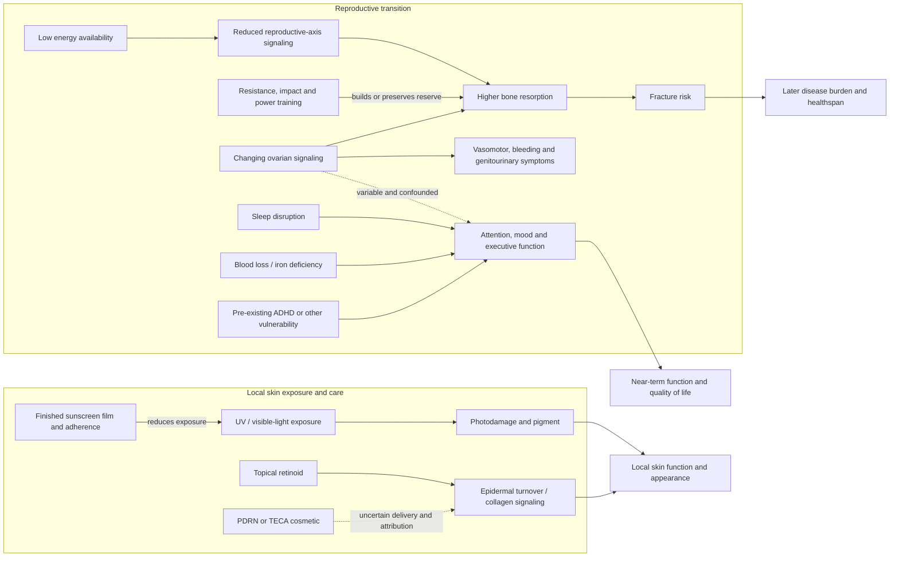
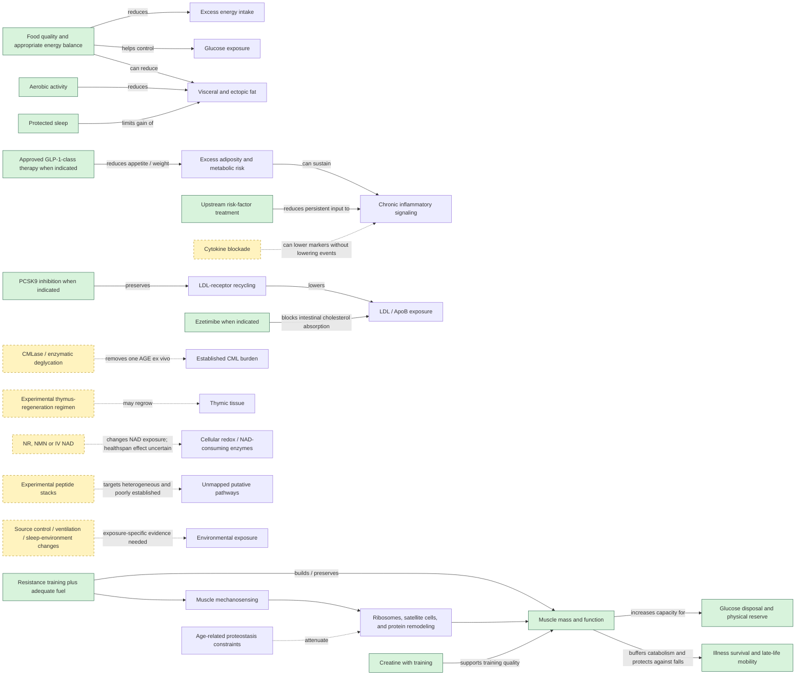
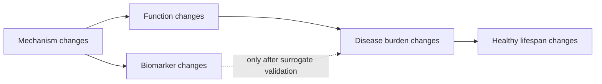

# Aging model

This page is a causal hypothesis under revision, not a claim that aging has one master cause. It separates upstream exposures and time-dependent changes from mediating damage and physiology, then from functional and clinical outcomes. Solid arrows represent links directly supported within the current wiki; dashed arrows are plausible but weak, indirect, or not yet shown to improve organism-level outcomes. An intervention can lower disease risk without slowing aging as a whole, and a molecular repair can succeed without restoring tissue function. [[biological-age-reversal]] provides the necessary hierarchy of endpoints.

[[aging-dynamics-and-resilience]] adds a complementary longitudinal view: damage is persistent drift, resilience is recovery toward a stable state after perturbation, and physiological noise reflects both incoming stress and recovery dynamics. This coarse-graining does not replace the molecular branches below; it asks which branch changes persist, which recover, and which fluctuations cross a threshold into disease. Peter Fedichev's proposed level 1/2/3 intervention hierarchy—stress response, noise reduction, and damage control—is a testable theoretical framing, while its projected lifespan effects remain unvalidated. (@TheSheekeyScienceShow (The Sheekey Science Show) — "How We Should Target Aging | Peter Fedichev", 2026-04-10, [link](https://www.youtube.com/watch?v=buEPyBiKrXw))

## Grand causal map

```mermaid
flowchart TD
  subgraph U[Upstream drivers and modifiers]
    TIME[Chronological time]
    GE[Repeated glucose exposure]
    EI[Excess energy intake]
    DQ[Diet quality and activity pattern]
    SLEEP[Sleep duration and regularity]
    PCSK9[PCSK9 activity]
    ENV[Air, noise, light and other environmental exposures]
    UV[Ultraviolet exposure]
    EVAL[Social evaluation and ordinary demands]
  end

  subgraph M[Mediating pathways and tissue states]
    SEN[Persistent senescent-cell states and SASP]
    AUTO[Autophagic and lysosomal quality-control flux]
    DAMAGE[Damaged proteins and organelles]
    RECYC[Cargo degradation and recycling]
    ADIP[Visceral and ectopic fat / adverse metabolic state]
    INFL[Persistent IL-6 / inflammatory signaling]
    AGE[AGE accumulation in long-lived proteins]
    RAGE[RAGE inflammatory signaling]
    ECM[Extracellular-matrix alteration and stiffness]
    LDLR[Reduced hepatic LDL-receptor recycling]
    APOB[Higher cumulative LDL / ApoB exposure]
    RET[Arterial-wall entry and retention]
    THYM[Thymic involution]
    TCELL[Reduced or altered T-cell output]
    EXPP[Respiratory, stress, sleep and inflammatory pathways]
    THREAT[Learned threat appraisal and protective response]
    SKIN[Barrier disruption, pigment change and dermal matrix injury]
  end

  subgraph O[Functional and clinical outcomes]
    MET[Diabetes and cardiovascular risk]
    TISSUE[Skin, lens, arterial and other tissue dysfunction]
    ASCVD[Atherosclerotic cardiovascular events]
    IMMUNE[Infection and cancer vulnerability]
    HEALTH[Integrated function, disease burden and healthspan]
    COG[Acute cognitive flexibility and task performance]
  end

  TIME --> AGE
  TIME -. tissue-specific accumulation .-> SEN
  TIME -. incompletely quantified decline .-> AUTO
  DAMAGE -->|cargo delivery| AUTO
  AUTO -->|successful flux| RECYC
  DAMAGE -. persistent stress .-> SEN
  SEN --> INFL
  TIME --> THYM
  GE --> AGE
  EI --> ADIP
  DQ --> EI
  SLEEP --> ADIP
  DQ -. also changes risk through pathways not yet mapped .-> MET
  ADIP --> MET
  ADIP --> INFL
  INFL -. context-dependent mediator .-> MET
  AGE --> RAGE
  AGE --> ECM
  RAGE --> TISSUE
  ECM --> TISSUE
  PCSK9 --> LDLR
  ENV -. exposure-specific contribution .-> EXPP
  UV --> SKIN
  TIME --> SKIN
  EVAL --> THREAT
  THREAT --> COG
  SKIN --> TISSUE
  EXPP -. confounded and incompletely quantified .-> HEALTH
  LDLR --> APOB
  APOB --> RET
  RET --> ASCVD
  THYM --> TCELL
  TCELL -. plausible human causal contribution .-> IMMUNE
  MET --> HEALTH
  TISSUE -. contribution not quantified .-> HEALTH
  ASCVD --> HEALTH
  IMMUNE -. contribution not quantified .-> HEALTH
  ADIP -. may increase glycation exposure .-> GE
  RAGE -. may amplify metabolic inflammation .-> MET
```

The AGE branch is the most explicit damage pathway in the current corpus: glucose exposure produces non-enzymatic adducts; stable AGEs accumulate particularly in slow-turnover proteins; CML can alter matrix proteins and engage RAGE–NF-κB inflammatory signaling; and matrix change plus inflammatory signaling plausibly impairs tissues. The importance of CML relative to glucosepane and other lesions is unresolved, and ex vivo CML removal has not demonstrated reduced inflammation or functional recovery in a living organism. [[advanced-glycation-end-products]] [[enzymatic-deglycation]] (@LongevityScienceNews (Longevity Science News) — "BREAKTHROUGH Skin Age Reversal: New Enzyme Removed 40 Years Of Damage", 2026-07-25, [link](https://www.youtube.com/watch?v=_Vf9pdoU3tU)) (@TheSheekeyScienceShow (The Sheekey Science Show) — "can this new enzyme reverse aging?", 2026-07-26, [link](https://www.youtube.com/watch?v=fGjWaC5ZnPI))

The cellular-maintenance branch separates persistent cell state from disposal rate. [[cellular-senescence]] links durable arrest and context-dependent SASP signaling to inflammation, fibrosis, repair, and cancer tradeoffs; transient senescence can be useful, so accumulation is not equivalent to every instance of the phenotype. [[autophagy-and-lysosomal-quality-control]] links cargo recognition, autophagosome formation, lysosomal degradation, and recycling. [[mtor-and-rapamycin]] places nutrient sensing upstream of the growth–maintenance allocation: rapamycin extends lifespan robustly in mice, but short human immune trials neither identify a longevity dose nor demonstrate human healthspan extension. RAPA-EX-01 further strengthens the growth–function tradeoff: weekly 6 mg sirolimus given 24 hours after the last exercise session did not improve 13-week function in 40 sedentary older adults, may have attenuated chair-stand gains, and increased adverse-event burden; the trial is too small to settle other doses or schedules but rules out assuming that calendar intermittency preserves adaptation. (Stanfield et al. — “Exercise and Weekly Sirolimus (Rapamycin) in Older Adults: RAPA-EX-01 Randomised, Double-Blind, Placebo-Controlled Trial,” 2026, [PubMed](https://pubmed.ncbi.nlm.nih.gov/41985884/), [DOI](https://doi.org/10.1002/jcsm.70274)) [[mitochondrial-dysfunction]] adds tissue energy capacity, network dynamics, redox signaling, and mitophagy while separating age associations from causality and from oxygen-delivery or activity effects. Snapshot marker abundance cannot establish flux, and neither early target engagement nor mitochondrial biomarkers demonstrate human healthspan extension.

The skin branch separates local tissue preservation from organism-wide aging. Ultraviolet exposure contributes to pigment, vascular, and dermal-matrix change; barrier impairment increases water loss and irritant entry; topical retinoids can change epidermal turnover and collagen; and light, microneedling, or radiofrequency procedures act on selected tissue targets. These interventions may improve appearance or local function without demonstrating a slower whole-body aging rate. [[photoprotection]] [[skin-barrier-and-moisturization]] [[topical-retinoids]] [[procedural-skin-remodeling]] (@DrDrayzday (Dr Dray) — "Costco Skincare: What’s Actually Worth Buying? | Dermatologist Shops", 2026-08-10, [link](https://www.youtube.com/watch?v=JukyC7WttqI)) (@DrDrayzday (Dr Dray) — "Is Sugar Really Bad for Your Skin? | Dermatologist Q&A", 2026-08-09, [link](https://www.youtube.com/watch?v=c0tYCBtxRO4)) (@DrDrayzday (Dr Dray) — "Copper Peptides, Hair Loss & Retinol Questions Answered", 2026-08-08, [link](https://www.youtube.com/watch?v=0sxHRZPDvss))

Therapeutic design sits upstream of intervention rather than constituting an aging mechanism. [[ai-guided-therapeutic-design]] can accelerate target-directed antibody or small-molecule discovery, but the causal chain still begins with a valid biological target and continues through experimental binding, developability, organismal function, and outcomes. Computational success therefore changes the cost and breadth of search without strengthening an aging claim by itself. (@TheSheekeyScienceShow (The Sheekey Science Show) — "how AI is inventing antibodies — Santiago Mille (Germinal)", 2026-07-17, [link](https://www.youtube.com/watch?v=g9GBoiOtibQ)) (@TheSheekeyScienceShow (The Sheekey Science Show) — "How We Should Target Aging | Peter Fedichev", 2026-04-10, [link](https://www.youtube.com/watch?v=buEPyBiKrXw))

The cardiometabolic branches describe risk modification more securely than aging modification. Energy conservation constrains change in body energy, while food composition, appetite, absorption, thermogenesis, movement, and measurement error determine the values and sustainability of a chosen intake. This separates the strong accounting identity from noisy individual prediction and from the disputed claim that meal timing outranks total intake. Indicated GLP-1-class therapy can reduce weight and metabolic risk; PCSK9 inhibition lowers LDL/ApoB by preserving hepatic LDL receptors; and ezetimibe lowers exposure by blocking intestinal NPC1L1-mediated cholesterol absorption. Cumulative ApoB exposure then supplies particles for arterial-wall entry and retention, the causal bridge to plaque rather than merely a risk-marker association. The established drugs have cardiovascular-outcome evidence in indicated secondary-prevention populations, but none of those facts alone establishes a slower organism-wide aging rate. [[energy-balance-and-calorie-counting]] [[caloric-restriction-and-meal-timing]] [[glp-1-receptor-agonists]] [[pcsk9-inhibition]] [[ezetimibe]] [[lipoprotein-retention-and-atherogenesis]] (@biolayne1 (Dr. Layne Norton) — "Stacy Sims PHD Says Calories Are BS | What the Fitness | Biolayne", 2026-08-07, [link](https://www.youtube.com/watch?v=tN97LNccMGQ)) (@mkaeberlein (Matt Kaeberlein) — "Longevity Science Update: The Biggest Stories in Longevity Medicine — July 2026", 2026-07-31, [link](https://www.youtube.com/watch?v=A0xNnGsGAJg)) (@DrBradStanfield (Dr Brad Stanfield) — "'Debunked' $6 Pill Found to Reduce Heart Disease", 2026-07-31, [link](https://www.youtube.com/watch?v=aWi_WGcDyto))

Dietary fat quality enters this branch through substitution: replacing saturated fat with polyunsaturated fat lowers LDL/ApoB exposure, while monounsaturated fat has a smaller favorable effect. Repeated high-temperature frying adds a separate oxidation route whose net clinical importance relative to the lipoprotein route is unresolved; this is why lard-versus-seed-oil frying cannot be settled from chemical stability alone. [[dietary-fat-quality-and-cardiovascular-risk]] [[seed-oils]] (@PeterAttiaMD (Peter Attia MD) — "380 ‒ The seed oil debate: are they uniquely harmful relative to other dietary fats?", 2026-01-19, [link](https://www.youtube.com/watch?v=iB49uq-t1UM)) (@PeterAttiaMD (Peter Attia MD) — "Cooking with Lard vs Seed Oils | Layne Norton, Ph.D.", 2026-01-21, [link](https://www.youtube.com/watch?v=7_cbaDXAWYM))

Two organ-specific routes make those systemic risks clinically visible. Endothelial injury and atherogenic lipoprotein burden can impair penile arterial inflow before overt coronary symptoms, making new ED a possible opportunity for cardiovascular assessment rather than a stand-alone aging marker. In the colon, repeated epithelial injury, altered mucus and microbial metabolism, and inflammation can support polyp formation and eventual cancer in a minority of lesions; screening interrupts this sequence by finding and removing precursors. [[erectile-dysfunction-and-vascular-health]] [[colorectal-cancer-prevention-and-screening]] (@RenaMalikMD (Rena Malik, M.D.) — "Want Stronger Erections for Years to Come? Your Blood May Hold the Answer", 2026-08-10, [link](https://www.youtube.com/watch?v=oFt7B9OAJPI)) (@RenaMalikMD (Rena Malik, M.D.) — "The #1 Food Mistake Raising Young Adults’ Cancer Risk – Are You Guilty?", 2026-08-05, [link](https://www.youtube.com/watch?v=wyuknV4btfE))

Microbiome-directed exposures can enter through substrate fermentation, live-organism ecology, or signaling from inactivated microbial components, but product identity and endpoint are decisive. A pooled cross-sectional association with colon-cancer prevalence is too confounded to map a probiotic-to-cancer-prevention arrow, while a randomized postbiotic trial supports only a tentative product-specific path to less fat regain after prior diet-induced loss. Neither finding establishes longevity benefit. [[probiotics-prebiotics-and-postbiotics]] (@biolayne1 (Dr. Layne Norton) — "Probiotics Cut Cancer Risk by 50% and Melt Fat! | Educational Video | Biolayne", 2026-08-05, [link](https://www.youtube.com/watch?v=RVN6GosoJUI))

Within adiposity, location matters: visceral fat around abdominal organs and ectopic fat within liver or pancreas can track metabolic risk more closely than scale weight alone. Dietary substitutions, regular aerobic activity, and adequate sleep can reduce or limit these compartments, sometimes without substantial weight change; large effects from purified RS2 or combined polyphenol-rich interventions remain promising trial-specific findings rather than proven universal prescriptions. [[visceral-and-ectopic-fat]] (@NutritionMadeSimple (Nutrition Made Simple!) — "It’s Boring, But It Will Destroy Visceral Fat FAST", 2026-08-02, [link](https://www.youtube.com/watch?v=C0PWUoDCaeg))

Persistent inflammatory signaling is both a possible mediator and a readout of upstream tissue state. Visceral fat can raise IL-6 and CRP, while exercise-induced IL-6 can participate in beneficial adaptation. CANTOS supports event reduction from selected upstream IL-1β blockade, but direct IL-6 removal in ZEUS lowered IL-6 and CRP without reducing cardiovascular events and increased infection; biomarker suppression therefore cannot substitute for clinical outcomes, and broad inflammatory blockade is not equivalent to removing the driver. [[inflammaging-and-il-6]] (@DrBradStanfield (Dr Brad Stanfield) — "Wrong About Inflammation & Heart Disease (new study)", 2026-08-09, [link](https://www.youtube.com/watch?v=tR0ueKzXmZ8))

The immune branch is mechanistically coherent but translationally weak. Adult thymic involution precedes reduced or altered T-cell output, yet small multi-drug studies showing MRI regrowth cannot establish that correct immune architecture, safer T-cell selection, or clinical protection was restored. [[thymus-regeneration]] (@ABCNewsIndepth (ABC News In-depth) — "The health trends outpacing regulation and putting people at risk | Four Corners Documentary", 2026-07-20, [link](https://www.youtube.com/watch?v=77TTDkR3nbI))

Immune competence also depends on recognition, contextual thresholds, and trafficking rather than cell counts alone. Antigen must be sampled in tissue, carried through lymphatic routes, interpreted with co-stimulatory or suppressive context, and answered by cells able to reach the relevant compartment. Aging-associated repertoire loss and chronic stimulation can therefore impair defense at several gates, while excessive activation can damage tissue. This strengthens the mechanism linking immune composition to function, but it weakens any inference that a single blood count, thymic image, or nonspecific “immune boost” demonstrates rejuvenation. [[immune-recognition-and-trafficking]] [[immune-aging-and-rejuvenation]]

The environmental branch treats pollution as an upstream modifier rather than a single aging mechanism. Repeated air, noise, light, or other exposures may act through respiratory injury, sleep disruption, stress, inflammation, and downstream disease, but correlated exposures and observational measurement error make the contribution of each pathway difficult to isolate. The available source establishes this causal-inference framework but does not quantify exposure-specific effects. [[environmental-pollution-and-health]] (@PeterAttiaMD (Peter Attia MD) — "Environmental pollution and longevity: air pollution, noise, light, EMFs, & more (AMA 87 sneak peek)", 2026-07-19, [link](https://www.youtube.com/watch?v=sDxAiqfy4-g))

Brain aging adds a capacity branch that cannot be reduced to pathology burden alone. Vascular and metabolic control, sleep, exercise, sensory input, injury avoidance, learning, and social engagement can support tissue maintenance or cognitive reserve through partly distinct routes. Reserve may preserve function despite pathology, so cognition is an outcome of both accumulated injury and adaptive network capacity; neither a subjective complaint nor an acute learning gain directly measures neurodegeneration. [[cognitive-reserve-and-brain-health]] [[exercise-enhanced-learning]] (@matt.kaeberlein (Healthspan Medicine) — "Neuroscientist Reveals What's Actually Working for Brain Longevity (with Dr. Tommy Wood)", 2026-04-05, [link](https://www.youtube.com/watch?v=XXmZtn4R0Ow))

The brain-maintenance branch now makes the heart–brain connection explicit: sustained blood pressure and glycemic exposure can damage cerebral vessels, while cumulative atherogenic-particle exposure supports plaque; hearing or vision loss can reduce sensory input and participation, and isolation can further reduce activity and care engagement. A multidomain Finnish trial supports improvement in cognitive performance from jointly treating diet, exercise, cognition, social contact, and vascular/metabolic risk, but it does not isolate a causal component or establish that two-year cognitive gains prevent dementia. [[lipoprotein-retention-and-atherogenesis]] (@NutritionMadeSimple (Nutrition Made Simple!) — "The REAL Dementia Risk Factors Doctors Won't Tell You", 2026-05-08, [link](https://www.youtube.com/watch?v=Tyy4UZO_MwI))

The neurodegeneration branch now has explicit internal structure. In Alzheimer's disease the working sequence is neuroimmune change, then amyloid, then tau, then synaptic dysfunction, unfolding over decades—placing inflammation upstream of the classical proteinopathies and making neurotropic viral exposure (varicella zoster, HSV) and gingival inflammation candidate upstream inputs, with shingles vaccination and antiviral suppression as candidate preventives. The cardiometabolic branch feeds the same outcome: every Alzheimer's risk factor is also a cerebrovascular risk factor, nearly all Alzheimer's coexists with other brain pathology at autopsy, and reserve modifies when pathology becomes functional impairment. Anti-amyloid immunotherapy is the first intervention acting directly on an accumulated-damage node in this branch, with clear target engagement, small average clinical effect in late disease, and an unresolved early-treatment hypothesis. Estrogen loss enters as a separable, reversible cause of Alzheimer's-like dysfunction rather than neurodegeneration. [[alzheimers-spectrum-and-diagnosis]] [[anti-amyloid-immunotherapy]] [[lewy-body-disease-and-synucleinopathies]] [[menopause-related-cognitive-impairment]] (Peter Attia MD — "399 - The evolution of Alzheimer's disease and dementia care | Gayatri Devi, M.D.", 2026-07-13, [link](https://www.youtube.com/watch?v=x7NhqMOwdOM))

Brain cholesterol is a distinct local pathway, not an extension of plasma LDL. Astrocytes and oligodendrocytes synthesize and distribute cholesterol behind the blood–brain barrier; ApoE-mediated delivery, neuronal uptake, and CYP46A1-mediated disposal maintain membrane balance. Excess neuronal membrane cholesterol plausibly shifts APP processing toward amyloid-beta 42, while APOE4 may impair delivery and clearance. This strengthens a cholesterol-homeostasis-to-amyloid mechanism but does not validate plasma desmosterol-guided statin dosing, CETP inhibition for dementia prevention, or a direct plasma-LDL-to-brain-cholesterol arrow. [[brain-cholesterol-homeostasis]]

Threat appraisal adds an acute functional branch rather than a demonstrated aging mechanism. Social evaluation or an ambiguous demand can be interpreted as danger, narrowing attention and recruiting fight, flight, freeze, or appeasement; repeated tolerable prediction errors may update that appraisal. The supplied sources do not show that this sequence accelerates biological aging or that retraining it preserves long-term cognition, so the branch ends at near-term flexibility and task performance rather than healthspan. [[stress-threat-discrimination]] [[protective-threat-responses]] [[social-evaluative-threat-and-criticism]] (@DrTraceyMarks (Dr. Tracey Marks) — "Your Brain Is Misinterpreting Stress as Danger", 2026-07-29, [link](https://www.youtube.com/watch?v=1v5lDzKAPz0)) (@DrTraceyMarks (Dr. Tracey Marks) — "Fight, Flight, Freeze, Fawn—Which One Is Your Pattern?", 2026-07-22, [link](https://www.youtube.com/watch?v=25kZd9Deums)) (@DrTraceyMarks (Dr. Tracey Marks) — "The Reason You Can't Stop Thinking About That Insult", 2026-08-05, [link](https://www.youtube.com/watch?v=x2oU1eskv0M))

Mental-strength training adds an updating mechanism to that branch: interpretation changes emotion, behavior generates feedback, and graded action can revise a pessimistic capability estimate. Rumination and avoidance can instead preserve the original estimate. This explains a near-term intervention point but does not establish slower biological aging, and the specific exercises described in the source have limited outcome evidence. [[mental-strength-and-behavioral-skills]] (@maxlugavere (Max Lugavere) — "Mental Health Expert: Stop Overthinking, Face Discomfort, and Take Back Control - Amy Morin", 2026-07-29, [link](https://www.youtube.com/watch?v=5C6Ji9iDJz8))

Proactive monitoring belongs in the measurement layer rather than among aging mechanisms. Glucose, insulin, A1c, lipoproteins, blood pressure, symptoms, and hormones may reveal risks or contributors, but changing a marker is useful only when the marker is causal, a validated surrogate, or part of a pathway known to improve outcomes. The five-marker panel proposed in one source is a clinical framework rather than a validated aging score. [[proactive-health-monitoring]] (@maxlugavere (Max Lugavere) — "The Longevity Doctor: These 5 Biomarkers That Predict How Well You’ll Age!", 2026-07-22, [link](https://www.youtube.com/watch?v=_AM9XeATR2U))

CCTA belongs in that measurement layer downstream of the arterial-disease mechanism: ApoB retention produces non-calcified, mixed, and calcified plaque; contrast-enhanced CCTA can depict these anatomical states and stenosis, but the scan does not itself reduce causal exposure. It can affect outcomes only through a decision pathway—detection, correctly interpreted risk, effective treatment, and sustained adherence—and broad asymptomatic screening remains contested because the source establishes visibility and selected cases rather than net outcome benefit. [[coronary-ct-angiography]] [[coronary-cta-screening-asymptomatic]] [[lipoprotein-retention-and-atherogenesis]] (@matt.kaeberlein (Healthspan Medicine) — "THIS Helps Detect Heart Disease Before It Happens", 2026-03-08, [link](https://www.youtube.com/watch?v=SSFkNCVXv6U))

The ApoB branch is causal but context-sensitive in absolute risk. Favorable metabolic health may lower risk from other pathways, yet available ketogenic-diet imaging data are heterogeneous and do not show that very high diet-induced ApoB is safe; existing plaque may identify particular vulnerability. [[ketogenic-diet-apob-and-atherosclerosis]] (@matt.kaeberlein (Healthspan Medicine) — "Neuroscientist Reveals What's Actually Working for Brain Longevity (with Dr. Tommy Wood)", 2026-04-05, [link](https://www.youtube.com/watch?v=XXmZtn4R0Ow))

Cardiorespiratory fitness is an integrated reserve rather than a molecular aging lesion. Oxygen delivery, mitochondrial capacity, muscle-fiber recruitment, and lactate clearance jointly determine usable aerobic output; training enlarges this reserve, while an approximately decade-by-decade decline brings fixed daily tasks closer to a person's ceiling. The mortality association is exceptionally strong, but specific zone-two-versus-high-intensity allocations remain programming extrapolations rather than proof that either changes organism-wide aging rate. [[cardiorespiratory-fitness]] (@PeterAttiaMD (Peter Attia MD) — "A guide to cardiorespiratory training at any fitness level to improve longevity (AMA 79 sneak peek)", 2026-01-12, [link](https://www.youtube.com/watch?v=yisfGtcV5xk))

Muscle and physical activity create a lifecourse bridge between fitness and later disease risk. Resistance training supplies the primary signal for muscle growth; adequate energy and protein permit adaptation; and muscle takes up glucose, supporting metabolic regulation. The muscle node now carries direct mortality evidence rather than only metabolic plausibility: grip strength, muscle mass, and VO2 max rank among the strongest non-age mortality predictors in cohort data, Mendelian randomization on polygenic grip strength supports partial causality (about 3% lower all-cause mortality per standard deviation), and three mediating routes are mapped — glucose disposal, a protein reservoir drawn on during illness and hospitalization, and fall protection against an exponentially age-rising fall death rate. Strength declines about 1–2% per year from a fourth-decade peak with power lost first (type 2A fiber atrophy), and individual decline is punctuated by inactivity after injury, which makes injury avoidance itself a causal input to the trajectory. [[muscle-strength-and-mortality]] [[resistance-training]] (Peter Attia MD — "Building strength and muscle mass: optimize training & nutrition for longevity (AMA #71 rebroadcast)", 2026-07-06, [link](https://www.youtube.com/watch?v=CqNqfb37gig)) Childhood activity is associated across several research designs with lower adult diabetes and atherosclerosis, while also supporting cognitive and psychosocial development. The long-term association is credible but does not establish how much benefit comes from persistent adult behavior versus a durable childhood effect. [[performance-nutrition-and-hydration]] [[youth-resistance-training]] (@drandygalpin (Andy Galpin) — "The Fundamentals of Nutrition, Hydration & Performance Fueling", 2026-08-05, [link](https://www.youtube.com/watch?v=_GEhu3vdL7w)) (@drandygalpin (Andy Galpin) — "Health Benefits of Strength Training in Kids | Dr. Andy Galpin", 2026-08-02, [link](https://www.youtube.com/watch?v=Re2sad9Bd5s))

Training frequency sits upstream of muscle only by distributing the recoverable mechanical dose; it is not an independent longevity mechanism. Tendon capacity constrains whether muscle-building load can be sustained, and graded loading can restore function when demand has outrun capacity. The evidence added here supports these causal placements, but the daily-training demonstration cannot isolate frequency from volume and the isometric tendon protocol has not established organism-level aging benefit. [[training-frequency-and-hypertrophy]] [[tendon-adaptation-and-rehabilitation]] (@JeremyEthier (Jeremy Ethier) — "It’s Dumb, But It Builds Muscle Almost 4x Faster", 2026-07-26, [link](https://www.youtube.com/watch?v=4OP8FI1TXK8)) (@JeremyEthier (Jeremy Ethier) — "It's Weird, But It Re-Builds Your Tendons In 30 Days", 2026-06-28, [link](https://www.youtube.com/watch?v=GSwL3Lgw6zI))

Exercise technique and specialization sit within that same upstream training branch. Lunge direction, stance, trunk angle, and load position redistribute mechanical demand and may keep lower-body training tolerable; short arm blocks redistribute direct volume and recovery; abdominal flexion cues alter execution but do not locally remove fat. These choices may support adherence, muscle, and functional reserve, but none is an independent aging intervention, and the three source videos provide coaching protocols rather than clinical-outcome evidence. [[lunge-biomechanics-and-programming]] [[arm-hypertrophy-specialization]] [[abdominal-definition-and-training]] (@athleanx (ATHLEAN-X™) — "Stop Doing Lunges Like This! (SAVE A FRIEND)", 2026-07-27, [link](https://www.youtube.com/watch?v=Pwsn3HR4L90)) (@athleanx (ATHLEAN-X™) — "How to Get 'Bigger Arms' Fast (22 DAYS | NO B.S)", 2026-07-19, [link](https://www.youtube.com/watch?v=CTblai7olJo)) (@athleanx (ATHLEAN-X™) — "I'm 51. Here's How I Still Have Visible Abs (WORKS AT ANY AGE)", 2026-08-04, [link](https://www.youtube.com/watch?v=ZOMKA0qCQ_w))

## Bounded life-stage and local-tissue branches

The reproductive transition changes symptoms and selected disease risks, but it is not itself a complete theory of aging. Estrogen loss plausibly shifts bone remodeling toward net loss, while bleeding, sleep disruption, thyroid disease, iron deficiency, medication effects, mood disorders, and pre-existing ADHD can converge on the same cognitive complaint. A fluctuating FSH or estradiol value therefore neither proves nor excludes the cause of functional impairment. [[perimenopause-assessment-and-testing]] [[adhd-and-reproductive-hormone-transitions]]

Energy availability adds an upstream branch that can imitate or amplify reproductive aging. Inadequate energy after exercise can suppress reproductive signaling, disrupt cycles, impair adolescent bone accrual, and weaken recovery; appetite suppression from GLP-1 therapy can enter the same branch. Across the lifespan, resistance, aerobic, and power training raise or preserve functional reserve, while perimenopausal symptoms and changes in muscle quality can reduce the training dose a person can sustain. These are intervention and reserve pathways, not proof that exercise slows every molecular aging process. [[low-energy-availability-and-menstrual-function]] [[womens-exercise-across-the-lifespan]] [[time-efficient-concurrent-training]] (@PeterAttiaMD (Peter Attia MD) — "378 ‒ Women’s health & performance: how training, nutrition, & hormones interact across life stages", 2026-01-05, [link](https://www.youtube.com/watch?v=CDsH60jt34o))

Upstream of the menopausal transition sits the fastest-aging tissue in the body: the oocyte pool. Meiotic-error rates rise exponentially from a mid-twenties minimum (blastocyst aneuploidy roughly 20–25% at 25, ~40% at 35, 80–85% at 42), ending genetic reproductive capacity one to two decades before most other organ systems fail, while follicle depletion sets the timing of menopause itself and thus of the estrogen-loss inputs to bone, cognition, and symptoms mapped above. Cumulative ovulatory cycling is also a disease exposure in its own right: the modern four-fold increase in lifetime cycles multiplies retrograde-menstruation load, which — gated by macrophage clearance capacity — drives estrogen-dependent, progesterone-resistant endometriosis, an evolutionary-mismatch structure parallel to the food-environment branch. Interventions here are bounded: ovulatory suppression acts on cycle exposure, egg freezing and ovarian-cortex cryopreservation act on fertility preservation, and MHT acts downstream on hormone-loss symptoms and selected risks. Elective young-tissue banking with serial grafting to postpone menopause is a modeled hypothesis without long-term longevity evidence; stem-cell-derived oocytes and rejuvenated ovarian tissue remain still earlier. None is evidence of slower organism-wide aging. [[oocyte-aneuploidy-and-reproductive-aging]] [[ovarian-aging-and-tissue-cryopreservation]] [[menopause-hormone-therapy]] [[endometriosis]] [[adenomyosis]] (@matt.kaeberlein (Healthspan Medicine) — "The Best Women’s Health Tips on the Planet with Dr. Jennifer Pearlman", 2026-03-20, [link](https://www.youtube.com/watch?v=b_LAI4oG0_w))

The local skin branch now separates finished-product performance from ingredient category and marketing ancestry. Protection depends on spectrum, film, tolerability, and applied amount; “mineral” and “organic” labels do not determine real-world efficacy or safety by themselves. Topical PDRN and TECA have uncertain penetration and active attribution, especially when a product also contains a retinoid or ordinary moisturizing ingredients. These pages refine local intervention choice but do not strengthen a whole-body anti-aging claim. [[mineral-and-organic-sunscreens]] [[topical-pdrn-and-centella]] [[photoprotection]] [[topical-retinoids]]

Satiety-oriented food design acts before adiposity by changing energy density, satiation, cue exposure, and adherence. This extends rather than competes with energy balance: it changes the behavioral inputs to the accounting relation. A one-day swap and food-cue EEG demonstration are illustrative, not proof of universal weight loss or a validated neural phenotype. [[satiety-oriented-diet-design]] (@JeremyEthier (Jeremy Ethier) — "I Proved My 6-Pack Abs Diet Works For ANYONE", 2026-07-12, [link](https://www.youtube.com/watch?v=HkrWExj1QNk))

Transfer separates physical capacity from task skill. General resistance exercise can raise force and load tolerance, while sport practice supplies perception, timing, and coordination; neither a barbell lift nor a movement that visually resembles sport guarantees transfer by itself. This supports flexible exercise selection and functional reserve, but it does not show that squats or deadlifts uniquely improve healthspan. [[strength-transfer-and-exercise-specificity]] (@biolayne1 (Dr. Layne Norton) — "Powerlifting is Bad for Athletic Performance? | What the Fitness | Biolayne", 2026-07-31, [link](https://www.youtube.com/watch?v=xK6nNmazh4s))

Immune aging connects chronic antigen exposure, thymic involution, repertoire crowding, inflammation, infection vulnerability, and tumor surveillance in a feedback system rather than a one-way decline. Blood-cell composition can also move methylation clocks without proving rejuvenation of other organs. Repertoire renewal, selective depletion, engineered immunity, and partial reprogramming are plausible entry points, but none currently establishes safe organism-wide reversal. [[immune-aging-and-rejuvenation]] [[biological-age-biomarkers]] (@FoundMyFitness (FoundMyFitness) — "Why the Next 10 Years May Add 50 to Your Lifespan | Dr. Derya Unutmaz", 2026-07-22, [link](https://www.youtube.com/watch?v=OJCgQUT1aic))

Distributed movement adds repeated low-dose exposure upstream of metabolic regulation and functional reserve. Walking, position changes, floor transitions, and graded loading maintain activity and movement options, while pain can couple unfamiliar load, poor recovery, perceived threat, and avoidance into deconditioning. These routes support function and established risk reduction; they should not be described as direct proof of slower molecular aging. [[daily-movement-mobility-and-pain]] (@FoundMyFitness (FoundMyFitness) — "The Scientific Formula for a 'Healthy Day' | Dr. Kelly Starrett", 2026-05-04, [link](https://www.youtube.com/watch?v=IXmOJsfebMM))

## Where interventions enter

Sleep continuity and circadian alignment influence autonomic recovery, blood pressure, insulin sensitivity, eating timing, and inflammation; duration alone does not capture this branch. Varied fermentable substrates and fermented foods act through stool mechanics, microbial metabolism, barrier signaling, and food substitution, but microbiome intermediates are not equivalent to disease prevention. Statin therapy reduces cumulative ApoB exposure while producing a smaller competing glycemic effect in susceptible people, so monitored personalization should preserve the cardiovascular pathway rather than abandon it. [[sleep-quality-and-circadian-alignment]] [[food-patterns-and-gut-ecology]] [[statins-and-glycemic-risk]] (@NutritionMadeSimple (Nutrition Made Simple!) — "The #1 WORST Sleep Mistake Destroying Your Heart", 2026-05-21, [link](https://www.youtube.com/watch?v=2BAX8mJ27gA)) (@NutritionMadeSimple (Nutrition Made Simple!) — "8 Foods That Actually Fix Your Gut (Not Probiotics)", 2026-05-30, [link](https://www.youtube.com/watch?v=ykpITcKqWCo)) (@NutritionMadeSimple (Nutrition Made Simple!) — "The Common Pill That Raises your Risk of Diabetes (And How to Avoid it)", 2026-06-04, [link](https://www.youtube.com/watch?v=VLc1_vLZUSk))

Green nodes have actionable evidence for a defined risk or indication, not necessarily for lifespan extension. Dashed yellow nodes are experimental, unproven for longevity, or too heterogeneous to place confidently in the causal graph. [[nad-supplementation]] [[experimental-peptides]] (@mkaeberlein (Matt Kaeberlein) — "Longevity Science Update: The Biggest Stories in Longevity Medicine — July 2026", 2026-07-31, [link](https://www.youtube.com/watch?v=A0xNnGsGAJg))

## Explicit causal postulates

1. **Postulate—shared downstream convergence (moderate):** distinct upstream processes reduce healthspan chiefly by converging on functional loss and age-related disease, because [[advanced-glycation-end-products]], [[pcsk9-inhibition]], [[glp-1-receptor-agonists]], and [[thymus-regeneration]] each connect a different mechanism to tissue, cardiovascular, metabolic, or immune outcomes. This supports a multi-pathway model, but the relative contribution of each branch is unknown.
2. **Postulate—metabolic control partly limits glycation (moderate for prevention, weak for reversal):** sustained control of glucose exposure should reduce formation of new AGEs because [[advanced-glycation-end-products]] identifies glucose-driven non-enzymatic modification and [[caloric-restriction-and-meal-timing]] connects energy balance to metabolic state. It does not follow that diet removes old matrix cross-links, and the benefit attributable specifically to less glycation has not been isolated.
3. **Postulate—adiposity is a mediator, not a complete explanation (moderate):** part of the benefit of energy restriction and GLP-1-class treatment passes through lower adiposity and improved metabolic state because both [[caloric-restriction-and-meal-timing]] and [[glp-1-receptor-agonists]] place intake or appetite upstream of weight and risk. Calorie-independent drug effects and benefits in metabolically healthy lean people remain uncertain.
4. **Postulate—molecular repair requires a functional bridge (strong as an evidentiary rule; weak as a demonstrated CML outcome):** removing a lesion can improve healthspan only if the lesion materially causes dysfunction and repair reaches the relevant tissue safely. [[enzymatic-deglycation]] demonstrates ex vivo target removal, while [[biological-age-reversal]] explains why a molecular endpoint cannot be promoted directly to whole-organism rejuvenation.
5. **Postulate—thymic volume is an incomplete mediator (moderate):** regrowth can improve immune outcomes only if architecture, T-cell repertoire, and selection are also restored because [[thymus-regeneration]] distinguishes organ size from immune function. The arrow from regrowth to clinical protection therefore remains weak.
6. **Postulate—risk-factor therapy can extend healthy life without changing the aging rate (strong conceptually):** lowering ApoB or treating obesity can prevent major disease even if no shared aging process is altered because [[pcsk9-inhibition]] and [[glp-1-receptor-agonists]] have indication-specific pathways and endpoints. This distinction prevents “longevity” from becoming a synonym for every useful preventive treatment.
7. **Postulate—portfolio repair may be necessary but is not yet validated (emerging):** because AGE damage, immune involution, cardiometabolic risk, and other uncharted processes are partly independent, whole-organism reversal may require several compatible interventions. [[biological-age-reversal]] supports the logic of multiple damage classes but also exposes the unresolved problems of interaction, attribution, and safety.
8. **Postulate—functional reserve modifies expression of damage (moderate):** equivalent pathology need not produce identical cognitive function because learning, engagement, sensory access, and physical activity can build or preserve adaptive capacity. This does not imply that reserve removes pathology or indefinitely prevents clinical disease. [[cognitive-reserve-and-brain-health]]
9. **Postulate—product mechanisms do not establish geroprotection (strong as an evidentiary rule):** target engagement, a corrected nutrient level, or a shifted surrogate biomarker is insufficient to infer longer healthspan. Product identity, dose, interactions, human outcomes, and individual need remain separate links. [[supplement-evidence-and-safety]] (@matt.kaeberlein (Healthspan Medicine) — "Longevity Doctors Rank the Most Hyped Supplements (AMA with Dr. Kaeberlein and Dr. Byrne)", 2026-04-03, [link](https://www.youtube.com/watch?v=yM-vL5J3BIA))
10. **Postulate—fat distribution mediates risk beyond scale weight (moderate):** visceral and ectopic fat can fall without large total-weight change and connect diet, aerobic activity, and sleep to insulin resistance. Whether compartment loss explains clinical benefit independently of other intervention effects remains unresolved. [[visceral-and-ectopic-fat]] (@NutritionMadeSimple (Nutrition Made Simple!) — "It’s Boring, But It Will Destroy Visceral Fat FAST", 2026-08-02, [link](https://www.youtube.com/watch?v=C0PWUoDCaeg))
11. **Postulate—early physical capacity compounds across life (moderate):** childhood activity may improve current strength, competence, cognition, and participation, which can increase the probability of entering adulthood with greater functional and metabolic reserve. Long-term diabetes and atherosclerosis associations support the pathway, but mediation through continued activity is unresolved. [[youth-resistance-training]] (@drandygalpin (Andy Galpin) — "Health Benefits of Strength Training in Kids | Dr. Andy Galpin", 2026-08-02, [link](https://www.youtube.com/watch?v=Re2sad9Bd5s))
12. **Postulate—recovery dynamics modify disease transition (emerging):** accumulated damage may reduce resilience, allowing a given stress exposure to produce larger or longer fluctuations and a greater chance of entering a persistent pathological state. Longitudinal variation can test this proposition, but it cannot yet distinguish cause from consequence or justify noise reduction as a therapy. [[aging-dynamics-and-resilience]] (@TheSheekeyScienceShow (The Sheekey Science Show) — "How We Should Target Aging | Peter Fedichev", 2026-04-10, [link](https://www.youtube.com/watch?v=buEPyBiKrXw))
13. **Postulate—design efficiency cannot rescue target error (strong as an evidentiary rule):** a generated molecule can bind exactly as intended yet fail to improve health if its target is noncausal, redundant, inaccessible, or unsafe to perturb. Target selection, molecular generation, wet-lab validation, and clinical outcomes are separate evidentiary links. [[ai-guided-therapeutic-design]]
14. **Postulate—immune composition is not whole-organism age (strong as an evidentiary rule):** removing terminally differentiated cells or expanding naive cells can improve a blood readout without regenerating nonimmune tissue; clinical immune function and organ-specific outcomes remain necessary. [[immune-aging-and-rejuvenation]] (@FoundMyFitness (FoundMyFitness) — "Why the Next 10 Years May Add 50 to Your Lifespan | Dr. Derya Unutmaz", 2026-07-22, [link](https://www.youtube.com/watch?v=OJCgQUT1aic))
15. **Postulate—distributed movement supports reserve (moderate):** repeated walking and varied positions may preserve metabolic and movement capacity beyond a single exercise session, but observational step associations do not establish an exact causal threshold. [[daily-movement-mobility-and-pain]] (@FoundMyFitness (FoundMyFitness) — "The Scientific Formula for a 'Healthy Day' | Dr. Kelly Starrett", 2026-05-04, [link](https://www.youtube.com/watch?v=IXmOJsfebMM))
16. **Postulate—food structure acts through several mapped nodes (moderate):** intact fiber-rich foods can influence intake through volume and intestinal sensing, glucose exposure through slower delivery, and inflammatory signaling through microbial fermentation. These mechanisms support cardiometabolic plausibility but do not establish that maximizing fiber or suppressing every acute glucose peak slows organism-wide aging. [[dietary-fiber]] [[free-sugars-and-glycemic-response]] (@joinzoe (ZOE) — "You’re obsessing over the wrong thing! The #1 food that cuts disease risk", 2026-07-30, [link](https://www.youtube.com/watch?v=0CWC1GUEzHA)) (@joinzoe (ZOE) — "The 5 foods you’re eating every day that are more HARMFUL than sugar", 2026-07-23, [link](https://www.youtube.com/watch?v=yHv2NLaS7kw))
17. **Postulate—evolved appetite mediates environmental exposure (moderate):** persistent access to engineered energy-dense food can recruit preferences and fat-defense mechanisms that were adaptive under variable supply. Environmental design and appetite treatment can therefore act upstream of adiposity without implying that genetic susceptibility is destiny or that one ancestral diet is optimal. [[evolutionary-mismatch-and-weight-regulation]] (@joinzoe (ZOE) — "Harvard professor: The 3 evolutionary reasons why you can’t lose weight", 2026-08-06, [link](https://www.youtube.com/watch?v=9kXWRFZhj3s))
18. **Postulate—immune aging is a gated systems failure, not a scalar deficit (moderate mechanistically, weak clinically):** [[immune-recognition-and-trafficking]] and [[immune-aging-and-rejuvenation]] imply that repertoire, tissue sensing, activation thresholds, lymphatic movement, and target access jointly determine defense. Increasing one cell population or organ volume can fail if another gate remains limiting; human evidence that coordinated restoration reduces infection or cancer is still weak.
19. **Postulate—reproductive transition modifies vulnerability rather than explaining every symptom (moderate):** [[perimenopause-assessment-and-testing]] and [[adhd-and-reproductive-hormone-transitions]] imply that ovarian change can affect bone, sleep, vasomotor symptoms, and possibly executive function, while acquired mimics and pre-existing neurodevelopmental differences converge downstream. The direct hormone-to-ADHD link is weak, and symptom improvement cannot be assumed to mean organism-wide age reversal.
20. **Postulate—delivery and formulation sit between ingredient and tissue effect (strong as an evidentiary rule; emerging for PDRN/TECA):** [[topical-pdrn-and-centella]], [[topical-retinoids]], and [[mineral-and-organic-sunscreens]] imply that source labels and ingredient reputation do not bypass penetration, dose, film formation, co-actives, and adherence. This strengthens the finished-product-to-local-effect link while weakening category-wide and injectable-to-topical extrapolations.
21. **Postulate—retention is the causal bridge from ApoB exposure to plaque (strong):** [[lipoprotein-retention-and-atherogenesis]], [[dietary-fat-quality-and-cardiovascular-risk]], [[ezetimibe]], and [[pcsk9-inhibition]] imply that particle number accumulated over time changes how many ApoB particles can enter and remain in the arterial wall. Metabolic health modifies absolute risk but does not erase this substrate pathway; the share mediated by particle properties or inflammation remains uncertain.
22. **Postulate—brain and plasma cholesterol are causally compartmentalized (strong for separation; emerging downstream):** [[brain-cholesterol-homeostasis]] and [[alzheimers-spectrum-and-diagnosis]] imply that peripheral ApoB particles do not supply brain cholesterol, while local ApoE-particle handling may affect amyloid processing. This weakens the claim that indicated LDL lowering starves the brain; the homeostasis-to-clinical-dementia link and proposed sterol-guided treatment remain weak.
23. **Postulate—screening changes disease outcomes through detection and treatment, not by slowing aging (strong as a structural distinction):** [[breast-cancer-screening]], [[colorectal-cancer-prevention-and-screening]], and [[multi-cancer-early-detection]] imply that screening benefit requires adequate sensitivity, favorable stage shift or precursor removal, and effective follow-up treatment. A positive molecular signal is not itself prevention, and earlier detection without lower late-stage disease or mortality may add overdiagnosis instead of healthspan.
24. **Postulate—environmental detection must pass through dose before it enters the aging model (strong as an evidentiary rule; weak for microplastics as a human aging driver):** [[microplastics-exposure-and-measurement]] and [[environmental-pollution-and-health]] imply a chain from external exposure to absorption, persistent internal dose, biological interaction, and clinical outcome. Current assay contamination, chemical misclassification, and uncertain ordinary human dose weaken every downstream microplastics arrow; detection in food or tissue therefore does not yet justify a microplastics-to-aging edge comparable to ApoB retention, smoking, or ultraviolet exposure.
25. **Postulate—program design modifies whether exercise reaches functional reserve (moderate):** [[exercise-program-design]], [[resistance-training]], and [[cardiorespiratory-fitness]] imply that exercise selection matters through delivered dose, progression, recovery, adherence, and coverage of deficient capacities rather than through a uniquely geroprotective movement. This strengthens the training-to-reserve pathway while weakening claims that one split, rep range, intensity zone, or branded template independently slows aging.

## Measurement layer

[[biological-age-biomarkers]] sits above the causal system as measurement, not as a mechanism. A clock may estimate state, pace, or risk; moving it does not identify which node changed or prove that function, disease, or survival improved. [[nmr-blood-analysis]] adds narrower predictors: LPIR estimates an insulin-resistant lipoprotein pattern, GlycA reflects systemic inflammatory proteins, and MVX predicts mortality-associated metabolic vulnerability. Their prediction does not establish causal mediation or make a score a treatment target. (@PeterAttiaMD (Peter Attia MD) — "402 ‒ NMR blood analysis: how mortality risk and more can be assessed from a single blood sample", 2026-08-03, [link](https://www.youtube.com/watch?v=IMbghqZ1iXI))

## Practical implications

Use the map as an evidence filter, not as a personal treatment stack. At each clinical or research decision, identify the proposed causal node, verify that the intervention reaches it, measure a decision-relevant functional or disease endpoint, and set a reassessment or stopping point. Daily and weekly action should remain concentrated on established risk control and functional reserve as summarized in [[practice-playbook]]; experimental damage repair, noise reduction, or AI-generated molecules have no validated personal cadence. Evidence is **strong for keeping target engagement separate from health outcomes**, **moderate for several mapped disease-risk pathways**, and **emerging or absent for organism-wide aging modification**. (@TheSheekeyScienceShow (The Sheekey Science Show) — "can this new enzyme reverse aging?", 2026-07-26, [link](https://www.youtube.com/watch?v=fGjWaC5ZnPI)) (@TheSheekeyScienceShow (The Sheekey Science Show) — "how AI is inventing antibodies — Santiago Mille (Germinal)", 2026-07-17, [link](https://www.youtube.com/watch?v=g9GBoiOtibQ)) (@TheSheekeyScienceShow (The Sheekey Science Show) — "How We Should Target Aging | Peter Fedichev", 2026-04-10, [link](https://www.youtube.com/watch?v=buEPyBiKrXw))

## Revision log

- **2026-08-12—mTOR growth–function tradeoff strengthened:** RAPA-EX-01 adds direct exploratory human evidence that weekly 6 mg sirolimus, even 24 hours after the last exercise session, does not enhance short-term functional adaptation and may attenuate it while increasing adverse-event burden. **Still uncertain:** the trial does not settle lower exposure, longer separation, other compounds, hard immune outcomes, healthspan, or lifespan. [[mtor-and-rapamycin]]

- **2026-08-11—exposure and exercise-delivery links bounded:** microplastics now enter only as a candidate exposure whose path to healthspan is interrupted by uncertain dose, assay specificity, and absent ordinary-exposure human outcomes; exercise programming now sits between intention and delivered training adaptation. **Strengthened:** proportional precaution and adaptation-first program revision. **Weakened:** tissue detection as proof of an aging mechanism and any single exercise template as an independent longevity intervention. **Still uncertain:** realistic internal microplastic dose and which portfolio of physical capacities best predicts added healthy life. [[microplastics-exposure-and-measurement]] [[exercise-program-design]]

- **2026-08-11—hypertrophy mechanism refined:** mechanical loading now reaches muscle mass through mechanosensing, ribosomal capacity, satellite-cell contribution, and protein remodeling; age-related proteostasis constraints may attenuate this route without eliminating adaptation. **Strengthened:** mechanical tension as the primary training signal and resistance training as compatible with absolute mitochondrial expansion. **Weakened:** soreness, damage, normal-range sex hormones, or mitochondrial density alone as explanations of growth. **Still uncertain:** a universal optimal weekly set dose, the unpublished older-adult proteomics mechanism, and any meaningful adult human hyperplasia. [[skeletal-muscle-hypertrophy]] [[muscle-damage-and-hypertrophy]] (@drandygalpin (Andy Galpin) — "What Drives Muscle Growth & What Doesn't | Dr. Mike Roberts", 2026-07-08, [link](https://www.youtube.com/watch?v=CoU8-R0Id-g))

- **2026-08-11—heart–brain and food-selection pathways refined:** cerebral vascular injury, sensory access, and social engagement now converge on brain maintenance and reserve; food-label decisions enter upstream through repeated added-sugar, sodium, saturated-fat, satiety, and substitution exposures. **Still uncertain:** multidomain cognitive gains do not identify an active component or prove dementia prevention, and label education has not itself been shown here to reduce clinical events. [[cognitive-reserve-and-brain-health]] [[food-label-literacy-and-health-halos]] (@NutritionMadeSimple (Nutrition Made Simple!) — "The REAL Dementia Risk Factors Doctors Won't Tell You", 2026-05-08, [link](https://www.youtube.com/watch?v=Tyy4UZO_MwI)) (@NutritionMadeSimple (Nutrition Made Simple!) — "The REAL 7 Levels of Eating That Transform Your Health (Backed by Science)", 2026-04-28, [link](https://www.youtube.com/watch?v=U9a4KsG7QNw)) (@NutritionMadeSimple (Nutrition Made Simple!) — "15 'Healthy' Foods that are Quietly Clogging your Arteries (And What to Eat Instead)", 2026-04-20, [link](https://www.youtube.com/watch?v=oMOSvXcvnOw))

- **2026-08-11—ApoB, brain-cholesterol, and screening links refined:** arterial retention now mediates cumulative ApoB exposure and plaque; brain cholesterol is explicitly compartmentalized from plasma LDL; and screening is separated from aging modification through a detection-to-treatment pathway. **Strengthened:** cumulative ApoB causality and the case against avoiding indicated lipid lowering from fear of brain cholesterol deprivation. **Weakened:** direct ApoB-to-event shorthand, consumer sterol-guided statin protocols, and annual MCED testing as established screening. **Still uncertain:** which brain-cholesterol interventions improve cognition, and whether MCED testing reduces mortality. [[lipoprotein-retention-and-atherogenesis]] [[brain-cholesterol-homeostasis]] [[breast-cancer-screening]] [[multi-cancer-early-detection]]

- **2026-08-11—reproductive-aging branch added:** oocyte aneuploidy now anchors the reproductive-transition branch as the earliest hard aging boundary (exponential rise after 35, J-curve minimum near 25), and cumulative ovulatory cycling entered as an upstream exposure driving endometriosis through an immune-clearance gate, with adenomyosis as the uterine-wall counterpart. **Strengthened:** evolutionary-mismatch logic (ancestral ~100 versus modern ~400 lifetime cycles) and symptom-led early diagnosis as delay-dependent disease modification. **Weakened:** mitochondrial-replacement "egg rejuvenation" marketing (the lesion is nuclear). **Still uncertain:** whether early ovulatory suppression prevents disease burden, whether ovarian-cortex grafting beats hormone therapy, and stem-cell-oocyte safety. [[oocyte-aneuploidy-and-reproductive-aging]] [[endometriosis]] [[adenomyosis]] (Peter Attia MD — "397 - Endometriosis and adenomyosis: diagnosis, fertility, reproductive aging, & emerging treatments", 2026-06-22, [link](https://www.youtube.com/watch?v=IxHRYDM64dQ))

- **2026-08-11—muscle-to-mortality branch strengthened:** strength and muscle mass gained direct epidemiologic weight (grip strength, PURE, late-life quartile survival), Mendelian-randomization support for partial causality, and three explicit mediators (glucose disposal, illness-time protein reservoir, fall protection); creatine entered as an established training-support input, and injury-driven inactivity was made an explicit accelerant of decline. **Strengthened:** muscle as a load-bearing longevity node comparable to cardiometabolic branches, and power loss (type 2A atrophy) as the earliest functional decline. **Weakened:** myokine-mimetic substitution for exercise (repeated failures; Israetel's optimistic timeline recorded as a minority view) and aging clocks as mortality predictors relative to chronological age. **Still uncertain:** the causal share of the observational association, and whether late-life strength gains proportionally reduce mortality. [[muscle-strength-and-mortality]] [[resistance-training]] [[creatine]] (Peter Attia MD — "Building strength and muscle mass: optimize training & nutrition for longevity (AMA #71 rebroadcast)", 2026-07-06, [link](https://www.youtube.com/watch?v=CqNqfb37gig))

- **2026-08-11—neurodegeneration branch structured:** Alzheimer's gained an internal sequence (neuroimmune change → amyloid → tau → synaptic loss) with viral, gingival, vascular, and metabolic inputs; Lewy body disease joined as a comorbid synucleinopathy; anti-amyloid antibodies added a direct damage-removal intervention; estrogen loss was separated out as a reversible dementia mimic. **Strengthened:** inflammation-first ordering, vascular–Alzheimer's coupling, and reserve as an expression modifier. **Weakened:** amyloid positivity as a sufficient disease definition, and single-stage descriptions of dementia. **Still uncertain:** whether early anti-inflammatory or preclinical anti-amyloid treatment prevents disease, and whether GLP-1 dementia associations are weight-independent. [[alzheimers-spectrum-and-diagnosis]] [[alzheimers-diagnosis-biological-vs-clinical]] [[anti-amyloid-immunotherapy]] [[lewy-body-disease-and-synucleinopathies]] [[menopause-related-cognitive-impairment]] (Peter Attia MD — "399 - The evolution of Alzheimer's disease and dementia care | Gayatri Devi, M.D.", 2026-07-13, [link](https://www.youtube.com/watch?v=x7NhqMOwdOM))

- **2026-08-11—immune gating, reproductive transition, and formulation branches integrated:** recognition and trafficking now mediate immune function; ovarian transition, sleep, iron status, and pre-existing vulnerability converge on function; and finished formulation mediates local skin effects. **Strengthened:** the need to measure immune function and fracture or clinical risk rather than anatomy or a single hormone. **Weakened:** one-marker explanations of cognitive symptoms, mineral-versus-organic category claims, and extrapolation from injectable PDRN to cosmetics. **Still uncertain:** whether coordinated immune renewal improves clinical outcomes, whether hormone treatment changes ADHD-specific impairment, and whether topical PDRN or TECA adds benefit beyond vehicle and co-actives. [[immune-recognition-and-trafficking]] [[perimenopause-assessment-and-testing]] [[adhd-and-reproductive-hormone-transitions]] [[mineral-and-organic-sunscreens]] [[topical-pdrn-and-centella]]

- **2026-08-11—regional movement-capacity branch refined:** hip/adductor loading, shoulder force couples, and reverse-plank extension practice are treated as task-specific inputs to functional reserve, while acute test–retest change is kept separate from durable remodeling or injury prevention. **Still uncertain:** whether the reported activation, balance, and range changes persist or improve clinical outcomes. [[hip-mobility-and-adductor-loading]] [[shoulder-force-couples-and-exercise-selection]] [[sedentary-posture-and-reverse-plank]] (@SquatUniversity (Squat University) — "Have Tight Hips? This One Exercises Fixes EVERYTHING!", 2026-08-08, [link](https://www.youtube.com/watch?v=cIg1I5WN4l4)) (@SquatUniversity (Squat University) — "The Only 14 Shoulder Exercises You Ever Need!", 2026-07-28, [link](https://www.youtube.com/watch?v=B3lGOPPBRFg)) (@SquatUniversity (Squat University) — "Sitting All Day? This One Exercise Fixes Everything!", 2026-07-12, [link](https://www.youtube.com/watch?v=mwaEHn2mZsE))

- **2026-08-11—exercise-selection and specialization branch refined:** lunge variables redistribute joint and muscle demand, arm specialization redistributes direct volume, and abdominal training is separated from whole-body fat loss. **Still uncertain:** comparative injury effects of lunge direction, tissue-level arm growth over 22 days, and outcome effects of the abdominal cues and adjunct ingredients. [[lunge-biomechanics-and-programming]] [[arm-hypertrophy-specialization]] [[abdominal-definition-and-training]] (@athleanx (ATHLEAN-X™) — "Stop Doing Lunges Like This! (SAVE A FRIEND)", 2026-07-27, [link](https://www.youtube.com/watch?v=Pwsn3HR4L90)) (@athleanx (ATHLEAN-X™) — "How to Get 'Bigger Arms' Fast (22 DAYS | NO B.S)", 2026-07-19, [link](https://www.youtube.com/watch?v=CTblai7olJo)) (@athleanx (ATHLEAN-X™) — "I'm 51. Here's How I Still Have Visible Abs (WORKS AT ANY AGE)", 2026-08-04, [link](https://www.youtube.com/watch?v=ZOMKA0qCQ_w))

- **2026-08-11—load-distribution, tendon-capacity, and satiety-design branches added:** frequency distributes hypertrophy volume, tendon capacity constrains sustainable loading, and meal structure changes appetite and adherence upstream of energy balance. **Still uncertain:** frequency effects independent of volume, comparative tendon protocols, and long-term effects of the demonstrated diet tactics. [[training-frequency-and-hypertrophy]] [[tendon-adaptation-and-rehabilitation]] [[satiety-oriented-diet-design]] (@JeremyEthier (Jeremy Ethier) — "It’s Dumb, But It Builds Muscle Almost 4x Faster", 2026-07-26, [link](https://www.youtube.com/watch?v=4OP8FI1TXK8)) (@JeremyEthier (Jeremy Ethier) — "It's Weird, But It Re-Builds Your Tendons In 30 Days", 2026-06-28, [link](https://www.youtube.com/watch?v=GSwL3Lgw6zI)) (@JeremyEthier (Jeremy Ethier) — "I Proved My 6-Pack Abs Diet Works For ANYONE", 2026-07-12, [link](https://www.youtube.com/watch?v=HkrWExj1QNk))

- **2026-08-11—energy, microbiome, and strength-transfer boundaries clarified:** energy balance is separated from measurement precision; pooled microbiome associations are separated from product-specific trials; and general force capacity is separated from sport skill. **Still uncertain:** timing-independent weight effects, the mechanism and replication of postbiotic weight maintenance, and comparative long-term transfer of particular lifts. [[energy-balance-and-calorie-counting]] [[probiotics-prebiotics-and-postbiotics]] [[strength-transfer-and-exercise-specificity]] (@biolayne1 (Dr. Layne Norton) — "Stacy Sims PHD Says Calories Are BS | What the Fitness | Biolayne", 2026-08-07, [link](https://www.youtube.com/watch?v=tN97LNccMGQ)) (@biolayne1 (Dr. Layne Norton) — "Probiotics Cut Cancer Risk by 50% and Melt Fat! | Educational Video | Biolayne", 2026-08-05, [link](https://www.youtube.com/watch?v=RVN6GosoJUI)) (@biolayne1 (Dr. Layne Norton) — "Powerlifting is Bad for Athletic Performance? | What the Fitness | Biolayne", 2026-07-31, [link](https://www.youtube.com/watch?v=xK6nNmazh4s))

- **2026-08-11—behavioral updating and proactive monitoring added:** graded action can update capability estimates, while risk-directed tests can expose modifiable disease pathways before symptoms. **Still uncertain:** whether the specific mental-strength exercises or proposed five-marker panel improve long-term clinical outcomes. [[mental-strength-and-behavioral-skills]] [[proactive-health-monitoring]] (@maxlugavere (Max Lugavere) — "Mental Health Expert: Stop Overthinking, Face Discomfort, and Take Back Control - Amy Morin", 2026-07-29, [link](https://www.youtube.com/watch?v=5C6Ji9iDJz8)) (@maxlugavere (Max Lugavere) — "The Longevity Doctor: These 5 Biomarkers That Predict How Well You’ll Age!", 2026-07-22, [link](https://www.youtube.com/watch?v=_AM9XeATR2U))

- **2026-08-11—immune-aging and distributed-movement branches added:** immune repertoire and chronic stimulation now connect inflammation, infection, tumor surveillance, and blood-clock interpretation; daily movement connects sedentary exposure and pain-related avoidance to functional reserve. **Still uncertain:** immune reprogramming and digital twins are experimental, and no exact step threshold proves longevity causally. [[immune-aging-and-rejuvenation]] [[daily-movement-mobility-and-pain]]

- **2026-08-11—diet, muscle, cognition, and treatment-response pathways refined:** resistant starch enters through gut ecology and visceral-fat handling; omega-3s add tentative membrane, anabolic, and motor-unit routes; olive oil adds barrier and vascular-maintenance hypotheses; microbiome-directed products may modify anticancer treatment response. **Still uncertain:** none of these surrogate or early-trial pathways establishes slower organismal aging, and dietary fiber is not proven equivalent to an investigational cancer product. [[resistant-starch]] [[omega-3-fatty-acids]] [[olive-oil-and-cognitive-aging]] [[microbiome-directed-cancer-therapy]] (@Physionic (Physionic) — "The Unexpected Muscle Effect of… Omega-3 Fats?", 2026-08-10, [link](https://www.youtube.com/watch?v=r__LqzSrU0c)) (@Physionic (Physionic) — "I analyzed 1,000 Health Studies: Here are 10 Things I Learned", 2026-08-06, [link](https://www.youtube.com/watch?v=sx8MyamJf3g)) (@Physionic (Physionic) — "Your Brain on Olive Oil - Many Studies Later", 2026-08-03, [link](https://www.youtube.com/watch?v=OW8gyDLTt1s))

- **2026-08-11—acute threat-appraisal branch added:** social evaluation and ordinary demands can recruit learned protective responses and temporarily constrain cognitive flexibility. **Still uncertain:** these sources do not establish biological-aging effects or long-term cognitive benefit from appraisal retraining. [[stress-threat-discrimination]] [[protective-threat-responses]] [[social-evaluative-threat-and-criticism]]
- **2026-08-11—longitudinal dynamics added:** persistent damage, reversible stress response, resilience, and physiological fluctuation now provide a time-domain interpretation of mapped mechanisms. **Still uncertain:** whether one effective-noise factor predicts or causes human disease transitions and whether changing it affects lifespan. [[aging-dynamics-and-resilience]]
- **2026-08-11—therapeutic-design layer added:** generative antibody design and patent-derived binding data can broaden intervention search. **Still uncertain:** generalization to novel targets, developability, and whether faster design improves aging outcomes. [[ai-guided-therapeutic-design]]
- **2026-08-11—CML mechanism refined:** CML now connects explicitly to RAGE–NF-κB signaling, and enzyme reaction products, tissue penetration, site accessibility, and immunogenicity are tracked as barriers. **Still uncertain:** whether removal changes living-cell inflammation or tissue function. [[advanced-glycation-end-products]] [[enzymatic-deglycation]]
- **2026-08-11—strengthened:** the AGE-to-tissue branch gained direct ex vivo evidence that engineered CMLase can remove CML from aged human artery, lens, and skin samples. **Still weak:** no in vivo delivery, safety, mechanical-function, or clinical-outcome evidence exists. [[enzymatic-deglycation]]
- **2026-08-11—strengthened:** the LDL-receptor-to-ApoB branch has large biochemical effects and cardiovascular-outcome support for established injectable PCSK9 inhibition. **Still provisional:** equivalent event reduction cannot be assumed for a newer oral inhibitor from LDL lowering alone. [[pcsk9-inhibition]]
- **2026-08-11—weakened:** a general NAD-decline-to-longevity branch was omitted from the grand map because decline appears tissue-specific, human evidence is limited, and a larger mouse program did not reproduce an early NR lifespan result. [[nad-supplementation]]
- **2026-08-11—weakened:** thymic regrowth was not connected by a solid arrow to immune protection because current studies are small, use multi-drug regimens, and have not established safe T-cell education or clinical benefit. [[thymus-regeneration]]
- **2026-08-11—held uncertain:** calorie-independent benefit from meal timing and GLP-1 signaling remains unconfirmed; the map routes their established effects primarily through intake, weight, and metabolic state. [[caloric-restriction-and-meal-timing]] [[glp-1-receptor-agonists]]
- **2026-08-11—experimental-peptide branch clarified:** the framework now separates unsupported molecules such as BPC-157 from biologically active but outcome-unproven agents such as CJC-1295 and from indication-specific approved peptide drugs. **Still uncertain:** heterogeneous peptide stacks cannot be assigned one causal target or risk-benefit estimate. [[experimental-peptides]] (@PeterAttiaMD (Peter Attia MD) — "403 ‒ Peptides: separating scientific promise from marketing hype", 2026-08-10, [link](https://www.youtube.com/watch?v=Km_01CLEkYU))
- **2026-08-11—measurement added:** NMR-derived LPIR, GlycA, and MVX add predictive information about insulin resistance, systemic inflammation, and mortality vulnerability. **Still uncertain:** whether changing these scores changes outcomes. [[nmr-blood-analysis]] (@PeterAttiaMD (Peter Attia MD) — "402 ‒ NMR blood analysis: how mortality risk and more can be assessed from a single blood sample", 2026-08-03, [link](https://www.youtube.com/watch?v=IMbghqZ1iXI))
- **2026-08-11—exposure branch added:** environmental pollution was added upstream of sleep, stress, respiratory, and inflammatory pathways. **Still uncertain:** the source does not quantify pollutant-specific causal effects or intervention benefit. [[environmental-pollution-and-health]] (@PeterAttiaMD (Peter Attia MD) — "Environmental pollution and longevity: air pollution, noise, light, EMFs, & more (AMA 87 sneak peek)", 2026-07-19, [link](https://www.youtube.com/watch?v=sDxAiqfy4-g))
- **2026-08-11—brain reserve added:** brain maintenance and cognitive reserve now jointly explain cognitive function. **Still uncertain:** how much each behavior independently changes dementia outcomes. [[cognitive-reserve-and-brain-health]]
- **2026-08-11—prioritization clarified:** a public tournament can expose competing values but cannot estimate comparative effects; votes and expert intuition remain outside the causal evidence graph. (@matt.kaeberlein (Healthspan Medicine) — "Dr. Kaeberlein Reacts to Round 2 of Longevity March Madness (Live Results Reveal)", 2026-03-31, [link](https://www.youtube.com/watch?v=x5w3pTjI8sM))
- **2026-08-11—adiposity branch refined:** visceral and ectopic fat replace undifferentiated adiposity as the more proximal metabolic compartment, with aerobic activity and sleep added as modifiers. **Still uncertain:** how much compartment-specific loss changes clinical outcomes independently of total weight and other behavior changes. [[visceral-and-ectopic-fat]] (@NutritionMadeSimple (Nutrition Made Simple!) — "It’s Boring, But It Will Destroy Visceral Fat FAST", 2026-08-02, [link](https://www.youtube.com/watch?v=C0PWUoDCaeg))
- **2026-08-11—muscle and lifecourse branch added:** resistance training, adequate fuel, muscle, glucose disposal, and physical reserve now connect fitness with metabolic risk; childhood activity adds a possible early-life input. **Still uncertain:** the independent causal contribution of childhood exposure after adult behavior. [[performance-nutrition-and-hydration]] [[youth-resistance-training]]
- **2026-08-11—skin branch added:** ultraviolet exposure, chronological change, barrier function, pigment, and dermal remodeling now connect local skincare interventions to tissue outcomes. **Still uncertain:** how local cosmetic or functional improvement relates to organism-wide aging. [[photoprotection]] [[skin-barrier-and-moisturization]] [[topical-retinoids]] [[procedural-skin-remodeling]]
- **2026-08-11—vascular and colorectal sentinels added:** ED can expose shared endothelial risk, while colonoscopy can interrupt polyp-to-cancer progression. **Still uncertain:** the incremental prediction from ApoA-I measures and the causes of the early-onset colorectal birth-cohort pattern. [[erectile-dysfunction-and-vascular-health]] [[colorectal-cancer-prevention-and-screening]]

## Gaps & open questions

- Which behavioral skills change durable function or healthspan rather than near-term distress and task performance?
- Which biomarker bundles add clinical decisions beyond established risk models, and does earlier action improve outcomes without overdiagnosis?

- Which mapped nodes are causal rate-limiters in humans rather than correlates or parallel consequences?
- How much disease burden is attributable to CML, glucosepane, thymic involution, adiposity, and ApoB exposure, separately and jointly?
- Which biomarkers are validated surrogates for integrated function, morbidity, or lifespan?
- Which environmental exposures materially accelerate mapped pathways at ordinary chronic doses, and which mitigations change health outcomes?
- Can multi-intervention portfolios be tested without obscuring active components, interactions, and delayed harms?
- Which major aging mechanisms are absent because the current wiki has not yet accrued pages for them?
- How much does cognitive reserve delay functional expression of pathology, and does it alter pathology itself?
- How much cardiometabolic benefit is mediated specifically by loss of visceral or organ fat rather than total adiposity or parallel dietary and fitness changes?
- Which inflammatory signals mediate disease, which merely report upstream damage, and which are required for repair or exercise adaptation?
- How should lifetime LDL-exposure reasoning be converted into treatment thresholds for low-risk primary prevention without direct decades-long trials?
- Does childhood activity create durable metabolic and cognitive reserve independent of activity maintained in adulthood?
- Which repeated measures can identify resilience and physiological noise independently of exposure frequency and assay error?
- Do temporary intervention effects decay differently in short- and long-lived mammals, and does that predict human clinical durability?
- Does cheaper binder generation improve outcomes, or merely move the bottleneck to causal target selection and validation?
- Does recurrent social-evaluative threat affect long-term cognitive or healthspan outcomes independently of chronic adversity, and can appraisal retraining change them?
- Which skin changes are useful systemic-aging markers rather than local consequences of ultraviolet exposure, irritation, and treatment?
- Do ED-triggered cardiovascular reviews improve event outcomes, and which lipoprotein measures add actionable information?
- Which early-life and dietary exposures causally drive early-onset colorectal cancer rather than merely tracking its rise?
- Does neuroimmune change causally initiate the amyloid–tau cascade, and can decades-early anti-inflammatory intervention prevent dementia?
- Why does oocyte aneuploidy rise exponentially decades before other tissues fail, and does ovarian aging share mechanisms with — or predict — systemic aging?

## Related

[[abdominal-definition-and-training]] · [[arm-hypertrophy-specialization]] · [[lunge-biomechanics-and-programming]] · [[satiety-oriented-diet-design]] · [[training-frequency-and-hypertrophy]] · [[tendon-adaptation-and-rehabilitation]]

[[energy-balance-and-calorie-counting]] · [[probiotics-prebiotics-and-postbiotics]] · [[strength-transfer-and-exercise-specificity]] · [[muscle-strength-and-mortality]] · [[resistance-training]] · [[creatine]] · [[peter-attia]]

[[alzheimers-spectrum-and-diagnosis]] · [[alzheimers-diagnosis-biological-vs-clinical]] · [[anti-amyloid-immunotherapy]] · [[lewy-body-disease-and-synucleinopathies]] · [[menopause-related-cognitive-impairment]] · [[gayatri-devi]]

[[endometriosis]] · [[adenomyosis]] · [[oocyte-aneuploidy-and-reproductive-aging]] · [[ovarian-aging-and-tissue-cryopreservation]] · [[menopause-hormone-therapy]] · [[jennifer-pearlman]] · [[womens-exercise-across-the-lifespan]] · [[low-energy-availability-and-menstrual-function]] · [[time-efficient-concurrent-training]] · [[abbie-smith-ryan]]

[[practice-playbook]] · [[advanced-glycation-end-products]] · [[aging-dynamics-and-resilience]] · [[ai-guided-therapeutic-design]] · [[biological-age-biomarkers]] · [[biological-age-reversal]] · [[caloric-restriction-and-meal-timing]] · [[cognitive-reserve-and-brain-health]] · [[colorectal-cancer-prevention-and-screening]] · [[creatine-for-depression]] · [[daily-movement-mobility-and-pain]] · [[environmental-pollution-and-health]] · [[enzymatic-deglycation]] · [[erectile-dysfunction-and-vascular-health]] · [[exercise-enhanced-learning]] · [[experimental-peptides]] · [[ezetimibe]] · [[food-patterns-and-gut-ecology]] · [[glp-1-receptor-agonists]] · [[hair-loss-diagnosis-and-scalp-health]] · [[immune-aging-and-rejuvenation]] · [[immune-recognition-and-trafficking]] · [[inflammaging-and-il-6]] · [[ketogenic-diet-apob-and-atherosclerosis]] · [[male-contraception]] · [[male-fertility-and-exogenous-testosterone]] · [[mental-strength-and-behavioral-skills]] · [[microbiome-directed-cancer-therapy]] · [[nad-supplementation]] · [[nattokinase]] · [[nmr-blood-analysis]] · [[nutrition-evidence-and-personalization]] · [[olive-oil-and-cognitive-aging]] · [[omega-3-fatty-acids]] · [[pcsk9-inhibition]] · [[performance-nutrition-and-hydration]] · [[perimenopause-assessment-and-testing]] · [[photoprotection]] · [[pre-sleep-routines-and-stimulus-control]] · [[procedural-skin-remodeling]] · [[proactive-health-monitoring]] · [[protective-threat-responses]] · [[resistant-starch]] · [[skin-barrier-and-moisturization]] · [[skincare-evidence-and-routine-design]] · [[sleep-quality-and-circadian-alignment]] · [[social-evaluative-threat-and-criticism]] · [[statins-and-glycemic-risk]] · [[stress-threat-discrimination]] · [[supplement-evidence-and-safety]] · [[thymus-regeneration]] · [[topical-pdrn-and-centella]] · [[topical-retinoids]] · [[trunk-training]] · [[visceral-and-ectopic-fat]] · [[youth-resistance-training]]
