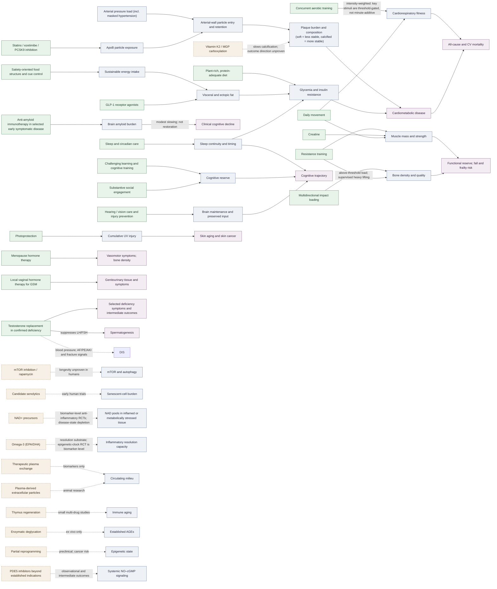

# Aging model

This page is a causal hypothesis under revision, not a declaration that aging has one master cause. It organizes the current wiki into upstream pressures, damage and maintenance processes, tissue states, functional reserve, and clinical outcomes. A solid arrow means the linked pages support the direction in humans or through convergent mechanistic evidence; a dashed arrow means the direction, importance, or human translation remains weak. Moving a biomarker is not equivalent to restoring function, preventing disease, or extending life. [[hallmarks-of-aging]] [[biological-age-biomarkers]] [[biological-age-reversal]]

## Reading the model

Three distinctions prevent category errors.

- **Aging rate versus disease risk:** lowering ApoB can prevent cardiovascular events without proving slower organism-wide aging. [[lipoprotein-retention-and-atherogenesis]]
- **Damage versus response:** inflammation, senescence, and repair programs can be harmful when persistent yet useful during infection, wound healing, or adaptation. Suppressing an age-associated signal is not automatically repair. [[cellular-senescence]] [[inflammaging-and-il-6]]
- **State versus trajectory:** a measurement can reflect current level, rate of drift, resilience after stress, or noise. These are not interchangeable and may respond differently to intervention. [[aging-dynamics-and-resilience]]

## Grand causal map

```mermaid
flowchart TD
  subgraph U[Upstream drivers and modifiers]
    T[Chronological time and replication]
    GEN[Inherited susceptibility]
    FOOD[Food environment and learned cues]
    APP[Satiety, reward and adherence]
    META[Energy surplus, diet pattern and glycemic exposure]
    INACT[Inactivity and underloading]
    SLP[Sleep and circadian disruption]
    PSY[Persistent threat load and impaired regulation]
    EXP[Tobacco, UV, pollution and other exposures]
    HORM[Reproductive and endocrine transitions]
    LEARN[Directed learning and cognitive challenge]
    SOCIAL[Social engagement and purpose]
    SENS[Sensory loss and repeated head injury]
  end

  subgraph D[Damage, maintenance and information]
    DNA[DNA lesions, somatic mutation and clonal selection]
    EPI[Epigenetic drift and regulatory noise]
    TEL[Telomere dysfunction]
    PROT[Misfolded, aggregated and glycated proteins]
    AUTO[Autophagy, lysosomes and proteasomes]
    MITO[Mitochondrial energetics, dynamics and mitophagy]
    ECM[Long-lived extracellular-matrix damage]
    NUT[mTOR and nutrient-sensing allocation]
  end

  subgraph C[Cell and tissue states]
    SEN[Persistent senescence and SASP]
    STEM[Stem-cell and niche exhaustion]
    IMM[Immune repertoire loss and chronic stimulation]
    IREC[Immune recognition, trafficking and resolution]
    ADIP[Visceral and ectopic fat]
    INFL[Chronic inflammatory signaling]
    VASC[ApoB retention and atherosclerotic plaque]
    BRAIN[Brain pathology and reduced maintenance]
    BCHOL[Brain cholesterol transport and ApoE lipidation]
    SKIN[Barrier and dermal injury]
    REPRO[Ovarian and reproductive decline]
    SEX[Sexual and genitourinary function]
  end

  subgraph R[Reserve, resilience and outcomes]
    MUS[Muscle strength, power and metabolic reserve]
    BONE[Bone strength and fracture reserve]
    CRF[Cardiorespiratory fitness]
    CRES[Cognitive and social reserve]
    RES[Recovery after perturbation]
    DIS[Cardiovascular, metabolic, cancer, neurodegenerative and infectious disease]
    FUNC[Mobility, cognition, independence and quality of life]
    HS[Healthspan and survival]
  end

  T --> DNA
  T -.-> EPI
  T --> TEL
  T --> PROT
  T --> ECM
  GEN --> DNA
  GEN --> TEL
  GEN --> BRAIN
  GEN --> BCHOL
  FOOD --> APP
  GEN -. appetite susceptibility .-> APP
  SLP --> APP
  PSY -. relief learning and attentional capture .-> APP
  APP --> META
  META --> NUT
  META --> ADIP
  META --> PROT
  INACT --> ADIP
  INACT --> MUS
  INACT --> CRF
  INACT --> BONE
  SLP --> ADIP
  SLP -.-> INFL
  PSY --> SLP
  PSY -. behavior and autonomic pathways .-> META
  PSY -. human aging effect poorly identified .-> INFL
  DIS -. symptoms and uncertainty .-> PSY
  EXP --> DNA
  EXP --> ECM
  EXP --> SKIN
  HORM --> REPRO
  HORM -.-> BRAIN
  HORM -.-> STEM
  HORM --> BONE
  HORM -. human physiology; visible effect magnitude uncertain .-> SKIN
  HORM --> SEX
  LEARN --> CRES
  SOCIAL --> CRES
  SENS --> BRAIN
  SENS -. reduced input and participation .-> CRES

  DNA -.-> EPI
  EPI -. feedback on maintenance .-> DNA
  TEL --> SEN
  PROT --> AUTO
  AUTO -->|successful flux lowers burden| PROT
  NUT --> AUTO
  MITO -. stress and energy failure .-> SEN
  AUTO --> MITO
  ECM -. altered mechanics .-> SEN
  ECM --> INFL
  DNA --> SEN
  SEN --> INFL
  SEN -. context dependent .-> STEM
  IMM --> INFL
  IREC -->|failed clearance or resolution| INFL
  IMM -->|narrows response diversity| IREC
  INFL -. chronic feedback .-> IMM
  ADIP --> INFL
  ADIP --> DIS
  META --> VASC
  VASC --> DIS
  BCHOL -. context-dependent effects on amyloid, tau and repair .-> BRAIN
  INFL -. neuroimmune amplification .-> BRAIN
  BRAIN --> DIS
  REPRO --> FUNC
  VASC --> SEX
  BRAIN -. neural and cognitive inputs .-> SEX
  PSY -. threat, attention and relationship context .-> SEX
  SEX --> FUNC
  STEM --> FUNC
  IMM --> DIS
  SKIN --> FUNC
  INFL --> DIS
  MUS --> RES
  BONE --> FUNC
  CRF --> RES
  CRES --> FUNC
  RES --> FUNC
  DIS --> FUNC
  FUNC --> HS
  DIS --> HS
```

The map is deliberately cyclic. Damage can impair the systems that clear damage; senescent and immune cells can sustain inflammation; altered recognition, trafficking, or resolution can turn incomplete clearance into chronic stimulation; matrix fragments can provoke tissue injury that releases more fragments; illness can reduce activity and further erode reserve. Brain cholesterol is shown as a local transport system rather than an extension of blood cholesterol because the blood–brain barrier largely separates the two pools. [[loss-of-proteostasis]] [[autophagy-and-lysosomal-quality-control]] [[extracellular-matrix-aging]] [[immune-aging-and-rejuvenation]] [[immune-recognition-and-trafficking]] [[brain-cholesterol-homeostasis]]

## Where interventions enter

```mermaid
flowchart LR
classDef est fill:#e8f4ea,stroke:#4a7c59,color:#1b3a25
classDef inv fill:#f6f0e6,stroke:#a08050,color:#3d2f1a,stroke-dasharray:4 3
classDef mech fill:#eef1f6,stroke:#5a6b8c,color:#22293a
classDef out fill:#f3ecf3,stroke:#7d5a80,color:#33203a

RT["Resistance training"]:::est --> MUS["Muscle mass and strength"]:::mech
CREAT["Creatine"]:::est --> MUS
AER["Concurrent aerobic training"]:::est -->|intensity-weighted: key stimuli are threshold-gated, not minute-additive| CRF["Cardiorespiratory fitness"]:::mech
MOVE["Daily movement"]:::est --> CRF
MOVE --> MUS
MUS --> FUNC["Functional reserve; fall and frailty risk"]:::out
CRF --> MORT["All-cause and CV mortality"]:::out

DIET["Plant-rich, protein-adequate diet"]:::est --> META["Glycemia and insulin resistance"]:::mech
SAT["Satiety-oriented food structure and cue control"]:::est --> EIN["Sustainable energy intake"]:::mech
EIN --> ADIP["Visceral and ectopic fat"]:::mech
GLP["GLP-1 receptor agonists"]:::est --> ADIP["Visceral and ectopic fat"]:::mech
ADIP --> META
LIPID["Statins / ezetimibe / PCSK9 inhibition"]:::est --> APOB["ApoB particle exposure"]:::mech
BP["Arterial pressure load (incl. masked hypertension)"]:::mech --> RETN["Arterial-wall particle entry and retention"]:::mech
APOB --> RETN
RETN --> PLQ["Plaque burden and composition<br/>(soft = less stable, calcified = more stable)"]:::mech
PLQ --> CARD["Cardiometabolic disease"]:::out
META --> CARD
K2["Vitamin K2 / MGP carboxylation"]:::inv -. slows calcification; outcome direction unproven .-> PLQ
CARD --> MORT

ANTIAB["Anti-amyloid immunotherapy in selected early symptomatic disease"]:::est --> AMY["Brain amyloid burden"]:::mech
AMY -->|modest slowing; not restoration| COGD["Clinical cognitive decline"]:::out

SLEEP["Sleep and circadian care"]:::est --> SLP["Sleep continuity and timing"]:::mech
SLP --> COG["Cognitive trajectory"]:::out
SLP --> META
LEARN["Challenging learning and cognitive training"]:::est --> CRES["Cognitive reserve"]:::mech
SOCIAL["Substantive social engagement"]:::est --> CRES
SENSORY["Hearing / vision care and injury prevention"]:::est --> BMAINT["Brain maintenance and preserved input"]:::mech
CRES --> COG
BMAINT --> COG
SUN["Photoprotection"]:::est --> UV["Cumulative UV injury"]:::mech
UV --> SKIN["Skin aging and skin cancer"]:::out
MHT["Menopause hormone therapy"]:::est --> SYM["Vasomotor symptoms; bone density"]:::out
LOCALH["Local vaginal hormone therapy for GSM"]:::est --> GSM["Genitourinary tissue and symptoms"]:::out
IMP["Multidirectional impact loading"]:::est --> BONEQ["Bone density and quality"]:::mech
RT -->|above-threshold load; supervised heavy lifting| BONEQ
BONEQ --> FUNC
TRT["Testosterone replacement in confirmed deficiency"]:::est --> TSYM["Selected deficiency symptoms and intermediate outcomes"]:::out
TRT -->|suppresses LH/FSH| FERT["Spermatogenesis"]:::out
TRT -. blood pressure; AF/PE/AKI and fracture signals .-> DIS

RAPA["mTOR inhibition / rapamycin"]:::inv -. longevity unproven in humans .-> MTOR["mTOR and autophagy"]:::mech
SENO["Candidate senolytics"]:::inv -. early human trials .-> SEN["Senescent-cell burden"]:::mech
NAD["NAD+ precursors"]:::inv -. biomarker-level anti-inflammatory RCTs; disease-state depletion .-> NADPOOL["NAD pools in inflamed or metabolically stressed tissue"]:::mech
OM3["Omega-3 (EPA/DHA)"]:::inv -. resolution substrate; epigenetic-clock RCT is biomarker-level .-> RESOL["Inflammatory resolution capacity"]:::mech
TPE["Therapeutic plasma exchange"]:::inv -. biomarkers only .-> MILIEU["Circulating milieu"]:::mech
PEP["Plasma-derived extracellular particles"]:::inv -. animal research .-> MILIEU
THY["Thymus regeneration"]:::inv -. small multi-drug studies .-> IMM["Immune aging"]:::mech
DEGLY["Enzymatic deglycation"]:::inv -. ex vivo only .-> AGE["Established AGEs"]:::mech
REPROG["Partial reprogramming"]:::inv -. preclinical; cancer risk .-> EPI["Epigenetic state"]:::mech
PDE5["PDE5 inhibitors beyond established indications"]:::inv -. observational and intermediate outcomes .-> NOSIG["Systemic NO–cGMP signaling"]:::mech
```

The upper half contains interventions with actionable human uses, although their demonstrated endpoint is often disease prevention or function rather than aging itself. The lower half contains research hypotheses; it must not be converted into a consumer regimen. [[longevity-intervention-prioritization]] [[longevity-clinics-and-evidence]] [[supplement-evidence-and-safety]]

## Explicit causal postulates

### Postulate 1 — aging is a coupled loss of maintenance and reserve, not a list of independent hallmarks

**Postulate:** persistent damage increasingly exceeds repair and buffering capacity; interacting cell, matrix, immune, and metabolic states then reduce recovery and functional reserve. This is proposed because [[aging-dynamics-and-resilience]] frames aging as drift plus impaired recovery, while [[loss-of-proteostasis]], [[mitochondrial-dysfunction]], [[genomic-instability-and-dna-repair]], and [[extracellular-matrix-aging]] each describe damage–maintenance feedback. **Confidence: moderate as an organizing structure, weak as a quantitatively identified human model.** No current measure partitions a person's decline into these components.

### Postulate 2 — stochastic information loss and molecular damage reinforce one another

**Postulate:** DNA lesions, somatic mutation, and regulatory dispersion impair maintenance programs, while declining maintenance permits further damage and noise. [[stochastic-aging-and-molecular-noise]] and [[dream-complex-and-repair-capacity]] imply this loop; [[programmed-versus-stochastic-aging]] shows why developmental-gene signatures do not by themselves prove an active aging program. **Confidence: emerging.** Cross-species and cell evidence support parts of the loop, but causal ordering in humans and the size of any irreversible component remain unknown.

### Postulate 3 — long-lived extracellular matrix is an independent memory of age

**Postulate:** matrix cross-links, cleavage, and stiffness preserve damage outside cells, alter mechanotransduction, and can drive inflammatory feedback even if cellular state is partly reset. This follows from [[advanced-glycation-end-products]] and [[extracellular-matrix-aging]], including old-matrix/young-cell experiments. **Confidence: moderate preclinically, weak for human outcome attribution.** The specific contribution of CML, glucosepane, elastin fragments, and other lesions is unresolved.

### Postulate 4 — chronic inflammation is usually a mediator and amplifier, not a single root cause

**Postulate:** senescent cells, visceral fat, immune remodeling, matrix fragments, infection, and tissue injury converge on inflammatory signaling, which then worsens metabolic, vascular, and tissue function. [[cellular-senescence]], [[visceral-and-ectopic-fat]], [[immune-aging-and-rejuvenation]], and [[inflammaging-and-il-6]] imply convergence. **Confidence: moderate.** The weak link is intervention logic: IL-6 and related pathways also support host defense, repair, and exercise adaptation, so indiscriminate suppression may cause harm.

### Postulate 5 — reserve changes the clinical expression of accumulated pathology

**Postulate:** muscle, cardiorespiratory fitness, cognitive reserve, and social function buffer a given molecular burden and improve recovery after stress, delaying disability even when they do not erase damage. [[muscle-strength-and-mortality]], [[cardiorespiratory-fitness]], [[cognitive-reserve-and-brain-health]], and [[daily-movement-mobility-and-pain]] jointly imply this layer. **Confidence: moderate-to-strong for function and risk, weak for maximum-lifespan extension.** Reverse causation remains important in observational mortality gradients. The reserve-building edge is also not established as monotonic to arbitrarily high doses: lifelong endurance volumes around 10 or more hours weekly associate with greater coronary plaque of both compositions, though no study in that literature has measured events, so the far end of the dose–response curve is unresolved rather than reversed. [[endurance-exercise-and-coronary-atherosclerosis]] A lifecourse reading further qualifies the reserve node: strength, VO2 max, and bone density peak around the fourth decade and decline thereafter, so late-life reserve depends on both the height of that peak and the slope of the decline — training before and during the peak years raises the entire later curve (bone is the sharpest case, with much of peak density set by late adolescence), while injury is a principal accelerant of the slope. Support for the peak-and-slope structure is convergent observational evidence (sibling-controlled analyses, roughly 40-year follow-up of childhood activity) plus expert interpretation, not randomized lifecourse trials. [[youth-resistance-training]] [[womens-exercise-across-the-lifespan]] [[bone-remodeling-and-mechanical-loading]]

### Postulate 6 — cumulative exposure is the correct time model for several preventable diseases

**Postulate:** repeated ApoB exposure, glycemic exposure, ultraviolet exposure, smoking, and underloading accrue risk over time; earlier prevention has more leverage than late repair. [[lipoprotein-retention-and-atherogenesis]], [[advanced-glycation-end-products]], [[photoprotection]], and [[genomic-instability-and-dna-repair]] support this ordering. **Confidence: strong for the named disease pathways, unproven as a unified rate of aging.** Two refinements follow from the retention step itself. Pressure is a partly independent input rather than only a parallel risk factor, because it both injures the endothelium and convectively drives particles into the wall — which also means an exposure measured badly (clinic rather than ambulatory blood pressure) can survive statistical adjustment and keep acting. And plaque composition, not just plaque quantity, carries the risk: soft plaque is the less stable phenotype, so an intervention that changes only the calcified compartment has an ambiguous sign. [[endurance-exercise-and-coronary-atherosclerosis]] [[vitamin-k2]]

### Postulate 7 — reproductive aging is partly coupled to, and partly distinct from, systemic aging

**Postulate:** endocrine transitions can alter sleep, bone, vascular, cognitive, and reproductive function, but the exponential rise in oocyte aneuploidy and depletion of ovarian reserve cannot be treated as a generic whole-body clock. [[oocyte-aneuploidy-and-reproductive-aging]], [[ovarian-aging-and-tissue-cryopreservation]], [[perimenopause-assessment-and-testing]], and [[menopause-related-cognitive-impairment]] imply partial coupling. **Confidence: strong that trajectories differ; weak on shared causal mechanisms.**

### Postulate 8 — most current interventions target reversible state or disease risk, not irreversible damage

**Postulate:** exercise, nutrition, sleep, lipid lowering, metabolic treatment, and symptom-directed hormone therapy can improve reserve or reduce specific risks, while evidence that they remove somatic mutations, established cross-links, or other putatively irreversible damage is absent. [[healthspan-versus-maximum-lifespan]] and [[biological-age-reversal]] require this endpoint separation. **Confidence: strong as an evidentiary boundary; contested as a theoretical ceiling.** It remains possible that repeated state improvement changes damage accumulation indirectly.

### Postulate 9 — persistent threat can amplify aging-relevant exposures without being a demonstrated root cause of aging

**Postulate:** repeated threat appraisal and limited regulatory capacity can disturb sleep and shape movement, eating, substance use, social connection, and care-seeking; these behavioral and physiological routes may amplify metabolic and inflammatory pressure. [[stress-threat-discrimination]], [[interpersonal-regulation-and-emotional-capacity]], [[catastrophizing-and-uncertainty]], and [[addiction-recovery-and-emotional-sobriety]] imply the mediating routes. **Confidence: weak for an independent aging-rate effect, moderate for effects on symptoms and health behavior.** The causal map therefore gives threat load a solid arrow only to sleep and dashed arrows to metabolism and inflammation; distress should not be reduced to a biomarker or blamed on the person experiencing it.

### Postulate 10 — immune aging reflects failures of coordination as well as excess inflammation

**Postulate:** age-related immune dysfunction arises partly from reduced repertoire diversity and altered recognition, trafficking, tissue context, and resolution; chronic inflammation is therefore both an output of incomplete control and a feedback pressure on future responses. [[immune-aging-and-rejuvenation]] and [[immune-recognition-and-trafficking]] imply this coordination layer, while [[inflammaging-and-il-6]] shows why one circulating cytokine cannot stand in for the system. **Confidence: moderate for the component mechanisms, weak for their relative causal weights in human aging.** This weakens any inference that nonspecific immune stimulation or cytokine suppression is rejuvenation.

### Postulate 11 — brain aging is partly governed by a compartment-specific lipid economy

**Postulate:** ApoE-mediated cholesterol transport and lipidation within the brain modify membrane repair and amyloid- and tau-relevant biology, but peripheral LDL lowering should not be drawn as direct depletion of brain cholesterol because the pools are substantially separated. [[brain-cholesterol-homeostasis]] and [[alzheimers-spectrum-and-diagnosis]] imply this boundary. **Confidence: moderate for compartmentalization and genetic association, weak for a simple modifiable causal chain.** [[anti-amyloid-immunotherapy]] supports amyloid as a therapeutically alterable disease node in selected early symptomatic patients, but its modest clinical effect and treatment harms argue against treating amyloid clearance as global brain rejuvenation.

### Postulate 12 — sexual function is an integrated output and early sentinel, not a separate compartment

**Postulate:** desire, arousal, and erectile or genital function integrate vascular, hormonal, neural, tissue, and psychological inputs; because penile and vulvovaginal tissues depend on small-vessel blood flow and local hormone signaling, sexual dysfunction can surface cardiometabolic or endocrine disease before it is otherwise recognized, and a large share of later-life decline is a modifiable mismatch between an aging response threshold and an unchanged behavioral script rather than fixed biology. [[erectile-dysfunction-and-vascular-health]] positions erectile change as a small-artery sentinel; [[sexual-desire-arousal-and-aging]], [[genitourinary-syndrome-of-menopause]], and [[vulvovaginal-anatomy-and-hormone-sensitivity]] supply the hormonal and tissue arms; [[pornography-motivation-and-sexual-health]] shows shame and misattribution acting through the psychological arm. **Confidence: moderate for the sentinel logic and for local hormone dependence of genital tissue, weak for quantified predictive value.** No source establishes how often sexual dysfunction is the first detectable sign of systemic disease or how much script renegotiation restores function in controlled designs.

### Postulate 13 — the food environment acts through appetite and adherence, not around energy balance

**Postulate:** food availability, learned cues, energy density, protein and fiber content, texture, attention, sleep, and stress alter hunger, satiation, reward, and the repeatability of a dietary pattern; these mediators change long-run energy intake and fat distribution while conserving the physical requirement that body-energy change reflects intake minus expenditure. [[evolutionary-mismatch-and-weight-regulation]], [[satiety-oriented-diet-design]], [[dietary-fiber]], and [[energy-balance-and-calorie-counting]] jointly imply this pathway. **Confidence: moderate for the component effects and energy-balance constraint; weak for any universal appetite-control protocol or fixed plate geometry.** This explains why calorie arithmetic can be causally true yet behaviorally insufficient, and why a food or tactic should be judged by its substitution and durability rather than by a health halo.

### Postulate 14 — brain maintenance and cognitive reserve are parallel, partly independent buffers

**Postulate:** vascular-risk control, sleep, sensory care, and injury prevention primarily limit new brain injury, whereas effortful learning and substantive social engagement build flexible networks that preserve function despite a given pathology burden. Exercise can act on both arms. [[cognitive-reserve-and-brain-health]], [[exercise-enhanced-learning]], and [[sleep-quality-and-circadian-alignment]] imply this separation. **Confidence: moderate for the distinction and for functional benefit; weak for assigning each component a dementia-prevention effect.** The multidomain FINGER trial supports the combined portfolio but cannot isolate its active ingredient, and reserve can delay clinical detection without removing disease. Observational coffee associations and preclinical caffeine mechanisms do not justify adding caffeine as a maintenance intervention. [[caffeinated-coffee-and-cognitive-aging]]

## Mechanism-specific boundaries

- **Proteostasis and autophagy:** cargo abundance is not flux, and fasting hours or supplement use cannot be inferred from a pathway marker. Exercise and adequate nutrition remain justified by outcomes, not proven autophagy optimization. [[autophagy-and-lysosomal-quality-control]] [[loss-of-proteostasis]]
- **Mitochondria:** mitochondrial changes can be causes, compensations, or consequences of inactivity and disease. Target engagement does not establish healthspan benefit. [[mitochondrial-dysfunction]]
- **Telomeres and stem cells:** short-telomere disorders establish biological importance, but population telomere length is an incomplete aging measure and indiscriminate proliferative stimulation carries cancer and clonal-selection risks. [[telomere-biology]] [[stem-cell-exhaustion]]
- **Brain aging:** vascular injury, protein pathology, sensory loss, cognitive reserve, and hormonal or Lewy-body syndromes can overlap clinically. Molecular positivity, symptoms, and function must remain separate. [[alzheimers-spectrum-and-diagnosis]] [[alzheimers-diagnosis-biological-vs-clinical]] [[lewy-body-disease-and-synucleinopathies]]
- **Skin aging:** photoprotection and topical or procedural treatment can preserve or remodel local tissue without demonstrating whole-body rejuvenation. The skin is also a diagnostic surface, not only a target: velvety fold plaques driven by hyperinsulinemia, xanthomas, jaundice, nail changes, and unexplained generalized itch can surface metabolic, hepatic, hematologic, autoimmune, cardiac, or pulmonary disease before other signs, so a visible change is read here as a prompt for diagnosis-led evaluation rather than cosmetics. Sign-specific sensitivity and predictive values remain unquantified. [[skin-barrier-and-moisturization]] [[topical-retinoids]] [[procedural-skin-remodeling]] [[cutaneous-signs-of-systemic-disease]]

## Revision ledger

- **2026-09-03 — Norton batch (CGM, dietary protein and cardiovascular risk, stacked-dehydration death) reviewed; no new edge, postulates 5, 6, and 12 gain reading notes:** three integrations previously assessed only in the changelog are now recorded here with their verdicts. (1) Continuous glucose monitoring ([[continuous-glucose-monitoring]]) is a measurement layer over the existing META glycemic-exposure node, governed by the same reading rules as NMR scores and biological-age tests: a single post-meal excursion is the downstream sum of many simultaneous inputs and is not a validated surrogate for disease in a normoglycemic person, and the 23-study review's benefit signal (short-term, program-linked, concentrated in prediabetes) is behavior- and adherence-level — no structure, one more instance of the model's rule that more resolution on a node is not more causal knowledge. (2) A candidate protein-quantity→cardiovascular edge ([[dietary-protein-and-cardiovascular-risk]]) was reviewed and declined, because the exposure decomposes without remainder into branches the map already draws: protein-source saturated fat acts through the established ApoB→retention route (META→VASC), plant-for-animal substitution is the food-matrix logic of the dietary branches, and protein adequacy serves the muscle-reserve arm of postulate 5 — the same dietary target can load either branch depending on food source, which is why quantity alone carries no edge. Pooled cohort outcomes are null and short randomized trials move risk factors favorably; the 2026 UK Biobank association above 1.8 g/kg/day in adults over 55 is held as a low-certainty dose-and-age conflict on the topic page, not converted into structure. Two readings are recorded. Postulate 12's sentinel logic gains its converse: physique, leanness, and strength are *not* sentinels of vascular state — an athletic surface does not read out cumulative ApoB exposure, hypertension, or drug toxicity, so postulate 6's cumulative-exposure accounting must be done by measurement, not appearance. And the Danish registry cohort on anabolic-androgenic steroids (myocardial infarction HR 3.0, cardiomyopathy HR 8.9) enters as a large competing drug-toxicity exposure that explains bodybuilder event anecdotes without any protein pathway — disease-level, drawn nowhere as aging structure. (3) The stacked-dehydration death ([[sauna-and-deliberate-heat-exposure]], [[health-misinformation-and-media-incentives]]) is an acute compositional state risk — heat vasodilation plus sweat loss plus laxative, diuretic, or intoxicant exposure collapsing volume and sodium margin — with no aging-rate pathway; the safety warning lives in [[practice-playbook]], and the map's only residue is that recovery modalities are additional physiological loads, consistent with postulate 5's resilience reading. [[lipoprotein-retention-and-atherogenesis]] [[muscle-strength-and-mortality]] [[nmr-blood-analysis]] [[layne-norton]]

- **2026-09-03 — Norton trio (fiber–mortality in diabetes, fructose arithmetic, smartwatch calorie error) reviewed; no new edge:** the diabetes-cohort fiber–mortality association (adjusted HR 0.47, third versus lowest quartile) is food-pattern observational evidence of the class this ledger declines to convert into causal edges, and its ~13% statistical mediation through the systemic immune-inflammation index is consistent with the SCFA/inflammation mechanism the dietary branches already carry — a reading note, not structure. The fructose material removes a candidate distinction rather than adding one: isocaloric-substitution nulls and the sucrose-composition arithmetic argue against any sweetener-specific aging pathway separate from the existing glycemic-exposure and energy-balance branches. Smartwatch expenditure error (−30% to +116% by exercise mode) is instrument-level measurement guidance on the energy-balance identity, not a causal claim. [[dietary-fiber]] [[free-sugars-and-glycemic-response]] [[energy-balance-and-calorie-counting]]

- **2026-09-03 — nutrient profiling, protein/EAA anabolic signaling, and partner-search integrations reviewed; no new edge, postulates 5 and 13 enriched:** three candidate structural changes were reviewed and none drawn. (1) The nutrient-profiling material ([[nutrient-density-and-food-profiling]], [[ty-beal]]) is entirely a measurement-and-policy layer sitting above postulate 13's existing food-environment input: a profiling score ranks composition, not outcomes, and its author concedes the score diverges from outcome evidence exactly where matrix and fermentation effects operate (cheese scoring moderate against a neutral-to-favorable mortality record — the standing tension already recorded at [[cheese-and-mortality]] and left unresolved rather than averaged). The genuine enrichment is to postulate 13's "food availability" input, which now carries a second economic mechanism alongside subsidy-driven price suppression: profiling algorithms govern shelf and search placement, health-claim eligibility, and program qualification, so the input is partly algorithmically set. The sodium-to-potassium ratio enters as an exposure-measurement heuristic (processing proxy, no outcome validation), not as a causal node. (2) The essential-amino-acid material ([[essential-amino-acid-supplementation]]) was reviewed as a candidate addition to the maintenance arm and declined: anabolic resistance is a real age-associated signaling change and belongs to postulate 5's reserve reading — muscle mass as the reserve whose defense determines clinical expression — but the intervention evidence is acute-synthesis surrogate endpoints from a commercially conflicted source, and postulate 8's boundary applies squarely (this targets reversible state, not irreversible damage). Postulate 5 gains the reading that reserve defense becomes signal-limited rather than substrate-limited with age, which is why resistance training, not supplementation, is the load-bearing lever; the unexamined mTOR trade-off of chronically spiking anabolic signaling is recorded as an open question rather than an edge. The protein-overfeeding claim ([[energy-balance-and-calorie-counting]]) does not threaten postulate 13's energy-balance conservation clause — it is a macronutrient-specific partitioning question inside the identity — and is held as a small, secondhand, provisional literature. (3) The partner-search material ([[partner-search-and-dating-behavior]]) carries no aging-rate pathway: partnership is a well-documented well-being correlate whose health route runs through postulate 9's existing social-threat and connection mediators, and the source is structured observation from a dating-advice author with no outcome data, so it stays behavior-level.

- **2026-09-03 — organ-specific aging, indoor air, and aesthetics integrations reviewed; no new edge, postulates 1 and 6 enriched:** the organ- and cell-type-specific aging material ([[biological-age-biomarkers]], [[will-cole]]) was reviewed as a candidate structural change — plasma-proteomic organ clocks reporting that about one in five adults over 50 carries at least one fast-aging organ, with organ-matched disease risk — and deliberately not drawn: the figures arrive secondhand through a functional-medicine interview without primary-paper verification, and even taken at face value they are measurement resolution, not new causal structure; postulate 1's reading is enriched in that heterogeneous per-organ aging rates within one body are exactly what a coupled damage–maintenance model predicts and what whole-body scores blur, and the described post-1965 birth-cohort acceleration is recorded as an unverified anomaly candidate consistent with postulate 6's cumulative-exposure logic (earlier, larger lifetime exposure to the modern metabolic environment) rather than as evidence of a changed aging mechanism. Cole's cellular-confusion/exdifferentiation frame is a popularization of the epigenetic information-loss reading already held at hypothesis tier in postulate 2 via [[epigenetic-alterations-and-reprogramming]]; his EMF–mold, C15-membrane, and spirituality–inflammation claims sit below the map's evidence floor and are bounded on his person page. The indoor-air material ([[indoor-air-quality]]) is exposure detail under the existing EXP input — indoor accumulation concentrates the same pollution exposure the map already carries, and the sham-controlled HEPA blood-pressure trial supports the EXP→vascular reading at intermediate-endpoint level without adding an edge. The aesthetics material ([[body-image-and-appearance-change]], [[mike-israetel]]) is behavior- and adherence-level with no aging-rate pathway; its map-relevant residue is that vanity is an unusually strong adherence motive for the exercise and dietary inputs the map already draws — a reading note on postulate 13's adherence logic, not structure — and his aging-reversal timelines are attributed futurism drawn nowhere. [[stochastic-aging-and-molecular-noise]] [[environmental-pollution-and-health]] [[evolutionary-mismatch-and-weight-regulation]]

- **2026-09-03 — anticipatory-threat, exfoliation, and desire-rehabilitation integrations reviewed; no new edge, postulate 9's reading enriched:** the Marks anticipatory-evaluation material ([[social-evaluative-threat-and-criticism]]) extends postulate 9's threat-load node backward in time — the PSY input includes predictive threat (stakes appraisals of upcoming interactions consuming working memory hours before contact, with evaluation-plus-low-control presented as the maximal stressor configuration) and not only experienced stressors — an interpretive enrichment of the node's reading, state- and behavior-level throughout, touching no edge; the countermeasures (affect labeling, single task-question redirection) are topic-level investigational practice, and the video's transcript is an auto-translated caption track, lowering claim-wording confidence. The exfoliation material ([[exfoliation-and-desquamation]]) is local skin-surface care with no organism-aging pathway: its menopause content (estrogen loss → natural-moisturizing-factor decline → barrier compromise and epidermal/dermal thinning) is already carried by the existing endocrine and skin-compartment readings, and its central contribution — cumulative exfoliation-load accounting and moisturization as the upstream desquamation lever — is routine-design logic for the topic pages. The desire-rehabilitation material ([[sexual-desire-arousal-and-aging]], [[maria-sophocles]]) is relationship- and behavior-level with no aging-rate pathway; the sexual-frequency–longevity association was previously reviewed and declined, and nothing here upgrades it. [[skin-barrier-and-moisturization]] [[genitourinary-syndrome-of-menopause]] [[interpersonal-regulation-and-emotional-capacity]]

- **2026-09-03 — synthesis maintenance audit: corpus sweep for never-integrated pages; postulate 5 gains a lifecourse reading, no new edge; diagram styling defect fixed:** a sweep of every page not yet cited by either synthesis page confirmed that nearly all were reviewed at integration time with recorded no-change verdicts — training-technique detail (trunk, lunge, arm, shoulder, hip, posture pages), state-control and behavioral-skill material resolving to postulate 9's existing mediating routes ([[neuromodulators-and-state-control]], [[combat-sports-as-controlled-stress-training]], [[self-schema-updating-after-achievement]], [[cognitive-dissonance-and-narrative-protection]]), disease- and symptom-specific care, local skin treatment, people pages, and off-domain urbanism and AI content, all below the map's evidence floor or carried by existing structure. One reading was missing: postulate 5 previously described reserve as a static adult buffer, but [[youth-resistance-training]] and [[womens-exercise-across-the-lifespan]] jointly support a lifecourse structure — an accrual phase, a peak near the fourth decade, and a decline slope, each separately modifiable — now stated in the postulate with its observational confidence bound. No edge is added or changed, because chronological time and the training inputs already reach the reserve nodes; what changes is that the intervention edges into muscle, cardiorespiratory fitness, and bone should be read as acting on both peak and slope, with timing mattering most for bone (accrual largely closes in late adolescence, and low energy availability during that window can permanently lower the peak — [[low-energy-availability-and-menstrual-function]]). Memory-aging material ([[memory-encoding-retrieval-and-reconstruction]]) was re-checked and stays absorbed by the existing directed-learning→reserve edge: corrected retrieval, spacing, and adaptive selectivity are mechanism beneath that edge, not new structure. Separately, the intervention-map classDef styling used invalid backtick-quoted color values that could break Mermaid rendering; fixed with no content change.

- **2026-09-03 — immune-surveillance skin-cancer framing, felt-safety neuroscience, and boundary-setting integrations reviewed; no new edge, postulates 6, 9, and 10 enriched:** the new [[skin-cancer-risk-and-immune-surveillance]] page strengthens the existing IMM→DIS edge at a specific disease: transplant-level immunosuppression multiplying skin-cancer incidence regardless of sun behavior is a natural experiment for immune surveillance as a disease gate, and checkpoint-immunotherapy melanoma control is its therapeutic mirror — enrichment of postulate 10's coordination reading, not new structure. The rising keratinocyte-cancer incidence in sun-protected young cohorts enters as a recorded anomaly for the UV-only reading of the EXP→DNA→cancer route (hypothesized environmental/immune/HPV contributions, unresolved). Soleymani's contested claim that 28-day epidermal turnover erases decades-old sunburn mutations was reviewed against postulate 6's cumulative-exposure logic and rejected as a structural change: persistent clonal UV-signature driver mutations in long-lived stem cells are the mainstream evidence, so cumulative UV keeps its solid reading and the dispute is recorded as a debate on the topic page. Narrowband UVB phototherapy ([[uv-phototherapy]]) is dose-controlled local immunomodulation — disease treatment, no aging edge. The Rabin material ([[david-rabin]]) enriches postulate 9's reading in two ways without touching its edges: information overload as a chronic low-grade threat input (his ambient-terror framing) gives the PSY node an explicit modern driver on the environment side, and bottom-up safety signals (touch, music, voluntary breath) plus felt-safety-gated learning give the node's regulation arm concrete levers — all state- and behavior-level, with his transgenerational-epigenetic-trauma and MDMA-epigenetic-repair claims held at hypothesis/preliminary tier and drawn nowhere. The Wallo267 boundary material ([[boundaries-and-overcommitment]]) is behavioral load management fully carried by postulate 9's existing mediating routes (overcommitment→sleep, stress, behavior); no edge. [[immune-aging-and-rejuvenation]] [[photoprotection]] [[stress-threat-discrimination]] [[emotion-regulation]]

- **2026-09-02 — microglial convergence thesis, ADHD/rejection-sensitivity, and optimization-culture integrations reviewed; no new edge, postulates 4, 6, and 14 enriched:** the new [[microglia-and-neuroinflammation]] page proposes a candidate restructuring — disrupted metabolism acting through microglial immunometabolism as the convergent upstream event across neurodegenerative disease — which was reviewed and deliberately not drawn as new map structure: it is attributed expert interpretation (Perlmutter) competing with proteinopathy models that retain independent evidence, the M1/M2 dichotomy it rests on is a didactic simplification, and its human reversal evidence (the small, short, unblinded Ornish–Tanzi lifestyle trial) is hypothesis-tier without microglial measurement. What changes is interpretive: postulate 4's INFL node gains its brain-facing effector mechanism (systemic inflammation shifting microglia toward a synapse-destructive, glycolytic state, with the MPTP cases showing a single toxin exposure can sustain that state for over a decade), and postulate 14's maintenance arm gains PM2.5 air pollution as an explicit injury input (Lancet-recognized modifiable dementia factor, observational with correlated-exposure caveats) plus agricultural mitochondrial toxins (paraquat–Parkinson's) as exposure detail under postulate 6's cumulative-exposure logic — enrichment of existing branches, not new edges. The UPF→Alzheimer's cohort resolves to the existing diet→inflammation→brain routes; creatine-for-Alzheimer's (open-label pilot) stays below the map's evidence floor; the anti-amyloid Cochrane characterization is recorded as a conflict on [[anti-amyloid-immunotherapy]] and does not change postulate 11's already-modest reading of amyloid clearance. The ADHD material ([[adhd-dysregulation-and-rejection-sensitivity]]) is symptom- and behavior-level with no aging-rate pathway — its sleep and threat-appraisal content resolves to postulate 9's existing mediating routes. The optimization-culture material ([[health-misinformation-and-media-incentives]], [[lucy-mcbride]]) is epistemic and care-delivery content; its anti-aging-industry critique reinforces the map's existing boundary that no marketed reversal product carries outcome evidence. [[ultra-processed-food]] [[environmental-pollution-and-health]] [[mitochondrial-dysfunction]] [[alzheimers-spectrum-and-diagnosis]]

- **2026-09-02 — UPF system economics, fungal nutrition, and gut-virome integrations reviewed; no new edge, postulates 4 and 13 enriched:** the ultra-processed-food material ([[ultra-processed-food]]) is fully absorbed by existing structure — engineered hyperpalatability, energy density, and satiety override are the mediators postulate 13 already names, and the UPF→metabolic-risk pathway is carried by postulate 6's cumulative glycemic and dietary exposure logic. The map-relevant enrichment is upstream: postulate 13's "food availability" input now has an explicit economic mechanism (subsidy-driven commodity overproduction → artificially cheap engineered calories → population exposure), which explains why the food environment is a policy object and not only a household one; the food-addiction framing stays attributed expert interpretation, not a new node. The gut-virome material ([[gut-virome-and-bacteriophages]]) was reviewed as a candidate regulatory layer beneath postulate 4's microbial input channel — phages controlling bacterial composition would sit upstream of the microbiome→inflammation route — and deliberately not drawn: the evidence is correlational diversity-tracking with 80% of the phage content functionally uncharacterized, and the age-related virome-diversity decline is an observation without a demonstrated susceptibility consequence, recorded as a gap. The mushroom material ([[culinary-mushrooms-and-fungal-nutrition]]) adds no aging edge — ergothioneine's reactive-oxygen scavenging is laboratory-tier with cellular-hallmark signals only, held below the map's evidence floor, and the vitamin D and beta-glucan content resolves to existing nutritional-adequacy and lipoprotein branches. Antimicrobial resistance ([[phage-therapy]]) is a disease-treatment and system-risk pathway, not an aging-rate mechanism. [[satiety-oriented-diet-design]] [[evolutionary-mismatch-and-weight-regulation]] [[food-patterns-and-gut-ecology]] [[inflammaging-and-il-6]]

- **2026-09-02 — neuroimmune depression and GLP-1 nutrition integrations reviewed; no new structure, postulates 4 and 14 enriched:** the new [[inflammation-and-depression]] page gives postulate 4's INFL node an explicit brain-facing output — circulating cytokines cross a filtered (not sealed) blood–brain barrier, modulate interoceptive circuits, and are proposed to drive an inflammatory subtype of depression (~30% of severe cases, expert estimate) and evolutionarily conserved sickness behavior; candidate inputs (obesity, microbiome, gum disease, menopause, aging, early-life stress encoded as immune memory) all resolve to existing upstream nodes, so no new edge is drawn and the endpoints remain mood-, symptom-, and disease-level rather than aging-rate. Postulate 14 gains a maintenance-arm reading: inflammation as an accelerator (not initiator) of neurodegenerative progression via the immune response to amyloid, which is consistent with the existing [[anti-amyloid-immunotherapy]] mapping and keeps the gum-disease–dementia association at hypothesis tier. The GLP-1 nutritional-support material ([[glp-1-receptor-agonists]], [[federica-amati]]) is treatment-phase behavior and body-composition management — sarcopenic obesity from unsupported drug cycling is a disease-risk pathway already carried by the reserve logic of postulate 5 and the appetite logic of postulate 13, which also absorbs the four-stage appetite cascade and food-texture/eating-rate evidence as mechanism detail under its existing mediators. Spector's Parkinson's gut-prodrome claim and Amati's unsourced 80%-dementia-preventability figure stay attributed and bounded on their topic pages. [[inflammation-and-depression]] [[nutritional-psychiatry]] [[satiety-oriented-diet-design]] [[inflammaging-and-il-6]]

- **2026-09-02 — candidate diet→microbiome→brain edge reviewed; no new structure, postulates 4 and 13 enriched:** the nutritional-psychiatry material proposes a route from dietary pattern through microbiome composition (butyrate producers, lactic-acid producers, GABA/glutamate organisms), gut-barrier and inflammatory signaling, to brain state and mood. It was reviewed and deliberately not drawn as new map structure, because its endpoints are mood, symptom, and biomarker-level (SMILES remission in diagnosed depression is disease treatment; hippocampal volume change in healthy women is a biomarker; mouse phenotype-transfer experiments are preclinical), not demonstrated aging-rate effects. What changes is interpretive: postulate 4's inflammation-as-mediator reading gains a concrete microbial input channel (reduced butyrate production and pro-inflammatory microbial patterns as upstream contributors to the INFL node), and the food-environment logic of postulate 13 gains a within-food processing dimension — the meal-replacement trial showing equal weight loss but opposite microbiome-diversity movement supports reading the dietary input as delivered food matrix and substrate diversity, not nutrient totals alone. The dietary-depression direction is now interventionally supported at the disease level, which strengthens the existing diet→inflammation→brain mediating routes without licensing a diet→aging-rate edge; Spector's two-types-of-brain-disease unification stays attributed expert interpretation on the topic pages. The paleo material adds no edge — its practical content (whole grains, legumes, UPF reduction) is already carried by the dietary branches, and the TMAO signal is an association-level microbiome-metabolite mechanism recorded at [[paleolithic-diets-and-modern-paleo]]. PRP/PRF is local tissue treatment with no organism-aging pathway. [[nutritional-psychiatry]] [[food-patterns-and-gut-ecology]] [[inflammaging-and-il-6]] [[platelet-rich-plasma-and-fibrin]]

- **2026-09-01 — emotion, female-hormone, and resilience integrations reviewed; no new edge, two postulate readings enriched:** the emotion-science material ([[emotions-as-functional-states]], [[emotion-regulation]]) refines how postulate 9's threat-load node should be read — "impaired regulation" is now legible as a trainable, flexibility-and-granularity-dependent capacity with an interpersonal dimension, and the fear/panic dissociation shows the node aggregates distinct exteroceptive and interoceptive systems — but everything remains state- and behavior-level, so the PSY edges (solid to sleep, dashed to metabolism and inflammation) are unchanged; the cold-exposure emotion-regulation transfer claim is an n-of-1 and does not touch the map. The perimenopausal cerebral-hypometabolism material (FDG-PET, ~20% average glucose-uptake decline tracking symptom burden) gives postulate 7's endocrine–cognition coupling a concrete brain-energy mechanism and strengthens the existing [[menopause-related-cognitive-impairment]] linkage without creating a new edge, because the therapeutic arm (early hormone therapy correcting the phenotype or preventing dementia) remains hypothesis, held contested at [[whi-and-menopause-hormone-therapy]]; hot-flash burden enters as a candidate readout of that coupling, not a causal node. PCOS's hyperinsulinemia→theca-cell androgen loop is carried entirely by the existing META branches and postulate 6's cumulative-exposure logic — its map-relevant contribution is that compensated hyperinsulinemia gains a second early-visible phenotype (after acanthosis nigricans) identifiable decades before disease. The resilience/discipline material is playbook- and topic-level behavior structure with no aging-rate pathway. [[polycystic-ovary-syndrome]] [[insulin-resistance]] [[interpersonal-regulation-and-emotional-capacity]] [[deliberate-cold-exposure]]

- **2026-09-01 — monthly evidence-correction audit; no new aging-rate edge, four causal bounds tightened:** selected high-risk cardiovascular benefit from prescription icosapent ethyl is disease prevention, not an omega-3 aging edge; its mineral-oil comparator conflict narrows effect-size confidence without changing the dashed resolution mechanism. NAD claims were narrowed because a proprietary oral formulation can change whole-blood intracellular NAD, but no healthy-person clinical outcome follows; the dashed edge remains biomarker/disease-state only. TRT stays established only for confirmed symptomatic deficiency, while current evidence adds blood-pressure, arrhythmia, pulmonary-embolism, kidney, and fracture harm branches and invalidates the shorthand that bone-density improvement implies fracture prevention. Modern hormonal contraception remains a method-specific reproductive trade-off rather than an aging intervention; its VTE risk persists and its sexual and adolescent-bone effects are heterogeneous. FDA's 2026 MHT boxed-warning changes alter regulatory communication, not the model: symptom treatment remains distinct from unproven cardiovascular, dementia, or longevity prevention. Experimental peptides and topical vitamin C add no organism-level edge. [[omega-3-fatty-acids]] [[nad-supplementation]] [[nad-precursors-and-healthy-aging]] [[testosterone-replacement-therapy]] [[hormonal-contraception]] [[whi-and-menopause-hormone-therapy]] [[experimental-peptides]] [[topical-vitamin-c]]

- **2026-09-01 — no edges from oats; carried by existing dietary branches:** whole-grain-oat cohort associations (dose-shaped coronary-heart-disease reduction capped at two-plus weekly servings; robust all-cause-mortality association in both sexes; a sex-split, power-limited coronary-mortality signal) are food-pattern evidence of the class this ledger has repeatedly declined to convert into causal edges, and the randomized beta-glucan trials (viscosity-dependent LDL lowering; slowed gastric emptying with reduced glycemic and insulinemic response) are mechanism for the existing dietary-substitution→lipoprotein and glycemic-exposure branches rather than new structure. The one map-relevant refinement is that processing (heat, enzymes, fermentation) can degrade the mediating fiber, so the dietary input is the delivered food matrix, not the labeled grain — a reading note, not an edge change. The same integration's dermatologic material (12% ammonium lactate dermal thickening) is local skin-compartment remodeling with no organism-aging claim, and the mastery-learning material has no aging-rate pathway. [[oats-and-cardiovascular-health]] [[dietary-fiber]] [[lipoprotein-retention-and-atherogenesis]] [[alpha-hydroxy-acids]]

- **2026-08-31 — synthesis audit: six standing pages reviewed against the map; one edge-reading refined, five candidate additions declined:** a corpus sweep integrated pages that had accrued without synthesis review. The material refinement is to the aerobic-training and daily-movement edges into cardiorespiratory fitness: several of the mediating stimuli are intensity-gated rather than duration-additive — lactate signaling requires crossing a metabolic threshold, endothelial adaptation tracks peak shear rather than shear time-under-curve, and type 2 fiber recruitment requires high demand — so accumulated light activity cannot buy these adaptations by volume, and the light-activity dose–response plateaus in outcome-priced cohort data. This changes how the existing edges should be read (the input is intensity-weighted movement, not minutes), not the map's structure, because the equivalence ratios are observational arithmetic from a single cohort resource. [[exercise-intensity-and-health-outcomes]] [[cardiorespiratory-fitness]] Five candidates were reviewed and deliberately not drawn. Vitamin D gets no aging edge despite receptor-knockout progeria, Mendelian-randomization mortality signals, and a deficiency-population epigenetic-clock reversal, because large general-population repletion trials are broadly null on primary endpoints and the MR design estimates lifelong exposure that mid-life supplementation may not recover — deficiency correction is a nutritional-adequacy action already covered by the playbook, not a demonstrated aging-rate lever. [[vitamin-d]] Sulforaphane's NRF2 activation stays off the map because its human chain stops at biomarkers (DNA-damage and carcinogen-excretion markers, one PSA-kinetics surrogate); the whole-food practical content is carried by the existing dietary branches. [[sulforaphane]] Microplastics get no exposure input alongside tobacco, UV, and pollution because internal dose is unestablished and tissue-detection methods have documented contamination and lipid-misclassification problems — an absent-experiments gap, not a negative result. [[microplastics-exposure-and-measurement]] Free-sugar and food-structure material is already carried by the META glycemic-exposure branches and postulate 13's appetite pathway. [[free-sugars-and-glycemic-response]] And NMR-derived scores (LPIR, MVX) are measurement of existing nodes (insulin resistance, inflammatory burden), governed by the same reading rules as other biomarkers, not new structure. [[nmr-blood-analysis]] [[insulin-resistance]]

- **2026-08-31 — mind→inflammation edge reviewed against new randomized evidence; held dashed. Two other routes reviewed without structural change:** the PSY→INFL dashed edge (postulate 9) gained its first randomized within-corpus support — five minutes daily of app-guided contemplative practice for 28 days lowered IL-6 three months post-trial versus untreated controls in ~1,200 moderately depressed adults, with parallel flu-vaccine antibody and butyrate-pathway microbiome findings. The edge stays dashed because the result is biomarker-level (the ZEUS lesson: moving IL-6 is not an outcome), investigator-affiliated, partly unpublished, and run in a depressed population against untreated controls; what changes is the annotation's content — the direction mind→inflammation is now interventionally supported at biomarker level rather than purely observational, which modestly strengthens postulate 9's mediating-route reading without upgrading it to an aging-rate claim. [[meditation-and-contemplative-training]] [[inflammaging-and-il-6]] Separately, the personalized neoantigen vaccine's positive melanoma phase 3 (topline only) supports the [[immune-recognition-and-trafficking]] reading that supplying a displayable, tolerance-spared target is where immunotherapy succeeds — a disease-treatment result at the IREC/DIS boundary, not an aging edge, and drawn nowhere until published numbers exist. [[personalized-neoantigen-cancer-vaccines]] And iodine's cognition pathway was reviewed and deliberately not added: it is a developmental-window exposure (fetal and childhood thyroid-hormone supply), not an aging-rate mechanism, so it lives in the nutrition domain and the playbook rather than this map. [[iodine-and-cognitive-development]]

- **2026-08-31 — hyperinsulinemia→cancer-initiation route reviewed; no new edge, but the glycemic-exposure reading of postulate 6 strengthens:** a candidate direct META→DIS edge (hyperinsulinemia and hyperglycemia promoting pancreatic cancer independent of adiposity) was reviewed and not drawn. Its initiation-stage evidence is genetically compelling but preclinical — acinar-specific insulin-receptor knockout in mice reduces pancreatic tumor formation stepwise with receptor density, via enzyme overproduction, tissue injury, and inflammatory amplification — and its human layer is cohort association between fasting glucose and pancreatic cancer incidence that is partly contaminated by reverse causation, since occult pancreatic tumors raise glucose. The practical content (keep glycemic exposure and insulin resistance low) is already carried by the META branches and daily foundations, so the map's structure is unchanged; what does shift is interpretation: compensated hyperinsulinemia gains a concrete candidate mechanism for doing damage while glucose is still normal, reinforcing postulate 6's cumulative-exposure logic and the model's inflammation-as-amplifier reading (postulate 4) at a second organ. The route is recorded in full at [[metabolic-drivers-of-pancreatic-cancer]]. [[insulin-resistance]] [[visceral-and-ectopic-fat]]

- **2026-08-31 — two candidate edges reviewed and declined; the adipose–inflammation branch gains disease-level support:** a proposed dashed GLP-1→inflammation edge (weight-independent anti-inflammatory action) was declined despite its best evidence yet — in the TOGETHER-PsO randomized trial some patients on tirzepatide plus a biologic achieved complete psoriasis clearance without reaching the weight-loss target — because that weight-independence reading is a post-hoc subgroup observation within a disease-specific trial, not a designed test of an inflammation mechanism; the hypothesis is recorded on [[glp-1-receptor-agonists]] and the existing GLP→ADIP edge already carries the established route. A proposed sodium→skin-inflammation input was likewise declined: skin sodium storage activating IL-17-associated pathways has mechanistic support and an associational eczema study, but it is a disease-activity route, not a demonstrated aging-rate edge, and its practical content (limit ultra-processed sodium) is already carried by the dietary branches — it lives at [[diet-and-inflammatory-skin-disease]]. The randomized psoriasis-combination result does strengthen confidence in the existing ADIP→INFL→DIS pathway (postulate 4) at the disease level, since shrinking the adipose compartment alongside cytokine blockade improved a clinical inflammatory endpoint. [[psoriasis-and-systemic-inflammation]] [[hidradenitis-suppurativa]] [[inflammaging-and-il-6]]

- **2026-08-29 — skin read as a sentinel surface; two candidate refinements declined:** the skin node now carries the same sentinel logic postulate 12 gives sexual function — visible findings such as acanthosis nigricans from hyperinsulinemia, xanthomas, jaundice, koilonychia, digital clubbing, and generalized pruritus without a rash can surface internal disease before other signs. This is a readout of existing nodes (META, and the disease layer generally) onto a visible surface, not a new causal pathway, so the map's structure is unchanged and the refinement lives in the skin boundary note; the source is expert clinical teaching without quantified predictive values, and the page has not yet passed external evidence review. Two proposed mechanisms were reviewed and deliberately not drawn. The fiber→SCFA→skin-inflammation route stays off the map because every human-clinical step is preclinical or cross-sectional — fermentation to short-chain fatty acids is established, but no trial shows a fiber dose changing a skin disease, and the acne arm is a glycemic-substitution effect already carried by the existing dietary branches. And social-evaluative threat's occupation of working memory refines how the threat-load node degrades present function — postulate 9's behavioral mediation — without adding an aging-rate edge, because the impairment is transient by design and the source itself separates it from persistent neurodevelopmental disorder. [[cutaneous-signs-of-systemic-disease]] [[fiber-gut-skin-axis]] [[executive-function-under-social-stress]] [[insulin-resistance]] [[social-evaluative-threat-and-criticism]]

- **2026-08-25 — thermal exposure and coffee preparation reviewed; no new aging-rate node:** repeated heat exposure plausibly acts through plasma-volume expansion, endothelial function, arterial stiffness, and blood pressure, but the clinical-outcome layer remains observational and does not show repair of aging damage. Deliberate cold has acute catecholamine, soreness, and tissue-adaptation effects without disease-incidence or survival evidence, and post-resistance cold can blunt hypertrophy; it therefore belongs to state control and recovery trade-offs rather than the grand causal map. Frequent unfiltered coffee supplies diterpenes that can raise LDL/ApoB, strengthening an exposure route already represented by META→VASC without making coffee itself an aging driver. These pages change the practical playbook but not the model's structure. [[sauna-and-deliberate-heat-exposure]] [[deliberate-cold-exposure]] [[coffee-preparation-and-health]] [[lipoprotein-retention-and-atherogenesis]]
- **2026-08-25 — resolution distinguished from suppression inside the inflammation node; omega-3 enters dashed:** the inflammation node's reading now separates actively signaled resolution (specialized pro-resolving mediators from EPA/DHA) from pharmacological cytokine blockade, because the two predict different harm profiles and the blockade trials (CANTOS infection excess, ZEUS null) already show suppression is not inherently protective. Omega-3 is drawn as a dashed intervention edge into resolution capacity: the mechanism is established, the DO-HEALTH epigenetic-clock slowing is randomized but biomarker-level, and its prefrailty and cancer reductions are unreplicated secondary endpoints, so no solid edge to disease or survival is justified. The proposed gut route — postprandial LPS binding ApoB, delaying hepatic clearance, and seeding foam cells — is recorded on [[lipoprotein-retention-and-atherogenesis]] and [[food-patterns-and-gut-ecology]] as a mechanistic proposal but deliberately not drawn as a new map node, because no step is established as a cause of human events. [[omega-3-fatty-acids]] [[inflammaging-and-il-6]] [[biological-age-biomarkers]]
- **2026-08-25 — NAD precursor edge retargeted; the omitted NAD-decline arrow now strengthened from both sides:** the NAD intervention edge no longer points generically at mitochondrial metabolism — its human trial signals (IL-6 and related markers across randomized trials, a peripheral-artery-disease walking benefit awaiting replication) concern repletion of NAD pools consumed by inflammatory PARP activation and disease-state metabolic stress, so the dashed edge now targets that pool. The 2026-08-12 decision to omit a general NAD-decline-to-longevity arrow is reinforced: the pathway's principal commercial advocate also denies a general age-driven blood-NAD decline in healthy people, placing advocate and skeptic on the same side of that structural question. Inflammation→PARP→NAD consumption is noted as a mechanistic refinement of the existing inflammatory feedback loops, not a new node. [[nad-metabolism]] [[nad-supplementation]] [[nad-precursors-and-healthy-aging]]
- **2026-08-25 — no structural change from the well-being integration:** close relationships and purpose already reach the model through the social-engagement and threat-load inputs, and the Harvard Study of Adult Development association adds cohort weight to the existing SOCIAL→CRES edge without justifying a new node; postulate 9's boundary (behavioral mediation, not a demonstrated aging-rate effect) already covers the meaning and relationship material. [[durable-well-being-and-hedonic-adaptation]] [[relationship-maintenance-and-friendship]] [[meaning-boredom-and-technology]]

- **2026-08-24 — brain maintenance separated from reserve-building:** directed learning and social engagement now feed cognitive reserve, while sensory loss and repeated head injury feed brain pathology and can also reduce reserve by degrading input and participation. The intervention map correspondingly separates hearing/vision care and injury prevention from cognitively demanding activity. This strengthens representation of two pathways already implicit in [[cognitive-reserve-and-brain-health]]; it does not establish the dementia-prevention effect of any one component because the randomized multidomain evidence cannot isolate ingredients. Caffeinated coffee was reviewed and deliberately not drawn: its human signal is observational, its amyloid/tau routes are preclinical, and sleep disruption supplies an opposing pathway. [[caffeinated-coffee-and-cognitive-aging]]
- **2026-08-24 — visible-aging chapters refined a local branch without changing the organism model:** [[visible-skin-and-facial-aging]] separates epidermis, dermis, pigment, vessels, fat, retaining structures, muscle, and bone, strengthening the interpretation of UV as one important but incomplete input to the existing skin node. Topical vitamin C and home photobiomodulation were not added as aging edges: both target local intermediate or appearance outcomes, have formulation/device-dependent evidence, and do not establish systemic repair. [[topical-vitamin-c]] [[home-skin-photobiomodulation]]
- **2026-08-24 — liver made legible inside existing structure; no new node:** the new [[metabolic-liver-disease]] page details how the META→ADIP→INFL→DIS and META→VASC branches run through one organ — selective hepatic insulin resistance keeps glucose output and lipogenesis running together, visceral fat feeds the liver via the portal vein, and fibrosis (not steatosis) is the risk-bearing stage — strengthening the existing edges with staging and quantitative anchors rather than changing the map. Alcohol-plus-steatosis is recorded as an interaction between two existing exposures (a ~15-fold liver-mortality hazard in NHANES when combined, none from steatosis alone), and the muscle glucose-sink mechanism reinforces the established MUS reserve edge (three quarters of glycogen capacity; 4× MASLD resolution with muscle gain in cohort data). [[visceral-and-ectopic-fat]] [[muscle-strength-and-mortality]]
- **2026-08-24 — K2 calcification edge held dashed with the pessimistic branch now data-supported:** the published VitaK-CAC plaque analysis shows calcification slowed while total plaque did not (non-significantly faster growth under MK-7), which is the composition-only-endpoint ambiguity postulate 6 already encodes — the edge annotation is unchanged, and the case for ever solidifying it weakened. Measurement, not structure, was the other lesson of the week: the reference-change-value framework in [[blood-marker-variability-and-reference-change]] governs when any node's biomarker can be said to have moved, a model-reading rule rather than a model change. [[vitamin-k2]]

- **2026-08-18 — appetite and adherence inserted between environment and metabolic exposure:** the upstream model now distinguishes food environment and learned cues from the satiety, reward, and adherence processes through which they affect sustained intake. A corresponding intervention edge represents food structure and cue control acting on sustainable intake, not a claim that one macronutrient split or plate template slows aging. This strengthens the behavioral explanation of the existing META→ADIP pathway while leaving energy balance intact; exact protocols remain weak and individualized. [[evolutionary-mismatch-and-weight-regulation]] [[satiety-oriented-diet-design]] [[dietary-fiber]] [[energy-balance-and-calorie-counting]]
- **2026-08-18 — visceral-fat node refined with a local paracrine route; two candidate edges declined:** the visceral/ectopic-fat node now explicitly includes the epicardial depot, whose lack of a fascial barrier gives adipose inflammatory output (IL-6, TNF-α) a direct route onto the myocardium and coronary arteries — an anatomical refinement of the existing ADIP→INFL→DIS pathway, not a new node, because the five-fold coronary-event association remains observational and no trial shows that shrinking the depot reduces events. SGLT2 inhibition is deliberately *not* drawn as a longevity or aging edge despite the ITP's 14% male-mouse lifespan extension and a partially weight-independent epicardial-fat effect: the human evidence is indication-bound (diabetes, heart failure, kidney disease) and the lifespan signal is single-sex and preclinical. Blood-pressure trial evidence (SPRINT, ESPRIT) strengthens confidence in the existing arterial-pressure input to the retention node without changing structure; the frailty finding — intensive lowering harms the frail while benefiting the robust at any age — is recorded as effect modification of an intervention on that edge, which postulate 5 (reserve changes the clinical expression of intervention as well as pathology) already accommodates. [[visceral-and-ectopic-fat]] [[sglt2-inhibitors]] [[blood-pressure-targets-and-frailty]] [[inflammaging-and-il-6]]
- **2026-08-18 — bone node gained a second established input; calcium declined as an edge:** heavy resistance training now feeds the bone density-and-quality node alongside multidirectional impact loading, because the load-threshold mechanism has convergent support from the spaceflight countermeasure sequence (cardio, calcium, and ~300 lb resistance all failed; ~600 lb loading stopped the loss) and a randomized density trial in low-bone-density older women. Calcium supplementation is deliberately *not* drawn as a bone input: pooled fracture evidence (~51,000 people) is null and a trial-derived cardiovascular harm signal points the other way — substrate without a loading signal is not a causal lever, which sharpens the model's general principle that the signal, not the material, drives adaptive maintenance. [[bone-remodeling-and-mechanical-loading]] [[resistance-training]] [[supplement-evidence-and-safety]]
- **2026-08-18 — no edges from anthocyanins or BPC-157:** the anthocyanin cohort associations (lower MI and CVD mortality at the nutrient-class level) remain food-pattern evidence of the kind the 2026-08-17 ledger already declined to convert into causal edges, with the instructive twist that the flagship food (blueberries) loses its association under multivariate adjustment while trials move only flow-mediated dilation; and BPC-157's regulatory motion (a non-binding compounding recommendation over FDA reviewers' objection) changed access classification, not evidence, so the experimental-peptide tier is untouched. [[anthocyanins-and-cardiovascular-health]] [[experimental-peptides]]

- **2026-08-17 — food-specific mortality associations reviewed; no mechanism edge added:** prospective associations for nuts and cheese and mixed food-versus-supplement evidence for tomato products refine dietary pattern choices but do not identify an aging-rate mechanism. Their plausible routes through food substitution, ApoB exposure, glycemia, and vascular risk are already represented by the metabolism and atherosclerosis branches; drawing direct arrows to survival would convert confounded cohort associations into causes. The practical consequences are recorded in [[practice-playbook]]. [[nut-consumption-and-mortality]] [[cheese-and-mortality]] [[tomato-products-and-lycopene]] [[nutrition-evidence-and-personalization]]

- **2026-08-17 — atherosclerosis branch refined, one dashed edge added:** the ApoB arm now passes through an explicit arterial-wall retention node fed by both particle exposure and arterial pressure load, and terminates in a plaque node that carries composition (soft versus calcified) rather than quantity alone. This strengthens representation of known pathway structure and makes two previously invisible failure modes legible: an exposure that survives adjustment because it was measured badly (clinic instead of ambulatory blood pressure), and an endpoint whose desirable direction is unknown (calcium score). Vitamin K2 enters dashed at the calcification step — it slows calcium progression in a two-year randomized trial in symptomatic coronary disease, but no trial measures events and calcified plaque is the more stable phenotype. [[lipoprotein-retention-and-atherogenesis]] [[endurance-exercise-and-coronary-atherosclerosis]] [[vitamin-k2]] [[coronary-ct-angiography]]
- **2026-08-17 — bounded, not weakened:** the aerobic-training-to-reserve edge stays established, but postulate 5 now records that its dose–response is unresolved above roughly 10 weekly training hours, where lifelong athletes show more plaque of both compositions with no accompanying event data. Nothing here reduces confidence at ordinary training volumes. [[cardiorespiratory-fitness]] [[endurance-exercise-and-coronary-atherosclerosis]]
- **2026-08-17 — not added:** myostatin/activin-pathway blockade is *not* drawn as an intervention edge into the muscle node, despite moving lean mass in phase 2 trials, because lean mass is a mixed compartment and every muscle-function endpoint reported so far (physical function, grip strength) has been null. The model's muscle node is defined by function and reserve, and no human functional benefit has been shown outside spinal muscular atrophy. [[myostatin-pathway-inhibition]] [[skeletal-muscle-hypertrophy]]

- **2026-08-13 — diagram reconciled with the causal postulates:** sexual and genitourinary function is now visible as an integrated outcome of endocrine, vascular, neural, and psychosocial pathways rather than appearing only in prose. The model also shows local vaginal hormone therapy at the tissue/symptom node and the fertility-harm branch of exogenous testosterone. This strengthens representation of known pathway structure without strengthening the weak claim that sexual change has quantified value as an early systemic-aging marker. [[sexual-desire-arousal-and-aging]] [[genitourinary-syndrome-of-menopause]] [[erectile-dysfunction-and-vascular-health]] [[male-fertility-and-exogenous-testosterone]]

- **2026-08-13 — added sentinel layer and two intervention edges (superseded in part 2026-09-01):** sexual function now enters as an integrated output and early-warning node (postulate 12): erectile change can flag small-vessel disease before events, genitourinary and vulvovaginal tissue decline flags local hormone loss, and desire integrates psychological threat with endocrine state. Testosterone replacement joins the established tier only for confirmed symptomatic deficiency, with axis suppression of spermatogenesis as a standing trade-off; the earlier “bone” shorthand did not distinguish density from fractures and is corrected by the 2026-09-01 audit. Hormonal contraception remains a deliberate, method-specific endocrine trade-off rather than an aging intervention. [[erectile-dysfunction-and-vascular-health]] [[testosterone-replacement-therapy]] [[pde5-inhibitors]] [[male-fertility-and-exogenous-testosterone]] [[hormonal-contraception]]

- **2026-08-13 — added intervention edge:** multidirectional impact loading now acts on a bone density-and-quality node feeding functional reserve and fracture risk, because ground-reaction forces near 3.5–4× body weight are the reported osteogenic threshold that walking and jogging undershoot; support is observational (masters jumping athletes) and mechanistic, not fracture-outcome trials, so the edge is established for the loading→density link and bounded for fracture outcomes. Estrogen-loss consequences also gained a treatable local branch: genitourinary tissue decline responds to local vaginal hormones independently of systemic MHT. The claimed ≥50% early-initiation cardiovascular benefit of MHT remains a contested debate-page claim, not a model edge. [[womens-exercise-across-the-lifespan]] [[genitourinary-syndrome-of-menopause]] [[whi-and-menopause-hormone-therapy]]

- **2026-08-12 — model broadened:** genomic/epigenetic noise, telomeres, proteostasis, mitochondria, stem cells, immune aging, reserve, brain pathology, and reproductive aging are now explicit nodes. This strengthens the model's coverage but increases uncertainty about causal ordering.
- **2026-08-12 — strengthened:** extracellular matrix is retained as an independent causal environment, not merely an AGE outcome, because cell–matrix experiments and elastin-fragment feedback support bidirectionality. Human outcome translation remains weak. [[extracellular-matrix-aging]]
- **2026-08-12 — strengthened:** ApoB retention remains a solid disease-causal branch because established LDL-lowering interventions have cardiovascular-outcome support. This does not establish whole-body age reversal. [[pcsk9-inhibition]] [[ezetimibe]]
- **2026-08-12 — strengthened but bounded:** ex vivo CMLase removal supports chemical reversibility of one AGE class; absent delivery, safety, mechanics, and clinical outcomes keep the intervention arrow dashed. [[enzymatic-deglycation]]
- **2026-08-12 — weakened:** a general NAD-decline-to-longevity arrow remains omitted because decline is tissue-specific and supplementation has not established human functional or longevity benefit. [[nad-supplementation]]
- **2026-08-12 — weakened:** thymic regrowth is not linked solidly to immune protection because small multi-drug studies do not establish safe repertoire renewal or clinical benefit. [[thymus-regeneration]]
- **2026-08-12 — weakened:** weekly rapamycin cannot be presumed compatible with training adaptation; a small older-adult trial found no functional advantage and possible attenuation with more adverse events. Human longevity efficacy and dosing remain unsettled. [[mtor-and-rapamycin]]
- **2026-08-12 — held contested:** systemic-milieu subtraction and addition remain distinct hypotheses. Neither plasma exchange nor plasma-derived particles has established healthy-human function, disease prevention, or survival benefit. [[circulating-rejuvenation-signaling]] [[therapeutic-plasma-exchange]] [[plasma-derived-extracellular-particles]] [[pig-plasma-fraction-rejuvenation]]
- **2026-08-12 — held contested:** current therapies may be limited to healthspan rather than maximum lifespan, but the proposed intervention-level ceiling is not measurable or validated in humans. [[healthspan-versus-maximum-lifespan]]
- **2026-08-12 — added but bounded:** persistent threat load now enters through sleep and behavior, with dashed links to metabolic and inflammatory pathways. New threat-regulation pages strengthened the case for these mediators but did not establish accelerated biological aging or justify treating distress as a master cause. [[stress-threat-discrimination]] [[interpersonal-regulation-and-emotional-capacity]]
- **2026-08-12 — refined:** immune aging is no longer represented only as repertoire loss plus inflammation. Recognition, trafficking, tissue context, and resolution now form an intermediate coordination node; the refinement strengthens the feedback model but does not identify a single immune rate-limiter. [[immune-recognition-and-trafficking]]
- **2026-08-12 — refined and bounded:** brain cholesterol transport is now separated from circulating ApoB exposure, and anti-amyloid therapy is mapped to amyloid burden and modest disease slowing rather than neuronal restoration. This strengthens the claim that amyloid is modifiable in selected symptomatic disease while weakening any equation of plaque clearance with brain-age reversal. [[brain-cholesterol-homeostasis]] [[anti-amyloid-immunotherapy]]

## Discriminating predictions

The model would gain credibility if an intervention changed the proposed upstream node, changed the predicted mediator, improved function or disease outcomes, and retained benefit on a time course consistent with the mechanism. It would weaken if downstream outcomes improved without the mediator changing, if the biomarker moved without function, or if blocking the proposed response impaired repair.

- Matrix repair should improve tissue mechanics beyond any change in cell-intrinsic age; cell-only reprogramming should remain limited by an old scaffold.
- A true maintenance intervention should slow new damage accumulation after withdrawal, whereas a state-only intervention should decay toward baseline.
- If reserve is a buffer rather than repair, training should improve stress recovery and function more reliably than molecular damage measures.
- If inflammatory signaling is chiefly an amplifier, pathway suppression should help only where upstream injury persists and should show context-dependent infection or adaptation costs.

## Gaps & open questions

- Which nodes are human rate-limiters rather than correlates, compensations, or parallel consequences?
- Can damage, reversible state, resilience, and physiological noise be measured separately within one person?
- Which combinations are additive, redundant, or antagonistic across exercise, nutrition, drugs, and recovery?
- How much age-associated inflammation originates from matrix fragments, senescent cells, visceral fat, infection, or immune repertoire loss?
- Does any current intervention reduce somatic mutation, stable cross-links, or another candidate irreversible burden in humans?
- Can reprogramming separate restoration from identity loss and cancer risk in living tissue? [[epigenetic-alterations-and-reprogramming]] [[engineered-reprogramming-factors]]
- Does circulating-milieu benefit, if any, come from removing harmful factors or adding missing factors?
- How much does reserve delay disease expression without altering pathology itself?
- Which apparent missing arrows reflect absent experiments rather than negative experiments? [[replication-and-research-incentives]] [[open-data-and-research-infrastructure]]

## Related

[[practice-playbook]] · [[hallmarks-of-aging]] · [[aging-dynamics-and-resilience]] · [[biological-age-biomarkers]] · [[biological-age-reversal]] · [[longevity-intervention-prioritization]] · [[programmed-versus-stochastic-aging]] · [[healthspan-versus-maximum-lifespan]]
