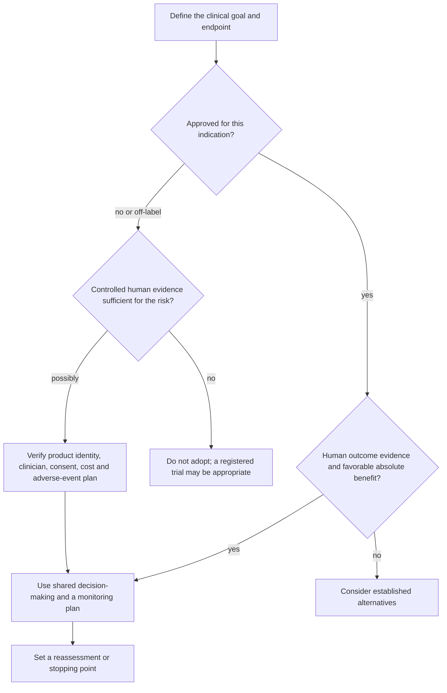

# Practice playbook

This playbook prioritizes actions that improve function or established disease risk over actions that merely move a molecular or commercial “age” measure. Grades apply to the specific claim made here: **strong** means consistent clinical or established risk-factor support; **moderate** means credible but limited, indirect, or population-dependent support; **emerging** means early mechanistic or small-study evidence without demonstrated clinical benefit; **contested** means reasonable experts or interpretations disagree materially. A grade is not a prescription, and clinical cadence must be individualized by age, history, medications, symptoms, and local guidance.

## Daily

- **Use low-burden plastic precautions without displacing established health priorities — emerging and precautionary, with weak direct clinical evidence.** Avoid heating food in plastic when glass or ceramic is convenient and do not repeatedly reuse soft single-use bottles; occasional contact is not an emergency, and elaborate elimination routines are not evidence-based. [[microplastics-exposure-and-measurement]] [[environmental-pollution-and-health]]
- **When a daily protein gap remains, a modest pre-sleep serving is an optional feeding opportunity — moderate for overnight muscle protein synthesis, limited for a unique long-term timing benefit.** Trial roughly 30–40 g protein about 30 minutes before bed, keep total energy in view, and stop if it worsens sleep, reflux, or gastrointestinal comfort. [[pre-sleep-protein-feeding]] (@drandygalpin (Andy Galpin) — "The Truth About Eating Before Bed | Dr. Michael Ormsbee & Dr. Andy Galpin", 2026-08-01, [link](https://www.youtube.com/watch?v=fOeZrm7LlZs))
- **For a low-burden state-regulation experiment, practice five minutes of comfortable slow breathing daily — moderate for short-term anxiety reduction as summarized by the source, limited for the full five-variable package.** Use a quiet, supported position; a soft-ball rib drill is optional sensory feedback, not treatment for apnea, bruxism, headache, or chronic pain. [[breathing-mechanics-and-state-regulation]] (@drandygalpin (Andy Galpin) — "5 Tools for Reducing Chronic Stress in Your Body | Dr. Andy Galpin & Jill Miller", 2026-07-24, [link](https://www.youtube.com/watch?v=70Gi-IE21oM)) (@drandygalpin (Andy Galpin) — "3 Zones of Breathing: How to Improve Performance & Recovery | Dr. Andy Galpin & Jill Miller", 2026-07-29, [link](https://www.youtube.com/watch?v=I0muXgmTDBY))
- **For composure under predictable pressure, practice several minutes of comfortable paced breathing and then rehearse it without live feedback — moderate for slow breathing, limited for HRV-biofeedback transfer and performance outcomes.** A four-second inhale and six-second exhale is a starting protocol, not a universal optimum; do not chase a device score or treat it as a diagnosis. [[breathing-mechanics-and-state-regulation]] (@drandygalpin (Andy Galpin) — "Heart Rate Variability (HRV): How to Stay Calm Under Pressure | Dr. Andy Galpin & Dr. Lenny Wiersma", 2026-07-13, [link](https://www.youtube.com/watch?v=BSdURZ4NVSc))
- **Before bed, trial a repeatable 15–30-minute low-arousal routine in dim light and keep stimulating work or scrolling outside it — moderate for a seven-day reading package, emerging for interchangeable routines.** Keep wake time reasonably consistent and obtain morning outdoor light within one to two hours of waking. Track sleep and next-day function for one to two weeks rather than assuming that reading itself is the active ingredient. [[pre-sleep-routines-and-stimulus-control]] (@NutritionMadeSimple (Nutrition Made Simple!) — "STOP Doing This Before Bed (1,000-Person Study)", 2026-07-03, [link](https://www.youtube.com/watch?v=bWXF65SZJps))
- **Protect sleep continuity and circadian alignment, not only hours in bed — moderate.** Keep sleep and wake times within roughly 30–60 minutes, obtain outdoor light within an hour after waking, and seek evaluation for persistent unrefreshing sleep, morning headaches, or daytime sleepiness despite adequate opportunity. [[sleep-quality-and-circadian-alignment]] (@NutritionMadeSimple (Nutrition Made Simple!) — "The #1 WORST Sleep Mistake Destroying Your Heart", 2026-05-21, [link](https://www.youtube.com/watch?v=2BAX8mJ27gA))
- **Do not use nattokinase as a substitute for established cardiovascular prevention — strong decision principle, insufficient nattokinase outcome evidence.** If considering it, first review bleeding risk, blood-thinning medicines, and planned procedures with a clinician; no evidence-supported routine preventive dose or cadence exists. [[nattokinase]] (@NutritionMadeSimple (Nutrition Made Simple!) — "The Internet is Misleading You on this Popular Supplement (Doctor Explains)", 2026-07-10, [link](https://www.youtube.com/watch?v=qRLiXKRuUCI))

- **During reproductive-hormone transitions, protect regular sleep and wake timing, obtain early-day light, move enjoyably, and eat regular adequate meals — moderate.** Support for general function is stronger than support for ADHD-specific control. Track functional effects rather than assuming every attention, mood, or memory change is hormonal; persistent impairment deserves assessment. [[adhd-and-reproductive-hormone-transitions]]

- **When recovering from harmful substance use, follow a continuing-care plan built around safety, honest contact, and support rather than abstinence alone — moderate principle, individualized treatment.** Peer fellowship, therapy, medical care, service, movement, and daily structure can be complementary; urgent intoxication, withdrawal, or overdose risk requires professional or emergency help. [[addiction-recovery-and-emotional-sobriety]] (@richroll (Rich Roll) — "Inside the Mind of an Addict | Zac Clark", 2026-08-06, [link](https://www.youtube.com/watch?v=sdJ1ku5nGcg))
- **When an old negative self-belief conflicts with current evidence, record one specific prediction, one observable counterexample, and a calibrated update — moderate as a cognitive-learning method, limited for the source's exact protocol.** Accept genuine praise without reflexive denial, but prefer evidence-specific reflection to implausible global affirmations. [[self-schema-updating-after-achievement]] (@MikeIsraetelMakingProgress (Mike Israetel) — "Why Success Still Feels Like Failure | Episode #159", 2026-07-30, [link](https://www.youtube.com/watch?v=lUwPaKZqId8))
- **During recurring pressure, address yourself by name and give one accurate, actionable coaching cue — limited-to-moderate for psychological distancing, limited for the exact protocol.** Classify self-talk by whether it improves the next action rather than whether it sounds positive or negative. [[mental-strength-and-behavioral-skills]] (@drandygalpin (Andy Galpin) — "Tool for Reducing Negative Self-Talk | Dr. Andy Galpin &  Dr. Lenny Wiersma", 2026-07-17, [link](https://www.youtube.com/watch?v=Fr97nAnACMU))
- **Before a consequential performance, spend up to about ten focused minutes rehearsing one purpose-specific sequence — moderate for mental imagery broadly, limited for this dose.** Rehearse success for confidence, the response to one plausible disruption for coping, an unfamiliar setting for familiarization, or a corrected action for technical learning; avoid activating rehearsal near bedtime if it delays sleep. [[mental-imagery-for-performance]] (@drandygalpin (Andy Galpin) — "Visualization Techniques for Peak Performance | Dr. Andy Galpin & Dr. Lenny Wiersma", 2026-07-15, [link](https://www.youtube.com/watch?v=15n-gKyU-PY))
- **Choose one small value-consistent action when discomfort or rumination is blocking movement — moderate as a skills framework, limited for specific exercises.** Name the thought and emotion, decide whether more analysis can produce new information, then act, defer the concern to a scheduled review, or seek help. [[mental-strength-and-behavioral-skills]] (@maxlugavere (Max Lugavere) — "Mental Health Expert: Stop Overthinking, Face Discomfort, and Take Back Control - Amy Morin", 2026-07-29, [link](https://www.youtube.com/watch?v=5C6Ji9iDJz8))
- **Use deliberate phone boundaries during sleep and shared attention — moderate.** Keep phones away from meals and trial charging the phone outside the bedroom for two to four weeks; judge the experiment by sleep, anxiety, attention, and adherence rather than assuming total abstinence is necessary. [[mental-strength-and-behavioral-skills]] (@maxlugavere (Max Lugavere) — "Mental Health Expert: Stop Overthinking, Face Discomfort, and Take Back Control - Amy Morin", 2026-07-29, [link](https://www.youtube.com/watch?v=5C6Ji9iDJz8))
- **Let energy balance and food quality—not carbohydrate avoidance—govern ordinary fat-loss eating — strong for energy balance, moderate for food selection.** Whole carbohydrate foods can support satiety and training; audit restaurant oils, drinks, and weekend intake before imposing a restrictive macronutrient rule. Treat calorie counts as adjustable estimates rather than exact measurements or irrelevant numbers. [[nutrition-evidence-and-personalization]] [[energy-balance-and-calorie-counting]] (@maxlugavere (Max Lugavere) — "Carbs Don’t Make You Fat: 10 Health Myths That Need to Die", 2026-08-05, [link](https://www.youtube.com/watch?v=TqcKy8yuc1U)) (@biolayne1 (Dr. Layne Norton) — "Stacy Sims PHD Says Calories Are BS | What the Fitness | Biolayne", 2026-08-07, [link](https://www.youtube.com/watch?v=tN97LNccMGQ))

- **Accumulate walking and interrupt long fixed positions with brief movement — moderate-to-strong.** Roughly 8,000 daily steps is a useful observational benchmark rather than a causal threshold; progress from baseline and use 5–10-minute walking, stairs, bodyweight, play, or mobility breaks when a full session is impractical. [[daily-movement-mobility-and-pain]] (@FoundMyFitness (FoundMyFitness) — "The Scientific Formula for a 'Healthy Day' | Dr. Kelly Starrett", 2026-05-04, [link](https://www.youtube.com/watch?v=IXmOJsfebMM))
- **Treat new pain as information requiring triage, not automatic proof of damage or permission to ignore symptoms — strong principle, individualized treatment.** Modify load, range, tempo, and recovery for ordinary non-red-flag discomfort; seek assessment for trauma, systemic or neurological signs, progressive symptoms, or failure to improve. [[daily-movement-mobility-and-pain]] (@FoundMyFitness (FoundMyFitness) — "The Scientific Formula for a 'Healthy Day' | Dr. Kelly Starrett", 2026-05-04, [link](https://www.youtube.com/watch?v=IXmOJsfebMM))
- **Use a reverse plank only as an optional movement break or warm-up, not as a posture cure — emerging.** If shoulder extension is comfortable, trial a controlled bout and retest overhead reach without lumbar arching; continue to prioritize walking, position changes, and progressive whole-body strength. [[sedentary-posture-and-reverse-plank]] (@SquatUniversity (Squat University) — "Sitting All Day? This One Exercise Fixes Everything!", 2026-07-12, [link](https://www.youtube.com/watch?v=mwaEHn2mZsE))

- **Protect exposed skin from ultraviolet radiation and reapply sunscreen during sustained outdoor exposure — strong.** Combine shade, clothing, and adequately applied sunscreen; reapply about every two hours and after water activity or heavy sweating rather than relying on unstandardized extended-wear claims. [[photoprotection]] (@DrDrayzday (Dr Dray) — "Is Sugar Really Bad for Your Skin? | Dermatologist Q&A", 2026-08-09, [link](https://www.youtube.com/watch?v=c0tYCBtxRO4))
- **Keep skincare function-based and barrier-tolerable — moderate-to-strong.** Cleanse as needed, moisturize dry skin, and add only treatments tied to a defined concern. During dryness or irritation, reduce product load, hot-water exposure, and unnecessary cleansing; never dilute preserved liquid cleansers or soaps. [[skin-barrier-and-moisturization]] [[skincare-evidence-and-routine-design]] (@DrDrayzday (Dr Dray) — "Costco Skincare: What’s Actually Worth Buying? | Dermatologist Shops", 2026-08-10, [link](https://www.youtube.com/watch?v=JukyC7WttqI)) (@DrDrayzday (Dr Dray) — "Copper Peptides, Hair Loss & Retinol Questions Answered", 2026-08-08, [link](https://www.youtube.com/watch?v=0sxHRZPDvss))

- **When a familiar alarm follows an ordinary demand, distinguish demand from danger before choosing a response — emerging/clinically plausible.** Notice the bodily shift, define what is concretely required, name the predicted catastrophe, check present safety evidence, and take the smallest useful next step. Repeat per episode; use protection, support, boundaries, or environmental change when danger is real rather than reframing it away. [[stress-threat-discrimination]] [[protective-threat-responses]] (@DrTraceyMarks (Dr. Tracey Marks) — "Your Brain Is Misinterpreting Stress as Danger", 2026-07-29, [link](https://www.youtube.com/watch?v=1v5lDzKAPz0))
- **During criticism, separate the spoken information from the identity or status story — emerging/clinically plausible.** Identify one usable behavior or output, ask for specificity, and defer a non-urgent reply if arousal has narrowed attention. This protocol is educational and mechanistically plausible but is not supported by outcome trials in the supplied source. [[social-evaluative-threat-and-criticism]] (@DrTraceyMarks (Dr. Tracey Marks) — "The Reason You Can't Stop Thinking About That Insult", 2026-08-05, [link](https://www.youtube.com/watch?v=x2oU1eskv0M))

- **Use a dietary pattern, not an isolated nutrient, as the primary unit of action — strong.** Build most meals from minimally processed plant foods, varied protein sources, and unsaturated fats; interpret any food claim by asking who was studied, what it replaced, whether the response was acute or chronic, and which outcome changed. [[nutrition-evidence-and-personalization]] (@NutritionMadeSimple (Nutrition Made Simple!) — "I Studied Nutrition for 30 Years. Here’s What Actually Matters.", 2026-07-25, [link](https://www.youtube.com/watch?v=T1-5Ic9iiPs))
- **Make unsweetened drinks the default and judge packaged foods by repeated exposure, not front-label identity — moderate-to-strong.** On first purchase and after reformulation, compare the portion actually eaten, added sugar, sodium, saturated fat, protein, fiber, and first ingredients; then ask what the product replaces. Review recurrent purchases weekly rather than treating an occasional food as an acute artery-clogging event. [[food-label-literacy-and-health-halos]] [[free-sugars-and-glycemic-response]] (@NutritionMadeSimple (Nutrition Made Simple!) — "15 'Healthy' Foods that are Quietly Clogging your Arteries (And What to Eat Instead)", 2026-04-20, [link](https://www.youtube.com/watch?v=oMOSvXcvnOw))
- **Use olive oil as a culinary replacement within a healthy pattern when it fits the diet — moderate for cognitive benefit, stronger for the broader dietary pattern.** About 30 mL/day was common in cognitive trials, but neither that amount nor extra-virgin status is established as a dementia treatment; virgin oils retain phenols, while clinical superiority over refined oil remains uncertain. [[olive-oil-and-cognitive-aging]] (@Physionic (Physionic) — "Your Brain on Olive Oil - Many Studies Later", 2026-08-03, [link](https://www.youtube.com/watch?v=OW8gyDLTt1s))
- **Treat concentrated resistant starch as a specific intervention, not as a synonym for fiber — moderate.** Trials used about 40 g/day of actual resistant starch and reported visceral-fat reduction; verify active content, increase gradually, and do not assume ordinary food portions reproduce the dose. [[resistant-starch]] (@Physionic (Physionic) — "I analyzed 1,000 Health Studies: Here are 10 Things I Learned", 2026-08-06, [link](https://www.youtube.com/watch?v=sx8MyamJf3g))
- **Build meals around minimally processed, plant-rich foods and adequate protein; match energy intake to metabolic and body-composition needs — strong for risk-factor management, not proven as whole-body age reversal.** Food quality ranks ahead of meal timing, and an energy deficit is useful when excess weight or metabolic disease makes it appropriate. Fixed restriction in an already lean person may threaten adherence or lean mass and is not established as a longevity prescription. [[caloric-restriction-and-meal-timing]] (@mkaeberlein (Matt Kaeberlein) — "Longevity Science Update: The Biggest Stories in Longevity Medicine — July 2026", 2026-07-31, [link](https://www.youtube.com/watch?v=A0xNnGsGAJg))
- **Replace sugar-sweetened drinks with water or a noncaloric alternative and prefer whole fruit to juice — moderate.** Use whole-food protein, legumes where tolerated, and minimally processed foods to reduce hunger during intentional fat loss; raise fiber gradually when gastrointestinal tolerance is uncertain. [[visceral-and-ectopic-fat]] (@DrBradStanfield (Dr Brad Stanfield) — "Fastest Way to Lose Visceral Fat Without Starving", 2026-08-04, [link](https://www.youtube.com/watch?v=KljR2O7DqOk))
- **Build toward the applicable fiber guideline from varied whole foods — moderate-to-strong.** About 30 g/day in the UK or 14 g per 1,000 kcal in the US is a practical target; increase over several weeks with adequate fluid when starting low. [[dietary-fiber]] (@joinzoe (ZOE) — "You’re obsessing over the wrong thing! The #1 food that cuts disease risk", 2026-07-30, [link](https://www.youtube.com/watch?v=0CWC1GUEzHA))
- **Build gut ecology with a rotating food pattern, not a cleanse — moderate for bowel function and intermediate microbial outcomes.** Combine tolerated fibers or resistant starch with an unsweetened fermented food if desired, start small, and match constipation-directed foods such as prunes or kiwifruit to the symptom rather than using them for diarrhea. [[food-patterns-and-gut-ecology]] (@NutritionMadeSimple (Nutrition Made Simple!) — "8 Foods That Actually Fix Your Gut (Not Probiotics)", 2026-05-30, [link](https://www.youtube.com/watch?v=ykpITcKqWCo))
- **Do not substitute a generic probiotic for fiber, colorectal screening, or a validated weight-management plan — moderate for prioritization, product-specific evidence otherwise.** Yogurt can be chosen as a nutritious protein food, but a pooled cross-sectional association does not establish cancer prevention, and one postbiotic maintenance trial does not establish probiotic-induced weight loss. [[probiotics-prebiotics-and-postbiotics]] (@biolayne1 (Dr. Layne Norton) — "Probiotics Cut Cancer Risk by 50% and Melt Fat! | Educational Video | Biolayne", 2026-08-05, [link](https://www.youtube.com/watch?v=RVN6GosoJUI))
- **After an unusually carbohydrate-rich meal, take an easy ten-minute walk within roughly 20–30 minutes when practical — moderate for acute glucose lowering.** Prefer intact fruit and meal-level fiber or protein over using this as compensation for habitual free-sugar intake. [[free-sugars-and-glycemic-response]] (@joinzoe (ZOE) — "The 5 foods you’re eating every day that are more HARMFUL than sugar", 2026-07-23, [link](https://www.youtube.com/watch?v=yHv2NLaS7kw))
- **Make an appropriate intake easier by combining protein, produce or another fiber-rich food, food volume, and a satisfying texture; replace routine sugary drinks and eat at least one meal without a screen — moderate overall, limited for utensil-size and EEG-based claims.** Judge the design by hunger, dietary adequacy, adherence, and the multiweek trend, not a one-day weigh-in. [[satiety-oriented-diet-design]] (@JeremyEthier (Jeremy Ethier) — "I Proved My 6-Pack Abs Diet Works For ANYONE", 2026-07-12, [link](https://www.youtube.com/watch?v=HkrWExj1QNk))
- **Use an eating window only when it improves adherence or prevents overconsumption — contested.** Calorie-controlled mouse studies show little or no independent lifespan effect, and large calorie-independent human benefits remain uncertain; timing-first protocols therefore overstate the present evidence. [[caloric-restriction-and-meal-timing]] (@mkaeberlein (Matt Kaeberlein) — "Longevity Science Update: The Biggest Stories in Longevity Medicine — July 2026", 2026-07-31, [link](https://www.youtube.com/watch?v=A0xNnGsGAJg))
- **Take prescribed medicines as directed and watch for treatment-specific adverse effects — strong.** GLP-1-class drugs belong to an indicated, monitored treatment plan; PCSK9 inhibitors belong to cardiovascular risk management, not a generic longevity stack. [[glp-1-receptor-agonists]] [[pcsk9-inhibition]]
- **Do not self-inject internet-sourced or research-use-only peptides, purported deglycation enzymes, or other unapproved products — strong for avoidance.** BPC-157 lacks a defined human mechanism, randomized healing evidence, pharmacokinetics, validated dose, and long-term safety; a prescription or purity report cannot create those data. CMLase remains an ex vivo research tool with unresolved delivery and immunogenicity. [[experimental-peptides]] [[enzymatic-deglycation]] (@PeterAttiaMD (Peter Attia MD) — "403 ‒ Peptides: separating scientific promise from marketing hype", 2026-08-10, [link](https://www.youtube.com/watch?v=Km_01CLEkYU)) (@LongevityScienceNews (Longevity Science News) — "BREAKTHROUGH Skin Age Reversal: New Enzyme Removed 40 Years Of Damage", 2026-07-25, [link](https://www.youtube.com/watch?v=_Vf9pdoU3tU))
- **Do not use IV NAD for general longevity — moderate for avoidance.** Longevity benefit is absent, human tissue-wide NAD decline is unestablished, and severe acute infusion reactions have been described; oral NR or NMN also lacks evidence for routine lifespan use. [[nad-supplementation]] (@mkaeberlein (Matt Kaeberlein) — "Longevity Science Update: The Biggest Stories in Longevity Medicine — July 2026", 2026-07-31, [link](https://www.youtube.com/watch?v=A0xNnGsGAJg))
- **Reduce obvious high-dose smoke or combustion exposure and control sleep-disrupting bedroom noise or light — moderate.** Use source control and ventilation where relevant; do not let expensive exposure products displace sleep, exercise, nutrition, blood-pressure, lipid, or metabolic care. The source supports prioritization but does not quantify product-specific effects. [[environmental-pollution-and-health]] (@PeterAttiaMD (Peter Attia MD) — "Environmental pollution and longevity: air pollution, noise, light, EMFs, & more (AMA 87 sneak peek)", 2026-07-19, [link](https://www.youtube.com/watch?v=sDxAiqfy4-g))
- **Protect cognition with movement, sufficient sleep, challenging learning, and meaningful engagement — moderate-to-strong.** These act through partly distinct maintenance and reserve pathways; persistent decline warrants assessment rather than an unvalidated cognition supplement. [[cognitive-reserve-and-brain-health]] (@matt.kaeberlein (Healthspan Medicine) — "Neuroscientist Reveals What's Actually Working for Brain Longevity (with Dr. Tommy Wood)", 2026-04-05, [link](https://www.youtube.com/watch?v=XXmZtn4R0Ow))
- **If long-chain omega-3 intake is low and supplementation is chosen, use the labeled EPA-plus-DHA dose with a meal and avoid assuming that more is safer — moderate.** Benefit appears modest and context-dependent; atrial-fibrillation risk rises with dose and is more concerning above 1 g/day. People with arrhythmia or high risk should involve a clinician, and prescription high-dose use is a separate indication. [[omega-3-fatty-acids]] (@NutritionMadeSimple (Nutrition Made Simple!) — "Watch This Before You Take Fish Oil (Protect Your Heart)", 2026-08-10, [link](https://www.youtube.com/watch?v=GpzX3NQzmio))
- **Do not use omega-3 as a substitute for resistance training or adequate protein — strong; any added strength benefit is small and uncertain.** Mechanistic studies suggest membrane, protein-synthesis, and motor-unit routes but often used 2–5 g/day and had small samples or weak controls; they do not justify a muscle-specific high dose. [[omega-3-fatty-acids]] (@Physionic (Physionic) — "The Unexpected Muscle Effect of… Omega-3 Fats?", 2026-08-10, [link](https://www.youtube.com/watch?v=r__LqzSrU0c))
- **When training for muscle: eat roughly 1.6–2.4 g protein/kg/day (about 1 g/lb), biased higher when older or in an energy deficit, in meaningful per-meal doses rather than trivial ones — moderate-to-strong for the range; timing within the day matters less than the total.** The post-workout window is broad (hours, not minutes); complete animal sources simplify the target, and plant-based approaches need more total protein and cooking for digestibility. [[performance-nutrition-and-hydration]] (Peter Attia MD — "Building strength and muscle mass: optimize training & nutrition for longevity (AMA #71 rebroadcast)", 2026-07-06, [link](https://www.youtube.com/watch?v=CqNqfb37gig))
- **If resistance training regularly, daily creatine monohydrate is one of the few near-universally reasonable supplements — strong for strength, power, and mass support.** Do not extend the claim to mood, cognition, or longevity. [[creatine]] [[creatine-for-depression]] (Peter Attia MD — "Building strength and muscle mass: optimize training & nutrition for longevity (AMA #71 rebroadcast)", 2026-07-06, [link](https://www.youtube.com/watch?v=CqNqfb37gig))
- **Meet food quality, energy, protein, fiber, and produce-variety needs before optimizing meal timing or supplements — moderate-to-strong.** A practical sequence is to fill clear nutrient gaps, adjust amounts and food types, then fine-tune tactics; roughly 13–15 g fiber per 1,000 kcal is a starting target, not a mandate when gastrointestinal tolerance differs. [[nutrition-evidence-and-personalization]] (@drandygalpin (Andy Galpin) — "The Fundamentals of Nutrition, Hydration & Performance Fueling", 2026-08-05, [link](https://www.youtube.com/watch?v=_GEhu3vdL7w))
- **Reduce habitual colorectal-risk exposures without treating diet as all-or-nothing — moderate-to-strong.** Favor varied fiber-rich whole plants; limit ultra-processed food, processed meat, sugar-sweetened drinks, and alcohol; and increase fiber gradually when baseline intake is low. [[colorectal-cancer-prevention-and-screening]] (@RenaMalikMD (Rena Malik, M.D.) — "The #1 Food Mistake Raising Young Adults’ Cancer Risk – Are You Guilty?", 2026-08-05, [link](https://www.youtube.com/watch?v=wyuknV4btfE))
- **For training: match carbohydrate, fluid, and electrolytes to session demand rather than consuming them automatically — moderate.** Most short ordinary sessions do not require intra-workout carbohydrate; prolonged high-output work may. Daily protein matters more than a narrow post-workout window. [[performance-nutrition-and-hydration]] (@drandygalpin (Andy Galpin) — "The Fundamentals of Nutrition, Hydration & Performance Fueling", 2026-08-05, [link](https://www.youtube.com/watch?v=_GEhu3vdL7w))
- **For abdominal definition: separate the muscle-training problem from the fat-loss problem — strong mechanistic distinction, limited evidence for the source’s specific tactics.** Train trunk functions progressively, use a sustainable vegetable–protein–starch meal structure if helpful, and judge fat loss from multiweek trends rather than eliminating fruit, starch, or relying on spices and extracts. [[abdominal-definition-and-training]] [[satiety-oriented-diet-design]] (@athleanx (ATHLEAN-X™) — "I'm 51. Here's How I Still Have Visible Abs (WORKS AT ANY AGE)", 2026-08-04, [link](https://www.youtube.com/watch?v=ZOMKA0qCQ_w))

## Weekly

- **Deliver a balanced, progressive exercise dose and review whether the program is producing its intended adaptation — strong for including resistance and aerobic work, moderate for the exact allocation.** Across the week include resistance, aerobic capacity, some faster work as appropriate, balance or usable range, and ordinary movement; log performance, symptoms, adherence, and recovery, then revise persistent mismatches rather than chasing one supposedly optimal template. [[exercise-program-design]] [[time-efficient-concurrent-training]]
- **For a sedentary on-ramp: begin with a repeatable 10-minute or one-mile walk and lengthen it gradually toward several longer walks weekly — strong for gradual activity adoption, limited for the source's mental-health claims.** Do not copy ultramarathon training; judge the dose by adherence, function, mood, pain, and recovery. [[mental-strength-and-behavioral-skills]] [[daily-movement-mobility-and-pain]] (@drandygalpin (Andy Galpin) — "Small Steps for Massive Health Gains | Ken Rideout & Dr. Andy Galpin", 2026-07-09, [link](https://www.youtube.com/watch?v=1_XyRaqWhYc))
- **For hypertrophy: start near 6–12 challenging weekly sets per target muscle across at least two sessions, then adjust every 4–8 weeks from repeatable performance and size trends — moderate-to-strong.** A broad load range works near fatigue; roughly 20 sets is a proposed high-volume ceiling or troubleshooting target, not a universal starting dose, and soreness is not the growth objective. [[skeletal-muscle-hypertrophy]] [[muscle-damage-and-hypertrophy]] (@drandygalpin (Andy Galpin) — "What Drives Muscle Growth & What Doesn't | Dr. Mike Roberts", 2026-07-08, [link](https://www.youtube.com/watch?v=CoU8-R0Id-g))
- **When total training time is about three hours: preserve two whole-body resistance sessions, one hard interval session, and one or more easier aerobic exposures — moderate, expert-derived allocation.** A second interval or third resistance day can replace easy work according to fitness, recomposition goals, energy availability, and recovery. A feasible interval option is six to ten rounds of one minute hard and one minute easy. [[time-efficient-concurrent-training]] (@PeterAttiaMD (Peter Attia MD) — "How Busy Moms Can Build Strength and Cardio Fitness | Abbie Smith-Ryan, Ph.D.", 2026-01-07, [link](https://www.youtube.com/watch?v=9Rxp2a0m8wM))
- **For girls and menstruating athletes: protect adequate energy and carbohydrate availability and notice persistent cycle disruption — moderate.** Delayed menarche, lost periods, repeated stress injuries, fatigue, or falling recovery warrant clinical and nutrition assessment rather than praise for training hardness. [[low-energy-availability-and-menstrual-function]] (@PeterAttiaMD (Peter Attia MD) — "How Early Training Choices Shape Women’s Health for Life | Abbie Smith-Ryan, Ph.D.", 2026-01-09, [link](https://www.youtube.com/watch?v=bsw0pKcWf5c))
- **Across women's life stages: retain resistance, aerobic, and safely scaled power work, adjusting symptoms and recovery rather than applying a universal cycle-synced program — moderate.** During pregnancy, postpartum, or symptomatic perimenopause, progression should be individualized and clinically informed. [[womens-exercise-across-the-lifespan]] (@PeterAttiaMD (Peter Attia MD) — "378 ‒ Women’s health & performance: how training, nutrition, & hormones interact across life stages", 2026-01-05, [link](https://www.youtube.com/watch?v=CDsH60jt34o))

- **Train both the aerobic base and peak, allocating intensity by available time and recovery — strong for prioritizing cardiorespiratory fitness, expert-graded for the split.** Near 150 total exercise minutes, preserve resistance work and favor high-intensity cardio for the remainder; with substantially more time, accumulate most cardio at zone two and retain regular recovery-limited high-intensity work. [[cardiorespiratory-fitness]] (@PeterAttiaMD (Peter Attia MD) — "A guide to cardiorespiratory training at any fitness level to improve longevity (AMA 79 sneak peek)", 2026-01-12, [link](https://www.youtube.com/watch?v=yisfGtcV5xk))
- **Use unsaturated fats in place of saturated fats, not merely in addition to them — strong for LDL lowering and moderate-to-strong for cardiovascular benefit.** If avoiding seed oils, use monounsaturated oils or leaner proteins rather than defaulting to lard or tallow; keep repeatedly heated fried foods occasional regardless of frying medium. [[dietary-fat-quality-and-cardiovascular-risk]] [[seed-oils]] (@PeterAttiaMD (Peter Attia MD) — "380 ‒ The seed oil debate: are they uniquely harmful relative to other dietary fats?", 2026-01-19, [link](https://www.youtube.com/watch?v=iB49uq-t1UM)) (@PeterAttiaMD (Peter Attia MD) — "Cooking with Lard vs Seed Oils | Layne Norton, Ph.D.", 2026-01-21, [link](https://www.youtube.com/watch?v=7_cbaDXAWYM))

- **For endurance training: distribute intensity around event demands and individual recovery cost; do not copy an elite athlete’s hours or assume one zone is universally optimal — moderate specificity principle, limited evidence for the source’s exact distribution.** Retain representative technique and some speed, progress volume gradually, and review performance, sleep, mood, and injury signals. [[elite-endurance-development]] (@richroll (Rich Roll) — "The World’s Greatest Winter Olympian Shares the Secrets to His Success", 2026-08-10, [link](https://www.youtube.com/watch?v=6ym0a5mqqxg))
- **Before lower-body training when hip opening is meaningfully restricted: trial a light kneeling weight shift, then retest — emerging for the exact protocol.** Keep the pelvis controlled, use active gluteal external rotation, and seek only a light adductor stretch; pair any temporary range gain with strength practice through the usable range. [[hip-mobility-and-adductor-loading]] (@SquatUniversity (Squat University) — "Have Tight Hips? This One Exercises Fixes EVERYTHING!", 2026-08-08, [link](https://www.youtube.com/watch?v=cIg1I5WN4l4))
- **During a shoulder-capacity block, two or three times weekly: progressively load the cuff or scapular function that limits the target task — moderate for exercise rehabilitation generally, limited for the exact 14-exercise menu.** Begin in a tolerable arm position, progress toward pressing or overhead demands, and judge transfer by function rather than muscle burn. [[shoulder-force-couples-and-exercise-selection]] (@SquatUniversity (Squat University) — "The Only 14 Shoulder Exercises You Ever Need!", 2026-07-28, [link](https://www.youtube.com/watch?v=B3lGOPPBRFg))

- **Protect recurring time for mastery, an undistracted close relationship, and value-aligned contribution — emerging as a bundled protocol.** Use money and status as tools for security, freedom, generosity, or shared experience rather than as endless comparative scores. [[durable-well-being-and-hedonic-adaptation]] (@MikeIsraetelMakingProgress (Mike Israetel) — "The Things That Actually Make You Happy | Episode #160", 2026-08-03, [link](https://www.youtube.com/watch?v=YIOGTdADktg))
- **When excess visceral or ectopic fat is a concern, accumulate sustainable aerobic activity across the week and retain resistance training — moderate for the specific visceral-fat protocol, strong for overall health.** Moderate continuous exercise is valid, intervals are optional, and short movement bouts can improve feasibility. Track waist under standardized conditions weekly during an active change phase rather than treating scale weight as the whole outcome. [[visceral-and-ectopic-fat]] (@NutritionMadeSimple (Nutrition Made Simple!) — "It’s Boring, But It Will Destroy Visceral Fat FAST", 2026-08-02, [link](https://www.youtube.com/watch?v=C0PWUoDCaeg)) (@DrBradStanfield (Dr Brad Stanfield) — "Fastest Way to Lose Visceral Fat Without Starving", 2026-08-04, [link](https://www.youtube.com/watch?v=KljR2O7DqOk))
- **Combine aerobic activity with regular muscle-strengthening sessions — strong.** This supports function and chronic-disease risk reduction and helps preserve lean mass during intentional weight loss or GLP-1-class treatment. The current wiki does not justify one universal dose, so fit frequency and intensity to health status and established exercise guidance. [[caloric-restriction-and-meal-timing]] [[glp-1-receptor-agonists]] (@ABCNewsIndepth (ABC News In-depth) — "The health trends outpacing regulation and putting people at risk | Four Corners Documentary", 2026-07-20, [link](https://www.youtube.com/watch?v=77TTDkR3nbI))
- **Resistance train 2–3 times weekly (novices: three 1-hour full-body sessions, 10–20 sets per body part weekly, 6–15 reps, working toward 1–2 reps in reserve; experienced: deeper splits, one hard weekly exposure per body part can suffice), including some explosive-concentric power work after warming up — strong for resistance training and the mortality-linked capacities it builds; the specific templates are expert protocol.** From midlife on, prioritize injury avoidance over maximal loading and substitute lower-risk exercise variants; use post-warm-up willingness to train, unresolving soreness, and logged-performance decline as back-off signals. [[resistance-training]] [[muscle-strength-and-mortality]] [[training-frequency-and-hypertrophy]] (Peter Attia MD — "Building strength and muscle mass: optimize training & nutrition for longevity (AMA #71 rebroadcast)", 2026-07-06, [link](https://www.youtube.com/watch?v=CqNqfb37gig))
- **For sport or demanding physical tasks: pair general progressive strength work with continued task-specific practice — moderate for the transfer framework.** Squats and deadlifts are optional tools, not inherently nonfunctional or universally optimal; test whether the chosen lift improves the limiting capacity at an acceptable recovery cost. [[strength-transfer-and-exercise-specificity]] (@biolayne1 (Dr. Layne Norton) — "Powerlifting is Bad for Athletic Performance? | What the Fitness | Biolayne", 2026-07-31, [link](https://www.youtube.com/watch?v=xK6nNmazh4s))
- **Accumulate at least 150 minutes of moderate aerobic activity weekly when appropriate — strong for cardiovascular health, moderate for erectile-function preservation.** New or persistent ED warrants vascular and cause-directed assessment, not exercise alone. [[erectile-dysfunction-and-vascular-health]] (@RenaMalikMD (Rena Malik, M.D.) — "Want Stronger Erections for Years to Come? Your Blood May Hold the Answer", 2026-08-10, [link](https://www.youtube.com/watch?v=oFt7B9OAJPI))
- **Review whether meal timing, medication effects, or weight-loss efforts are compromising protein intake, strength, recovery, or adherence — moderate.** Scale weight alone cannot distinguish desired fat loss from clinically important lean-mass loss. [[glp-1-receptor-agonists]] [[caloric-restriction-and-meal-timing]] (@mkaeberlein (Matt Kaeberlein) — "Longevity Science Update: The Biggest Stories in Longevity Medicine — July 2026", 2026-07-31, [link](https://www.youtube.com/watch?v=A0xNnGsGAJg))
- **For important learning, consider 20–30 minutes of moderate activity immediately before or after practice — moderate for retention.** The cadence is per selected learning bout, not a requirement around every task; attention and subsequent sleep remain essential. [[exercise-enhanced-learning]] (@matt.kaeberlein (Healthspan Medicine) — "Neuroscientist Reveals What's Actually Working for Brain Longevity (with Dr. Tommy Wood)", 2026-04-05, [link](https://www.youtube.com/watch?v=XXmZtn4R0Ow))
- **Train trunk movement and stabilization functions across the week — moderate programming evidence.** Sample flexion, rotation, anti-extension, and anti-rotation or anti-lateral flexion; heavy sessions can use two or three controlled sets of roughly 6–12 repetitions, with higher-repetition work varied within the week or across blocks. [[trunk-training]] (@drandygalpin (Andy Galpin) — "Simple Weekly Core Workout Plan | Dr. Andy Galpin", 2026-08-08, [link](https://www.youtube.com/watch?v=A6nlC-632nM))
- **For children and adolescents: include enjoyable, varied activity and supervised resistance work without requiring organized sport — strong for general health, moderate for cognitive and lifecourse effects.** Build competence through self-referenced progression and use exercise as a complement, not a replacement, for educational or mental-health care. [[youth-resistance-training]] (@drandygalpin (Andy Galpin) — "Health Benefits of Strength Training in Kids | Dr. Andy Galpin", 2026-08-02, [link](https://www.youtube.com/watch?v=Re2sad9Bd5s))
- **For youth sport: use a consistent neuromuscular warm-up and protect sleep, fueling, varied play, and time away from repetitive load — moderate-to-strong.** Landing, deceleration, and single-leg control have injury-prevention support; extra sport-specific volume is not a substitute for recovery or movement literacy. [[youth-resistance-training]] (@FoundMyFitness (FoundMyFitness) — "The Scientific Formula for a 'Healthy Day' | Dr. Kelly Starrett", 2026-05-04, [link](https://www.youtube.com/watch?v=IXmOJsfebMM))
- **Distribute hypertrophy volume across the week when long sessions reduce repetition quality; reserve high-frequency specialization for short, monitored blocks — moderate for volume distribution, very low for seven-day training.** Rotate movement patterns and track performance plus joint/tendon symptoms. [[training-frequency-and-hypertrophy]] (@JeremyEthier (Jeremy Ethier) — "It’s Dumb, But It Builds Muscle Almost 4x Faster", 2026-07-26, [link](https://www.youtube.com/watch?v=4OP8FI1TXK8))
- **For an optional arm-specialization block: replace overlapping direct work and distribute recoverable volume across up to three weekly sessions per muscle for two to three weeks — moderate general rationale, very low evidence for the exact 22-day plan.** Count compound pressing and pulling, scale progression to the trainee rather than fixed five-pound jumps, and stop escalating when performance or elbow/shoulder symptoms worsen. [[arm-hypertrophy-specialization]] [[training-frequency-and-hypertrophy]] (@athleanx (ATHLEAN-X™) — "How to Get 'Bigger Arms' Fast (22 DAYS | NO B.S)", 2026-07-19, [link](https://www.youtube.com/watch?v=CTblai7olJo))
- **When programming lunges: choose direction, stance, torso angle, load position, and depth as one system — moderate biomechanical rationale, limited comparative clinical evidence.** A reverse lunge can reduce abrupt force acceptance for a sensitive knee; use an upright torso for greater knee emphasis, a hip hinge for greater posterior emphasis, and only the depth that preserves the intended strategy. [[lunge-biomechanics-and-programming]] (@athleanx (ATHLEAN-X™) — "Stop Doing Lunges Like This! (SAVE A FRIEND)", 2026-07-27, [link](https://www.youtube.com/watch?v=Pwsn3HR4L90))
- **For a mild, familiar tendon complaint, use relative rest and graded loading rather than indefinite complete rest — moderate rehabilitation principle.** A source-derived starting option is three 30-second isometric holds, with symptoms no higher than 3–4/10 and no next-day worsening; continue progressive work three or four times weekly for four to eight weeks and seek assessment for trauma, lost function, major swelling, progressive weakness, or failure to improve. [[tendon-adaptation-and-rehabilitation]] (@JeremyEthier (Jeremy Ethier) — "It's Weird, But It Re-Builds Your Tendons In 30 Days", 2026-06-28, [link](https://www.youtube.com/watch?v=GSwL3Lgw6zI))

## Monthly

- **During a changing menstrual or treatment pattern, review a brief symptom-and-function record rather than chasing a single hormone value — moderate.** Include bleeding, vasomotor symptoms, sleep, mood, attention, medication timing, and concrete impairment; seek earlier review for heavy bleeding, severe symptoms, or safety-sensitive failures. [[perimenopause-assessment-and-testing]] [[adhd-and-reproductive-hormone-transitions]]
- **When trialing a topical PDRN or TECA cosmetic, reassess after one or two skin-turnover cycles and require a defined outcome — emerging.** Introduce one product at a time, credit known co-actives such as retinoids or moisturizers, and stop for persistent dermatitis. Do not infer collagen remodeling from transient hydration. [[topical-pdrn-and-centella]]

- **Audit the foundation rather than adding another product — moderate.** Review food quality, energy balance, aerobic and strength work, sleep, social connection, medication adherence, and emerging adverse effects. The monthly interval is a practical review rhythm, not a trial-validated optimum; the priority of these foundations over experimental stacks is better supported than the exact cadence. [[experimental-peptides]] [[caloric-restriction-and-meal-timing]] (@mkaeberlein (Matt Kaeberlein) — "Longevity Science Update: The Biggest Stories in Longevity Medicine — July 2026", 2026-07-31, [link](https://www.youtube.com/watch?v=A0xNnGsGAJg))
- **Reassess every supplement, infusion, or clinic service for a defined goal, observed benefit, cost, and harm — moderate.** Stop treating continued purchase as evidence that a treatment works. Approval status, compounding status, plausible mechanism, and demonstrated efficacy are separate questions. [[longevity-clinics-and-evidence]] [[nad-supplementation]] [[experimental-peptides]] (@ABCNewsIndepth (ABC News In-depth) — "The health trends outpacing regulation and putting people at risk | Four Corners Documentary", 2026-07-20, [link](https://www.youtube.com/watch?v=77TTDkR3nbI))
- **Review the whole supplement-and-medication stack, not each product in isolation — moderate.** Small surrogate-endpoint trials do not establish healthspan benefit, and products marketed as natural can share drug mechanisms and interactions. Remove items without a defined goal or stopping rule. [[supplement-evidence-and-safety]] (@matt.kaeberlein (Healthspan Medicine) — "Longevity Doctors Rank the Most Hyped Supplements (AMA with Dr. Kaeberlein and Dr. Byrne)", 2026-04-03, [link](https://www.youtube.com/watch?v=yM-vL5J3BIA))
- **Audit whether dietary restrictions match an actual diagnosis, symptom pattern, measured response, or nutrient need — moderate.** Do not universalize gluten, oxalate, glucose-spike, egg-cholesterol, or sodium advice from a susceptible subgroup; check predictable gaps such as B12 in vegan diets and iodine when major sources are absent. [[nutrition-evidence-and-personalization]] (@NutritionMadeSimple (Nutrition Made Simple!) — "I Studied Nutrition for 30 Years. Here’s What Actually Matters.", 2026-07-25, [link](https://www.youtube.com/watch?v=T1-5Ic9iiPs))
- **Review recurring protective defaults and rehearse one alternative — emerging.** Identify whether approach, escape, shutdown, or appeasement repeatedly costs trust, repair, voice, or self-directed choice; practice a boundary, an explicit time-limited break, a request for time, or a delayed answer in a low-stakes setting. The monthly cadence is pragmatic rather than trial-validated. [[protective-threat-responses]] (@DrTraceyMarks (Dr. Tracey Marks) — "Fight, Flight, Freeze, Fawn—Which One Is Your Pattern?", 2026-07-22, [link](https://www.youtube.com/watch?v=25kZd9Deums))

- **Every three months, and after a major health change, review the whole intervention portfolio for duplication, burden, interactions, and displacement of higher-value basics — moderate.** The prioritization principle is strong, while quarterly timing is a pragmatic cadence rather than a tested interval. Keep an endpoint, review date, adverse-effect plan, and stopping rule for every supplement or off-label drug. [[longevity-intervention-prioritization]] [[supplement-evidence-and-safety]]

## Periodically: measurements, labs, and screening

- **During perimenopause, use clinical history for staging and order tests to answer specific questions — strong for symptom-led assessment, contested for broad routine panels.** Heavy bleeding or compatible symptoms can justify CBC, ferritin, and evaluation of the bleeding source; validated cardiometabolic measures belong at preventive-care cadence. A single normal FSH or estradiol result should not dismiss a compatible transition. [[perimenopause-assessment-and-testing]]
- **Do not use elective ovarian-tissue removal and grafting as a menopause-delay protocol outside research—strong precaution under absent outcome evidence.** OTC has an established fertility-preservation role before selected gonadotoxic treatment, but AI-timed serial grafting for healthspan remains hypothetical. [[ovarian-aging-and-tissue-cryopreservation]] (@matt.kaeberlein (Healthspan Medicine) — "The Best Women’s Health Tips on the Planet with Dr. Jennifer Pearlman", 2026-03-20, [link](https://www.youtube.com/watch?v=b_LAI4oG0_w))
- **Estimate fracture risk and obtain DXA when age or individual risk makes the result decision-relevant — strong for risk-directed screening, contested for universal early baseline scanning.** Bone risk rises across menopause, but the wiki does not support one earlier age for everyone. Correct documented vitamin D deficiency with an individualized dose and recheck plan rather than pursuing an unvalidated high target. [[perimenopause-assessment-and-testing]] [[supplement-evidence-and-safety]]
- **When cyclic pelvic pain, painful intercourse, painful bowel movements or urination, heavy bleeding, or difficulty conceiving persists: demand a named diagnostic work-up for endometriosis and adenomyosis rather than symptom normalization — strong.** A normal routine transvaginal ultrasound does not exclude endometriosis; ask for MRI and, where available, the detailed endometriosis ultrasound protocol with bowel prep. Recent ACOG guidance supports clinical diagnosis and empiric hormonal treatment, and compressing the typical 5–12-year diagnostic delay protects against central sensitization and fertility loss. [[endometriosis]] [[adenomyosis]] (Peter Attia MD — "397 - Endometriosis and adenomyosis: diagnosis, fertility, reproductive aging, & emerging treatments", 2026-06-22, [link](https://www.youtube.com/watch?v=IxHRYDM64dQ))
- **If future children are wanted, treat reproductive timing as an explicit plan by the early thirties — strong on the biology, individualized on the action.** Blastocyst aneuploidy rises exponentially after 35 (roughly 20–25% at 25, ~40% at 35, 80–85% at 42); an AMH check is a reasonable low-cost input, egg freezing is most cost-effective around 32–35 (only ~10% of frozen cohorts are ever used), and a discouraging antral follicle count should be rechecked in a different cycle phase. After a year of trying, evaluate both partners. [[oocyte-aneuploidy-and-reproductive-aging]] (Peter Attia MD — "397 - Endometriosis and adenomyosis: diagnosis, fertility, reproductive aging, & emerging treatments", 2026-06-22, [link](https://www.youtube.com/watch?v=IxHRYDM64dQ))
- **When attention, mood, or executive function newly impairs work, driving, finances, relationships, or self-care, seek a comprehensive assessment — strong diagnostic principle.** Consider childhood history, sleep disorders, thyroid disease, iron deficiency, mood, medicines, and reproductive stage before assigning the change to ADHD or menopause. [[adhd-and-reproductive-hormone-transitions]]

- **Around age 50, after prior varicella exposure: discuss shingles vaccination, and suppressive antiviral therapy for recurrent HSV, as plausible dementia-risk reduction — moderate (epidemiologic plus limited vaccine-trial support, inflammatory mechanism unproven).** Maintain dental and gum care under the same rationale. [[alzheimers-spectrum-and-diagnosis]] (Peter Attia MD — "399 - The evolution of Alzheimer's disease and dementia care | Gayatri Devi, M.D.", 2026-07-13, [link](https://www.youtube.com/watch?v=x7NhqMOwdOM))
- **When cognitive decline is suspected—especially in a high-functioning person or a woman in her 40s–50s: seek multi-hour domain-level neuropsychological testing, consider reproductive-hormone status, and do not accept an Alzheimer's diagnosis from a blood biomarker alone without amyloid-plus-tau or CSF confirmation — strong practice guidance, institutionally contested for the biomarker threshold.** Brief screens can stay normal for a decade in high-reserve patients, and estrogen-deficiency impairment can mimic and reverse. [[alzheimers-spectrum-and-diagnosis]] [[alzheimers-diagnosis-biological-vs-clinical]] [[menopause-related-cognitive-impairment]] (Peter Attia MD — "399 - The evolution of Alzheimer's disease and dementia care | Gayatri Devi, M.D.", 2026-07-13, [link](https://www.youtube.com/watch?v=x7NhqMOwdOM))
- **Do not pursue amyloid blood testing as an asymptomatic screen without high pretest risk (confirmed family history, APOE4/4); a surprising positive requires confirmatory imaging or CSF before any label or treatment — moderate-to-strong.** Amyloid is present in roughly a quarter of asymptomatic 70-year-olds, rising to ~44% by 90. [[alzheimers-diagnosis-biological-vs-clinical]] (Peter Attia MD — "399 - The evolution of Alzheimer's disease and dementia care | Gayatri Devi, M.D.", 2026-07-13, [link](https://www.youtube.com/watch?v=x7NhqMOwdOM))
- **Use a question-to-test-to-action loop rather than collecting biomarkers without a decision — strong as a clinical measurement principle.** Begin with age, symptoms, family history, exposures, and established preventive guidance; confirm surprising results and define what treatment or follow-up would change. A proposed panel of fasting glucose, fasting insulin, A1c, cholesterol:HDL ratio, and free testosterone is clinician-specific and does not replace validated cardiovascular, diabetes, or cancer-screening pathways. [[proactive-health-monitoring]] (@maxlugavere (Max Lugavere) — "The Longevity Doctor: These 5 Biomarkers That Predict How Well You’ll Age!", 2026-07-22, [link](https://www.youtube.com/watch?v=_AM9XeATR2U))
- **Treat new persistent ED or loss of spontaneous erections as a reason for cause-directed review — moderate-to-strong.** Assess vascular, metabolic, sleep, medication, neurologic, endocrine, and psychological contributors rather than assuming testosterone deficiency. [[erectile-dysfunction-and-vascular-health]] [[proactive-health-monitoring]] (@maxlugavere (Max Lugavere) — "The Longevity Doctor: These 5 Biomarkers That Predict How Well You’ll Age!", 2026-07-22, [link](https://www.youtube.com/watch?v=_AM9XeATR2U))

- **Once or twice yearly, test functional strength (standing broad jump versus height, controlled pull-ups, dead hang, wall sit, loaded farmer's carry, box step-ups, strict push-ups) and, if available, DEXA-derived ALMI/FFMI percentiles — emerging for these exact thresholds and cadence.** People whose build makes high mass percentiles unreachable should substitute strength goals for size goals. [[muscle-strength-and-mortality]] (Peter Attia MD — "Building strength and muscle mass: optimize training & nutrition for longevity (AMA #71 rebroadcast)", 2026-07-06, [link](https://www.youtube.com/watch?v=CqNqfb37gig))
- **At routine preventive visits, review blood pressure, lipids, glucose or HbA1c, kidney function, fitness, and body composition on an age- and risk-appropriate schedule — strong for using established risk measures; cadence is individualized.** These measures are more directly actionable than a standalone consumer biological-age score. This wiki does not contain enough jurisdiction-specific screening guidance to prescribe universal intervals. [[biological-age-biomarkers]] (@ABCNewsIndepth (ABC News In-depth) — "The health trends outpacing regulation and putting people at risk | Four Corners Documentary", 2026-07-20, [link](https://www.youtube.com/watch?v=77TTDkR3nbI))
- **At baseline and when communication, reading, navigation, or social participation changes, assess hearing and vision and correct remediable loss — strong for function, moderate/uncertain for dementia prevention.** Combine sensory care with blood-pressure, glycemic, and lipid management, exercise, learning, and regular social engagement rather than relying on an isolated brain-training product. [[cognitive-reserve-and-brain-health]] (@NutritionMadeSimple (Nutrition Made Simple!) — "The REAL Dementia Risk Factors Doctors Won't Tell You", 2026-05-08, [link](https://www.youtube.com/watch?v=Tyy4UZO_MwI))
- **When lipid lowering is being considered or changed, assess baseline absolute cardiovascular risk and recheck lipid response and tolerability after initiation and periodically — strong.** Ezetimibe has add-on outcome evidence in secondary prevention and can complement a statin; dedicated first-event evidence and a universal below-55 mg/dL primary-prevention target are absent. Established injectable PCSK9 agents have outcome evidence, while a newer oral inhibitor’s LDL lowering should not be silently converted into proven event reduction before outcomes mature. [[ezetimibe]] [[pcsk9-inhibition]] (@DrBradStanfield (Dr Brad Stanfield) — "'Debunked' $6 Pill Found to Reduce Heart Disease", 2026-07-31, [link](https://www.youtube.com/watch?v=aWi_WGcDyto)) (@mkaeberlein (Matt Kaeberlein) — "Longevity Science Update: The Biggest Stories in Longevity Medicine — July 2026", 2026-07-31, [link](https://www.youtube.com/watch?v=A0xNnGsGAJg))
- **When starting or changing a statin, follow both atherogenic-particle response and glycemic context after a few months, then periodically — moderate for cadence, strong for preserving indicated cardiovascular therapy.** If A1c or glucose worsens meaningfully, examine alternative causes and discuss dose, statin, or combination options rather than stopping without a replacement plan. [[statins-and-glycemic-risk]] (@NutritionMadeSimple (Nutrition Made Simple!) — "The Common Pill That Raises your Risk of Diabetes (And How to Avoid it)", 2026-06-04, [link](https://www.youtube.com/watch?v=VLc1_vLZUSk))
- **Do not schedule screening or serial CCTA for an asymptomatic adult from a universal age rule—moderate-to-strong caution.** CCTA can reveal non-calcified plaque missed by a zero calcium score, but the proposed starting ages and one-to-five-year repeat intervals are expert practice rather than screening-outcome evidence. Consider CCTA only for a defined clinical question, after reviewing radiation, contrast, incidental findings, downstream actions, and whether the result would change established prevention. [[coronary-ct-angiography]] [[coronary-cta-screening-asymptomatic]] (@matt.kaeberlein (Healthspan Medicine) — "THIS Helps Detect Heart Disease Before It Happens", 2026-03-08, [link](https://www.youtube.com/watch?v=SSFkNCVXv6U))
- **Interpret persistent CRP or IL-6 in clinical context and address plausible upstream causes rather than treating the marker itself — moderate.** Direct IL-6 removal lowered biomarkers without lowering cardiovascular events and increased infection; cytokine blockade is not a self-directed anti-aging intervention. [[inflammaging-and-il-6]] (@DrBradStanfield (Dr Brad Stanfield) — "Wrong About Inflammation & Heart Disease (new study)", 2026-08-09, [link](https://www.youtube.com/watch?v=tR0ueKzXmZ8))
- **During GLP-1-class initiation and titration, review weight trajectory, adverse effects, dietary adequacy, resistance training, and lean mass or a practical proxy; continue periodic review thereafter — strong for indicated care.** Experts agree that more scale-weight loss is not automatically a better outcome; uncertainty remains about calorie-independent longevity effects and use in healthy lean people. [[glp-1-receptor-agonists]] (@mkaeberlein (Matt Kaeberlein) — "Longevity Science Update: The Biggest Stories in Longevity Medicine — July 2026", 2026-07-31, [link](https://www.youtube.com/watch?v=A0xNnGsGAJg))
- **Use age- and risk-appropriate disease screening through ordinary preventive care — strong in principle, unspecified here.** The present source pages support conventional risk-factor care but do not establish exact intervals for cancer, bone, eye, or other screenings; use applicable clinical guidance rather than inventing a longevity-clinic panel. [[biological-age-biomarkers]] [[longevity-clinics-and-evidence]]
- **If using a biological-age assay, repeat the same test and protocol no more often than its validated response window—often framed as months, not days—and interpret it beside conventional outcomes — emerging for personal decision-making.** Clocks can be useful research measures, but evidence that consumer score optimization improves morbidity or mortality is absent. [[biological-age-biomarkers]] [[biological-age-reversal]] (@ABCNewsIndepth (ABC News In-depth) — "The health trends outpacing regulation and putting people at risk | Four Corners Documentary", 2026-07-20, [link](https://www.youtube.com/watch?v=77TTDkR3nbI))
- **Use NMR-derived measures only when they answer a decision-relevant question — moderate for ApoB/LDL particle burden and diabetes prediction, emerging for mortality vulnerability.** LPIR may reveal insulin resistance before glucose rises; MVX may predict mortality but is not a validated treatment target. Review unexpected scores with established risk factors and acute inflammatory context rather than treating the number itself. [[nmr-blood-analysis]] (@PeterAttiaMD (Peter Attia MD) — "402 ‒ NMR blood analysis: how mortality risk and more can be assessed from a single blood sample", 2026-08-03, [link](https://www.youtube.com/watch?v=IMbghqZ1iXI))
- **Complete colorectal screening at an age and interval set by current local guidance and personal risk — strong.** The source uses age 45 for average-risk initiation; colonoscopy can remove precursors, while a positive stool, blood, or imaging test requires colonoscopic follow-up. [[colorectal-cancer-prevention-and-screening]] (@RenaMalikMD (Rena Malik, M.D.) — "The #1 Food Mistake Raising Young Adults’ Cancer Risk – Are You Guilty?", 2026-08-05, [link](https://www.youtube.com/watch?v=wyuknV4btfE))
- **For breast screening, complete formal risk assessment once by the mid-20s and use the result, breast density, symptoms, and local guidance to select modality and cadence — strong for risk assessment and screening; contested on interval.** The current page supports annual DBT mammography from 40 for average risk and MRI for high risk, while acknowledging that annual versus biennial mortality has not been tested in an interval RCT. Any new breast symptom requires diagnostic evaluation regardless of a recent normal screen. [[breast-cancer-screening]]
- **Continue established site-specific cancer screening; do not substitute an annual multi-cancer blood test for it — strong for established screening, moderate-to-strong against routine MCED adoption.** The NHS Galleri trial missed its primary stage-shift endpoint and mortality benefit remains unshown. A high-risk person considering MCED testing needs a pretest discussion and a written diagnostic follow-up pathway. [[multi-cancer-early-detection]]
- **When menopause symptoms emerge, assess clinically rather than waiting for a single hormone value; if MHT begins or changes, reassess within weeks to about three months and at least annually thereafter — strong for assessment and endometrial safety, moderate-to-strong for ongoing review.** Systemic estrogen requires an explicit contraindication, route, uterine-status, and endometrial-protection plan; unexpected bleeding needs prompt evaluation. MHT is symptom-directed care, not a universal anti-aging prescription. [[menopause-hormone-therapy]] [[perimenopause-assessment-and-testing]]
- **Do not avoid indicated LDL/ApoB lowering from fear of starving the brain — strong.** Brain cholesterol is synthesized locally. Report new cognitive symptoms after starting a statin and preserve cardiovascular risk reduction through clinician-guided dose or class adjustment; routine APOE or desmosterol-guided titration remains emerging rather than standard. [[brain-cholesterol-homeostasis]] [[lipoprotein-retention-and-atherogenesis]]
- **Before exogenous testosterone: establish symptoms, repeat appropriate measurements, and discuss future fertility — strong.** During treatment, reassess benefit and monitor clinician-selected adverse-effect measures; testosterone is neither fertility-preserving nor reliable contraception. [[male-fertility-and-exogenous-testosterone]] [[male-contraception]] (@RenaMalikMD (Rena Malik, M.D.) — "A Birth Control Gel for Men Could Be Approved Soon (Would You Actually Trust It?)", 2026-08-07, [link](https://www.youtube.com/watch?v=Z0yWylSfND8))

## Before any new intervention or renewal

At every proposed longevity procedure, ask for the exact product and dose, regulatory status, controlled human evidence, source and assay, practitioner credentials, interaction review, adverse-event plan, total cost, alternatives, and stopping rule. **Strong** evidence supports rejecting black-market injectables; evidence for many clinic-marketed infusions, peptide stacks, growth-hormone regimens, and deglycation treatments is **emerging, very weak, or absent**. [[longevity-clinics-and-evidence]] [[experimental-peptides]] [[thymus-regeneration]] [[enzymatic-deglycation]] (@ABCNewsIndepth (ABC News In-depth) — "The health trends outpacing regulation and putting people at risk | Four Corners Documentary", 2026-07-20, [link](https://www.youtube.com/watch?v=77TTDkR3nbI))

For skincare, judge a finished formula by the desired function, tolerability, and applied amount rather than prestige or ingredient category. **Strong** support favors photoprotection and established retinoids for their defined uses; topical PDRN/TECA benefit is **emerging**, and mineral-versus-organic superiority is **contested** at the category level. [[topical-pdrn-and-centella]] [[mineral-and-organic-sunscreens]] [[photoprotection]] [[topical-retinoids]]

## Where disagreement remains

- **Alzheimer's diagnosis and anti-amyloid treatment:** the Alzheimer's Association's amyloid-based definition conflicts with the International Working Group's requirement of amyloid plus tau plus symptoms; and Gayatri Devi's slow-titration, APOE4/4-inclusive anti-amyloid protocol (with steroid premedication after ARIA) is open-label practice against standard dosing and exclusion norms, with insurers refusing off-protocol schedules. Both remain **contested**; average clinical effect in late disease is small, and preclinical treatment is unproven. [[alzheimers-diagnosis-biological-vs-clinical]] [[anti-amyloid-immunotherapy]] (Peter Attia MD — "399 - The evolution of Alzheimer's disease and dementia care | Gayatri Devi, M.D.", 2026-07-13, [link](https://www.youtube.com/watch?v=x7NhqMOwdOM))
- **Perimenopause testing and treatment:** symptom-led clinical staging and risk-directed testing have stronger support than universal hormone panels. Earlier DXA, fasting insulin/HOMA-IR thresholds, high vitamin D targets, and hormone treatment for ADHD-specific impairment remain **contested or insufficiently established**. [[perimenopause-assessment-and-testing]] [[adhd-and-reproductive-hormone-transitions]]
- **WHI and contemporary MHT applicability — contested:** the WHI does not justify treating every formulation, route, age, or indication as interchangeable, but those limitations also do not prove that contemporary MHT prevents cardiovascular disease, dementia, cancer, or organism-wide aging. Match the evidence to the exact regimen and goal at initiation and annual review. [[whi-and-menopause-hormone-therapy]] [[menopause-hormone-therapy]]
- **Egg-freezing age:** Peter Attia argues a 25-year-old with unclear timelines who can afford it has capped her downside for maximally healthy eggs; his guest counters that with only ~10% of frozen cohorts ever used, the cost-effectiveness sweet spot is about 32–35. Biology favors earlier, economics later; both positions are recorded, neither is trial-validated. [[oocyte-aneuploidy-and-reproductive-aging]] (Peter Attia MD — "397 - Endometriosis and adenomyosis: diagnosis, fertility, reproductive aging, & emerging treatments", 2026-06-22, [link](https://www.youtube.com/watch?v=IxHRYDM64dQ))
- **Mineral versus organic sunscreen:** UV protection is **strong**, but neither filter category is intrinsically superior across protection, systemic safety, or reef impact. Finished spectrum, film, tolerability, dose, and exposure context matter; long-term comparative outcome data remain incomplete. [[mineral-and-organic-sunscreens]] [[photoprotection]]

- **Caloric restriction:** evidence is strong for metabolic risk-factor improvement in relevant populations and robust for lifespan extension in normally fed mice, but prescribing a fixed 20–30% restriction to an already lean, healthy person is **contested** because human longevity benefit, sustainability, and frailty or lean-mass costs are unresolved. [[caloric-restriction-and-meal-timing]]
- **Meal timing:** using a window as an adherence tool is reasonable; claiming major benefits independent of calorie intake is **contested** and currently weak. [[caloric-restriction-and-meal-timing]]
- **Energy balance versus calorie counting — contested:** conservation constrains body-energy change, but labels, absorption, expenditure, and adherence make individual prediction noisy. Treating measurement error as a refutation of energy balance and treating the identity as a complete behavioral prescription are both category errors. [[energy-balance-and-calorie-counting]] (@biolayne1 (Dr. Layne Norton) — "Stacy Sims PHD Says Calories Are BS | What the Fitness | Biolayne", 2026-08-07, [link](https://www.youtube.com/watch?v=tN97LNccMGQ))
- **Functional exercise and strength transfer — contested:** general strength can support sport while specific practice supplies coordination, but the comparative transfer and long-term risk of particular lifts depend on athlete, dose, comparator, and outcome. [[strength-transfer-and-exercise-specificity]] (@biolayne1 (Dr. Layne Norton) — "Powerlifting is Bad for Athletic Performance? | What the Fitness | Biolayne", 2026-07-31, [link](https://www.youtube.com/watch?v=xK6nNmazh4s))
- **GLP-1 drugs as geroprotectors:** indicated metabolic benefit is **strong**, while direct slowing of biological aging, longevity microdosing, and benefit in metabolically healthy lean people are **emerging or unsupported**. [[glp-1-receptor-agonists]]
- **Creatine for depression — contested:** strength-performance evidence is established, but antidepressant trials are split and a recent combination trial cannot isolate creatine from its microbiome intervention. Use, if any, is an adjunct discussed with the treating clinician, not a replacement for depression care. [[creatine-for-depression]] (@Physionic (Physionic) — "I analyzed 1,000 Health Studies: Here are 10 Things I Learned", 2026-08-06, [link](https://www.youtube.com/watch?v=sx8MyamJf3g))
- **Biological-age testing:** research utility is **moderate**, but using a consumer clock as a treatment target is **emerging** and disputed because clock movement is not a validated substitute for function or clinical outcomes. [[biological-age-biomarkers]] [[biological-age-reversal]]
- **Experimental access:** permissive practice emphasizes informed autonomy and the possibility that regulated compounding displaces black markets; precautionary practice emphasizes that consent and lawful supply cannot create missing efficacy or safety evidence. This remains **contested**, especially for invasive treatment. [[longevity-clinics-and-evidence]]
- **Environmental optimization — contested:** reducing demonstrated major exposures is reasonable, but whether costly filtration or shielding outranks other health spending depends on actual dose, product performance, and vulnerability. Everyday electromagnetic-field mitigation is unsupported by the available source. [[environmental-pollution-and-health]] (@PeterAttiaMD (Peter Attia MD) — "Environmental pollution and longevity: air pollution, noise, light, EMFs, & more (AMA 87 sneak peek)", 2026-07-19, [link](https://www.youtube.com/watch?v=sDxAiqfy4-g))
- **Microplastics risk — emerging and highly uncertain:** environmental presence and plausible ingestion are established, but contamination-prone assays, competing exposure estimates, and absent ordinary-dose human causal evidence prevent a confident disease or aging estimate. Prefer proportionate, low-cost precautions over fear-driven testing, detoxification, or wholesale household replacement. [[microplastics-exposure-and-measurement]]
- **Ketogenic-diet hyper-response — contested:** metabolic health may modify absolute risk, but it has not been shown to neutralize very high ApoB; heterogeneous plaque progression argues against blanket reassurance. [[ketogenic-diet-apob-and-atherosclerosis]] (@matt.kaeberlein (Healthspan Medicine) — "Neuroscientist Reveals What's Actually Working for Brain Longevity (with Dr. Tommy Wood)", 2026-04-05, [link](https://www.youtube.com/watch?v=XXmZtn4R0Ow))
- **Aggressive primary-prevention LDL targets — contested:** Brad Stanfield personally targets below 55 mg/dL with low-dose statin plus ezetimibe, explicitly ahead of guidelines. Lifetime-exposure reasoning supports earlier control, but dedicated ezetimibe first-event trials do not establish this target for all low-risk people. [[ezetimibe]] (@DrBradStanfield (Dr Brad Stanfield) — "'Debunked' $6 Pill Found to Reduce Heart Disease", 2026-07-31, [link](https://www.youtube.com/watch?v=aWi_WGcDyto))
- **Comparative longevity rankings — contested as prioritization evidence:** community tournament votes favored smoking avoidance, blood-pressure and metabolic optimization, oral health, strength training, caloric restriction, rapamycin, and other candidates in head-to-head matchups, but popularity percentages are not comparative-effect trials. Kaeberlein’s own rankings sometimes diverged from the vote, especially where high-upside experimental biology was weighed against mature evidence. Use the exercise only to expose priorities and uncertainty, not to infer efficacy. (@matt.kaeberlein (Healthspan Medicine) — "Dr. Kaeberlein Reacts to Round 2 of Longevity March Madness (Live Results Reveal)", 2026-03-31, [link](https://www.youtube.com/watch?v=x5w3pTjI8sM))
- **Asymptomatic CCTA screening — contested:** earlier anatomy can expose non-calcified plaque and may motivate prevention, but universal sex-specific starting ages and serial scans lack screening-outcome evidence in the available source and carry radiation, contrast, incidental-finding, cost, and downstream-procedure burdens. [[coronary-cta-screening-asymptomatic]] (@matt.kaeberlein (Healthspan Medicine) — "THIS Helps Detect Heart Disease Before It Happens", 2026-03-08, [link](https://www.youtube.com/watch?v=SSFkNCVXv6U))

## Gaps & open questions

- Which continuing-care combinations best sustain substance-use recovery, and how should readiness, relapse, emotional sobriety, and exercise substitution be measured?
- Which endurance athletes benefit from a very-easy-plus-threshold distribution rather than more moderate-intensity volume, and how should recovery cost guide the choice?
- Which mental-strength exercises improve daily function beyond established cognitive-behavioral, exposure, problem-solving, and behavioral-activation methods?
- Which self-schema and savoring practices produce durable functional benefit, and when do positive affirmations backfire?
- Which proactive monitoring panels and cadences improve outcomes beyond guideline-based preventive care without increasing overdiagnosis?

- What monitoring schedule detects meaningful benefit and harm without creating false alarms and overtesting?
- Which screening intervals belong here once the wiki contains age-, sex-, risk-, and jurisdiction-specific evidence?
- Which biological-age measures add decisions beyond routine clinical risk factors?
- How should evidence thresholds vary between low-risk behavior changes and invasive or irreversible interventions?
- How should established population benefit, individual applicability, evidence maturity, and speculative upside be combined when interventions are ranked?
- Which low-cost measure best tracks decision-relevant visceral-fat change without prompting unnecessary imaging or false precision?
- Which persistent inflammatory-marker patterns justify further investigation, and which interventions improve outcomes rather than only the marker?
- What primary-prevention risk threshold makes adding ezetimibe worthwhile, and what LDL/ApoB target best balances lifetime benefit and treatment burden?
- Which simple field measures best individualize training hydration and body-recomposition adjustments without false precision?
- What youth resistance-training frequency and supervision standard should this playbook adopt when age-specific evidence is added?
- Which sunscreen reapplication cadence best reflects real-world dose, film disruption, and behavior rather than a fixed clock alone?
- Which minimal skincare routines deliver equal or better outcomes than multi-step routines through improved tolerability and adherence?
- Do the proposed threat-discrimination, criticism-sorting, and response-rehearsal protocols improve function beyond ordinary graded exposure, problem solving, or communication training?

## Related

[[abdominal-definition-and-training]] · [[arm-hypertrophy-specialization]] · [[lunge-biomechanics-and-programming]] · [[satiety-oriented-diet-design]] · [[training-frequency-and-hypertrophy]] · [[tendon-adaptation-and-rehabilitation]]

[[energy-balance-and-calorie-counting]] · [[probiotics-prebiotics-and-postbiotics]] · [[strength-transfer-and-exercise-specificity]] · [[muscle-strength-and-mortality]] · [[resistance-training]] · [[creatine]] · [[peter-attia]] · [[elite-endurance-development]] · [[addiction-recovery-and-emotional-sobriety]] · [[myth-moral-injury-and-homecoming]] · [[self-schema-updating-after-achievement]] · [[durable-well-being-and-hedonic-adaptation]]

[[aging-model]] · [[biological-age-biomarkers]] · [[biological-age-reversal]] · [[caloric-restriction-and-meal-timing]] · [[cognitive-reserve-and-brain-health]] · [[colorectal-cancer-prevention-and-screening]] · [[creatine-for-depression]] · [[daily-movement-mobility-and-pain]] · [[environmental-pollution-and-health]] · [[enzymatic-deglycation]] · [[erectile-dysfunction-and-vascular-health]] · [[exercise-enhanced-learning]] · [[experimental-peptides]] · [[ezetimibe]] · [[food-patterns-and-gut-ecology]] · [[glp-1-receptor-agonists]] · [[hair-loss-diagnosis-and-scalp-health]] · [[immune-aging-and-rejuvenation]] · [[inflammaging-and-il-6]] · [[ketogenic-diet-apob-and-atherosclerosis]] · [[longevity-clinics-and-evidence]] · [[male-contraception]] · [[male-fertility-and-exogenous-testosterone]] · [[mental-strength-and-behavioral-skills]] · [[microbiome-directed-cancer-therapy]] · [[nad-supplementation]] · [[nmr-blood-analysis]] · [[nutrition-evidence-and-personalization]] · [[olive-oil-and-cognitive-aging]] · [[omega-3-fatty-acids]] · [[pcsk9-inhibition]] · [[performance-nutrition-and-hydration]] · [[photoprotection]] · [[procedural-skin-remodeling]] · [[proactive-health-monitoring]] · [[protective-threat-responses]] · [[resistant-starch]] · [[skin-barrier-and-moisturization]] · [[skincare-evidence-and-routine-design]] · [[sleep-quality-and-circadian-alignment]] · [[social-evaluative-threat-and-criticism]] · [[statins-and-glycemic-risk]] · [[stress-threat-discrimination]] · [[supplement-evidence-and-safety]] · [[thymus-regeneration]] · [[topical-retinoids]] · [[trunk-training]] · [[visceral-and-ectopic-fat]] · [[youth-resistance-training]]

[[adhd-and-reproductive-hormone-transitions]] · [[immune-recognition-and-trafficking]] · [[mineral-and-organic-sunscreens]] · [[perimenopause-assessment-and-testing]] · [[topical-pdrn-and-centella]] · [[endometriosis]] · [[adenomyosis]] · [[oocyte-aneuploidy-and-reproductive-aging]]

[[womens-exercise-across-the-lifespan]] · [[low-energy-availability-and-menstrual-function]] · [[time-efficient-concurrent-training]] · [[abbie-smith-ryan]]

[[multi-cancer-early-detection]] · [[longevity-intervention-prioritization]] · [[menopause-hormone-therapy]] · [[ovarian-aging-and-tissue-cryopreservation]] · [[jennifer-pearlman]] · [[coronary-ct-angiography]] · [[coronary-cta-screening-asymptomatic]]

[[alzheimers-spectrum-and-diagnosis]] · [[alzheimers-diagnosis-biological-vs-clinical]] · [[anti-amyloid-immunotherapy]] · [[lewy-body-disease-and-synucleinopathies]] · [[menopause-related-cognitive-impairment]] · [[gayatri-devi]]
